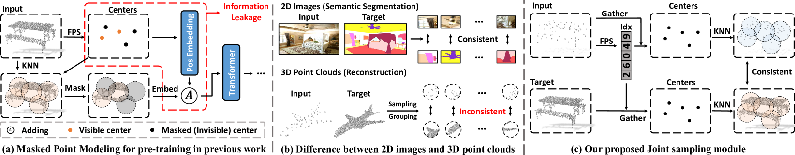
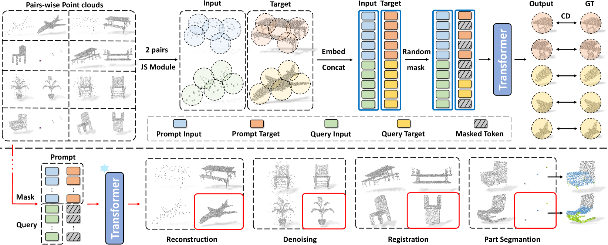
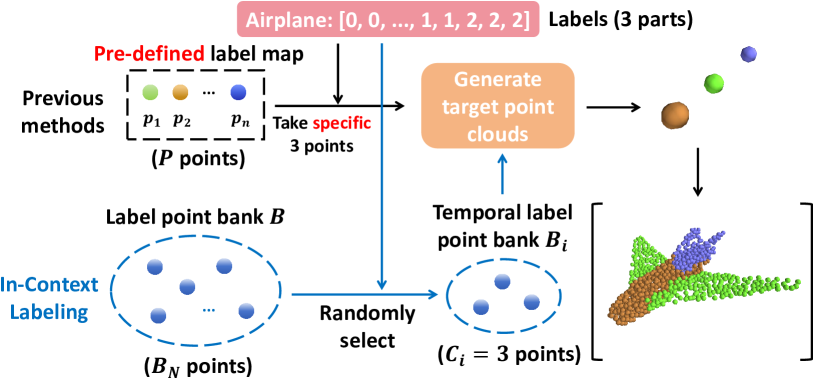
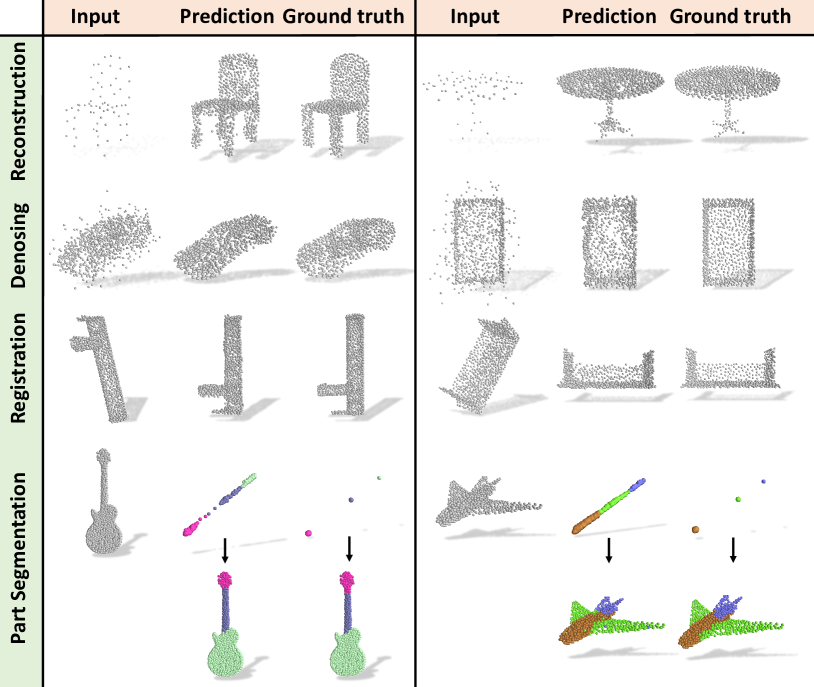
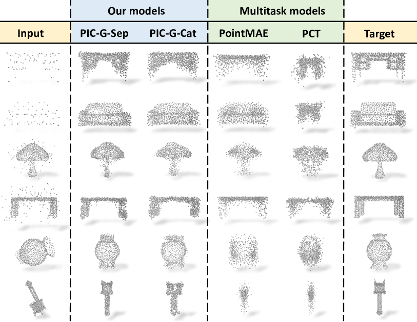
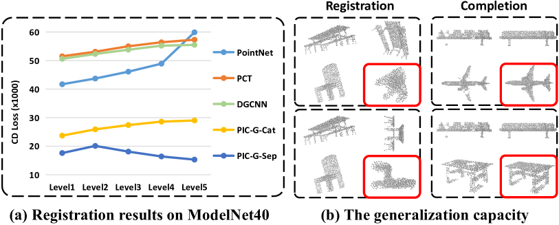
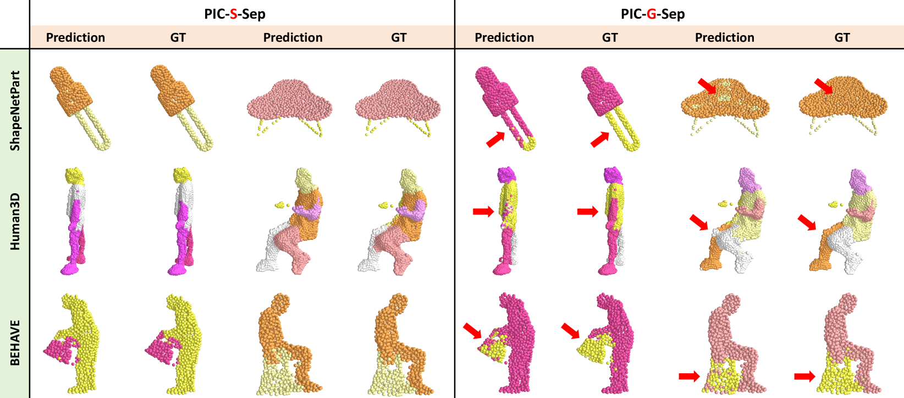
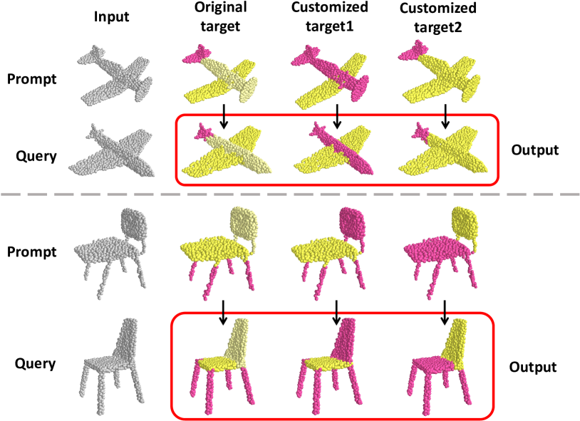

# 点云上下文理解：通过情境学习深入洞察点云数据

发布时间：2024年04月18日

`分类：RAG

这篇论文提出了一种创新框架——Point-In-Context（PIC），旨在通过上下文学习提升3D点云的理解能力。它涉及到多任务学习和上下文学习，这些是RAG（Retrieval-Augmented Generation）的关键组成部分。RAG是一种结合了检索（Retrieval）和生成（Generation）的方法，用于处理复杂的任务，如文本到图像的生成或多任务学习。这篇论文的框架和方法与RAG的概念紧密相关，因此可以归类为RAG。` `3D建模` `机器学习`

> Point-In-Context: Understanding Point Cloud via In-Context Learning

# 摘要

> 随着基于多样化数据集训练的大规模模型的兴起，上下文学习在多任务学习领域展现出巨大潜力，尤其是在自然语言处理与图像处理领域。然而，其在3D点云任务上的应用尚待深入研究。本研究提出了一种创新框架——Point-In-Context（PIC），旨在通过上下文学习提升3D点云的理解能力。我们通过引入联合采样模块，并设计了一个基础版的PIC，即Point-In-Context-Generalist（PIC-G），来克服将掩蔽点建模技术应用于3D点云的挑战。PIC-G作为一个多面手，能够处理各种3D点云任务，其输入输出均以坐标形式表现。在此框架下，复杂的分割任务通过为每个类别指定具有XYZ坐标的标签点来实现，最终预测则根据与预测点最近邻的标签点来确定。为了克服固定标签坐标分配的局限，我们提出了两种创新的训练策略——上下文标记和上下文增强，进而发展出PIC的增强版Point-In-Context-Segmenter（PIC-S），以提升动态上下文标记和模型训练的效果。PIC-S借助动态上下文标签和额外上下文对，显著提升了在不同部分分割数据集上的性能和泛化能力。PIC作为一个通用框架，允许其他任务或数据集通过统一格式轻松集成。我们通过大量实验验证了PIC在多样化任务处理和多数据集分割上的强大适应性和有效性。PIC-S不仅能够泛化至未见数据集，还能通过定制提示实现新部件的分割。

> With the emergence of large-scale models trained on diverse datasets, in-context learning has emerged as a promising paradigm for multitasking, notably in natural language processing and image processing. However, its application in 3D point cloud tasks remains largely unexplored. In this work, we introduce Point-In-Context (PIC), a novel framework for 3D point cloud understanding via in-context learning. We address the technical challenge of effectively extending masked point modeling to 3D point clouds by introducing a Joint Sampling module and proposing a vanilla version of PIC called Point-In-Context-Generalist (PIC-G). PIC-G is designed as a generalist model for various 3D point cloud tasks, with inputs and outputs modeled as coordinates. In this paradigm, the challenging segmentation task is achieved by assigning label points with XYZ coordinates for each category; the final prediction is then chosen based on the label point closest to the predictions. To break the limitation by the fixed label-coordinate assignment, which has poor generalization upon novel classes, we propose two novel training strategies, In-Context Labeling and In-Context Enhancing, forming an extended version of PIC named Point-In-Context-Segmenter (PIC-S), targeting improving dynamic context labeling and model training. By utilizing dynamic in-context labels and extra in-context pairs, PIC-S achieves enhanced performance and generalization capability in and across part segmentation datasets. PIC is a general framework so that other tasks or datasets can be seamlessly introduced into our PIC through a unified data format. We conduct extensive experiments to validate the versatility and adaptability of our proposed methods in handling a wide range of tasks and segmenting multi-datasets. Our PIC-S is capable of generalizing unseen datasets and performing novel part segmentation by customizing prompts.

[Arxiv](https://arxiv.org/abs/2404.12352)