# 多模态模型中的顺序组合泛化研究

发布时间：2024年04月18日

`分类：LLM应用` `计算机视觉` `机器学习`

> Sequential Compositional Generalization in Multimodal Models

# 摘要

> 大规模多模态模型的发展为生成建模和推理带来了革命性的进步，推动了复杂任务中的创新应用。但一个关键问题尚未充分探讨：这些模型在更高级泛化能力上的真实表现如何。本研究通过分析 \textsc{CompAct} 数据集——一个在自我为中心的厨房活动视频中精心构建、感知基础的序列组合泛化测试——来探讨这一问题。该数据集的每个案例都结合了原始视频、自然声音和众包的分步描述。关键的是，我们确保了各个概念在训练和评估集中均匀分布，同时在评估集中呈现新颖组合。我们对多种单模态和多模态模型进行了深入评估，发现双模态和三模态模型明显优于仅文本模型，这强调了多模态输入在未来研究中的重要性和价值。

> The rise of large-scale multimodal models has paved the pathway for groundbreaking advances in generative modeling and reasoning, unlocking transformative applications in a variety of complex tasks. However, a pressing question that remains is their genuine capability for stronger forms of generalization, which has been largely underexplored in the multimodal setting. Our study aims to address this by examining sequential compositional generalization using \textsc{CompAct} (\underline{Comp}ositional \underline{Act}ivities)\footnote{Project Page: \url{http://cyberiada.github.io/CompAct}}, a carefully constructed, perceptually grounded dataset set within a rich backdrop of egocentric kitchen activity videos. Each instance in our dataset is represented with a combination of raw video footage, naturally occurring sound, and crowd-sourced step-by-step descriptions. More importantly, our setup ensures that the individual concepts are consistently distributed across training and evaluation sets, while their compositions are novel in the evaluation set. We conduct a comprehensive assessment of several unimodal and multimodal models. Our findings reveal that bi-modal and tri-modal models exhibit a clear edge over their text-only counterparts. This highlights the importance of multimodality while charting a trajectory for future research in this domain.

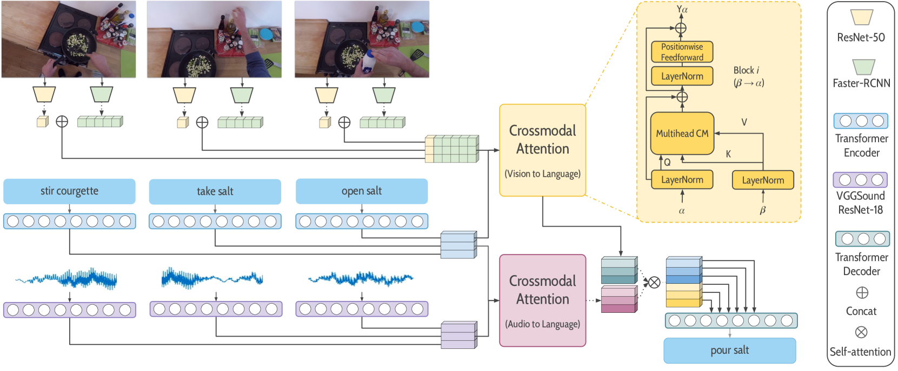

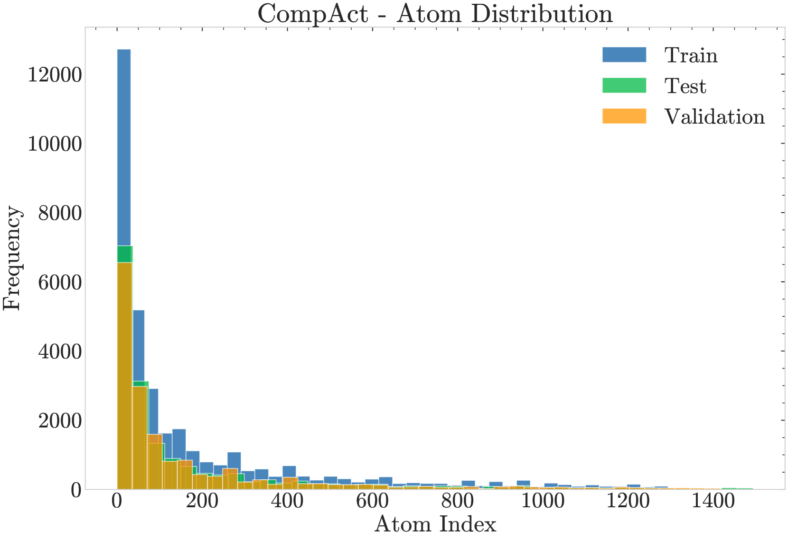

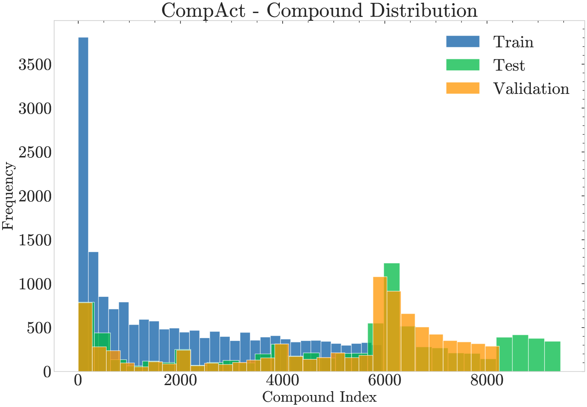

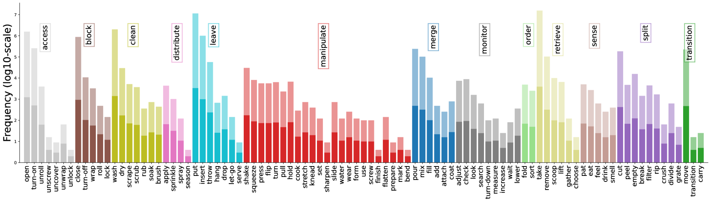

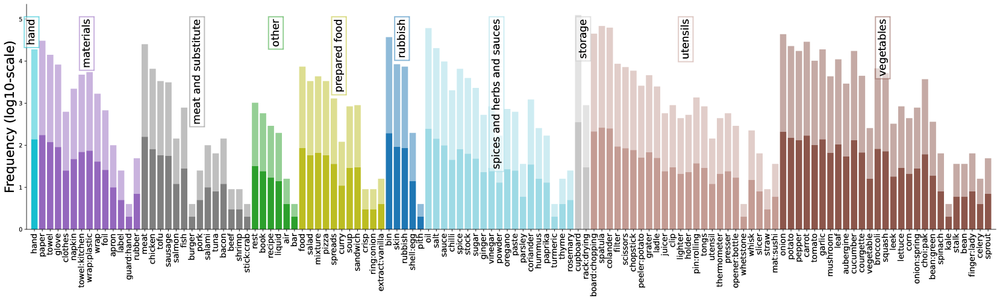

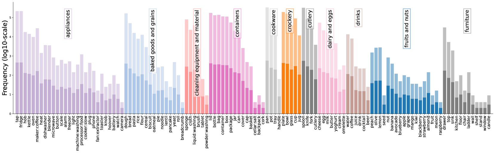

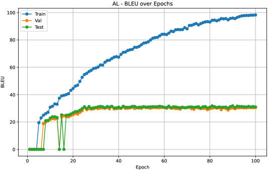

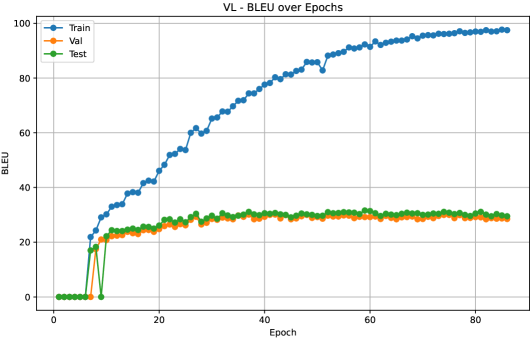

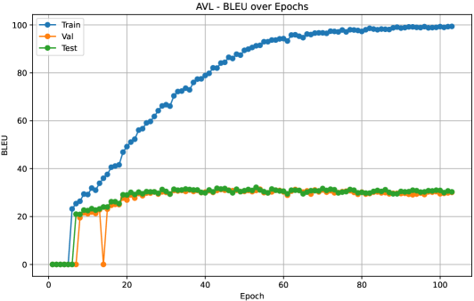

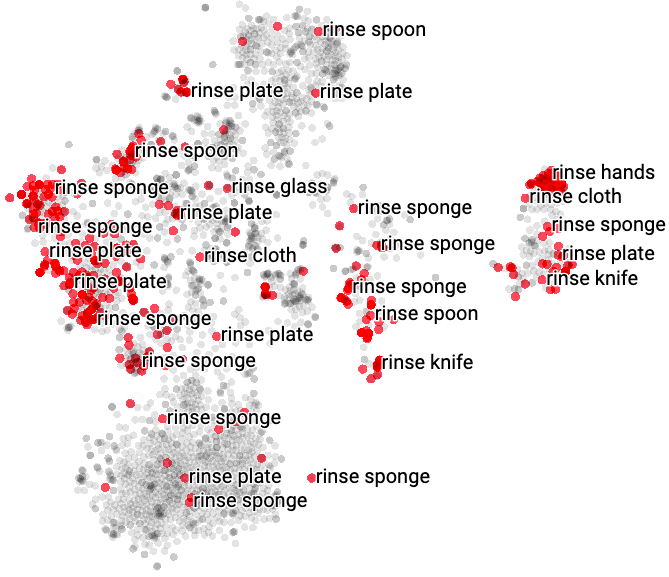

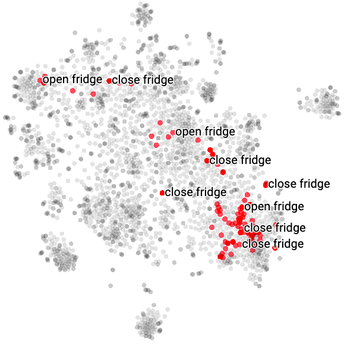

[Arxiv](https://arxiv.org/abs/2404.12013)