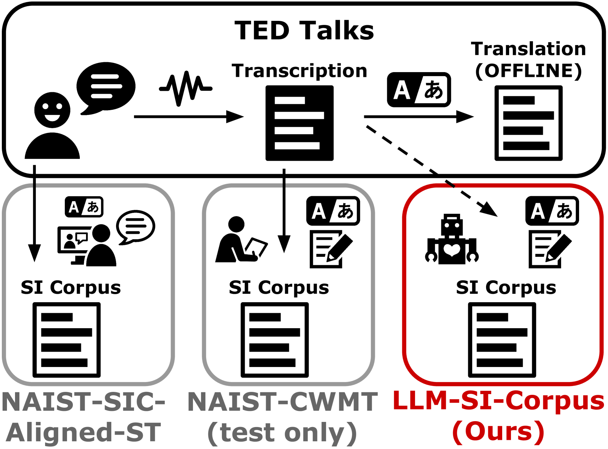
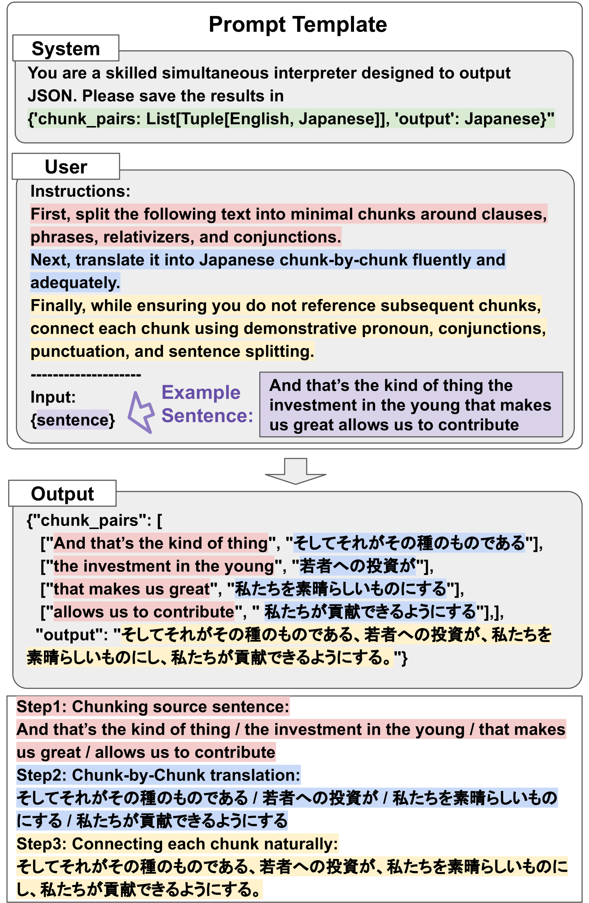
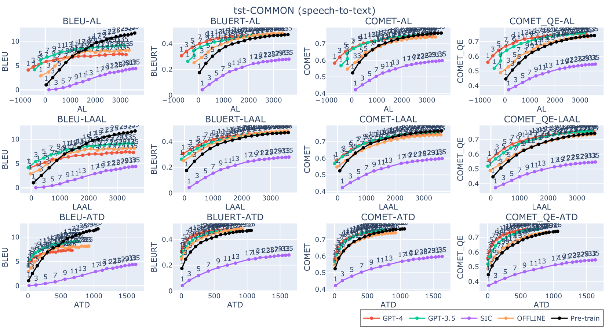
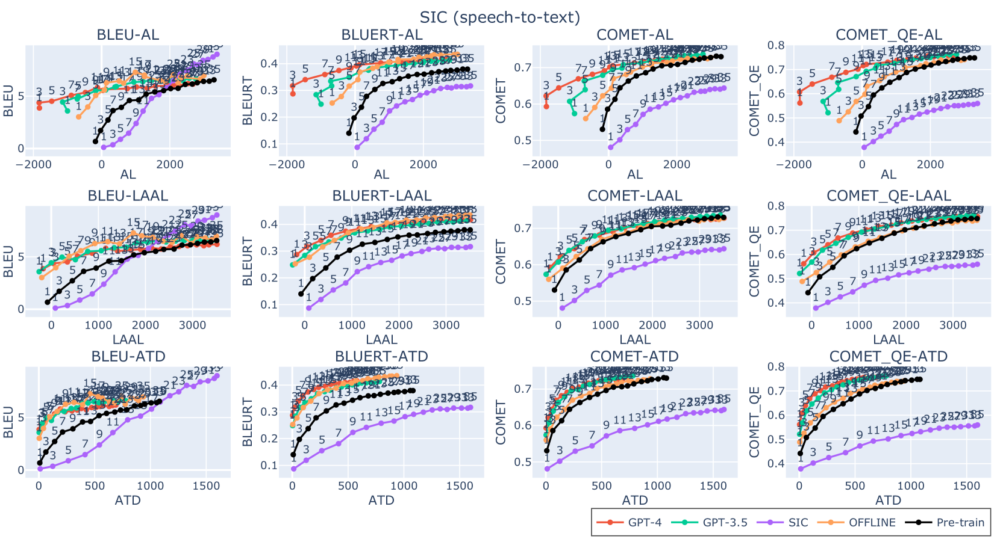
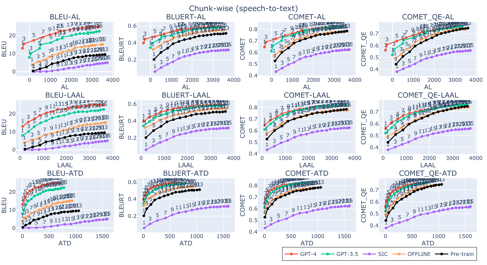
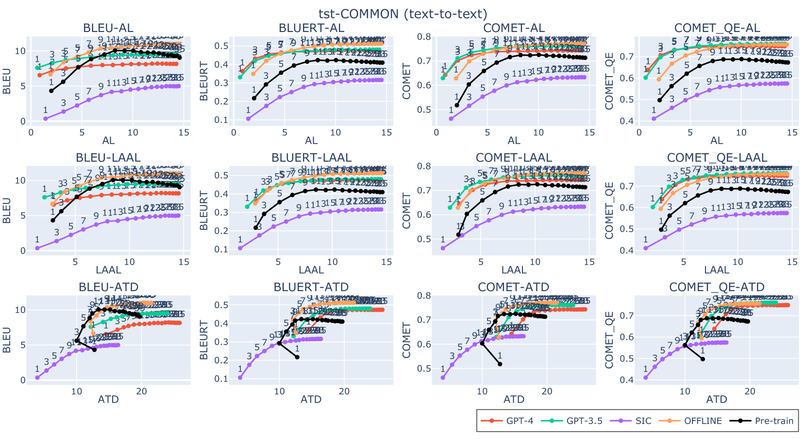
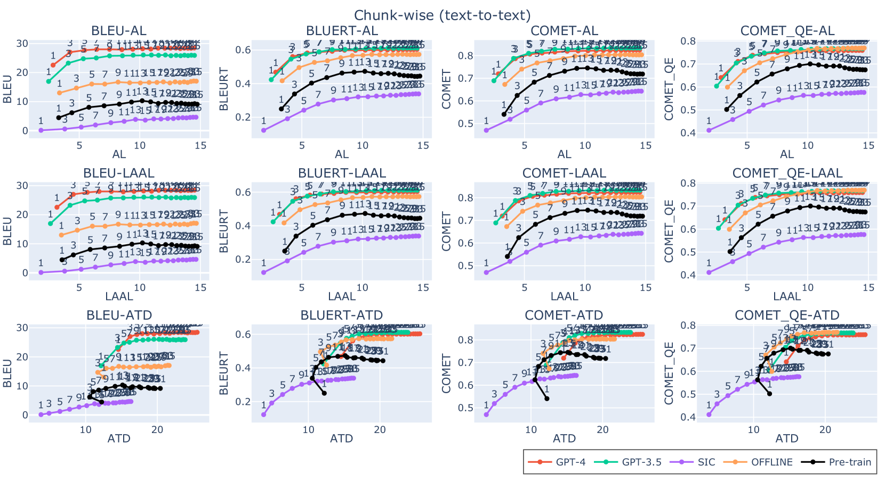
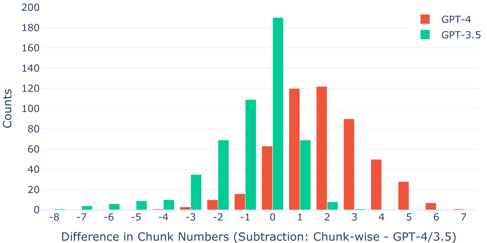

# 利用大型语言模型打造远距离语言对的同声传译语料库。

发布时间：2024年04月18日

`LLM应用` `机器翻译` `语音识别`

> Simultaneous Interpretation Corpus Construction by Large Language Models in Distant Language Pair

# 摘要

> 同步机器翻译（SiMT）系统通过同声传译（SI）语料库的训练，能有效实现高质且低延迟的翻译效果。但受限于注释者的能力，创建此类语料库颇为困难，导致现有SI语料库资源匮乏。为此，我们提出了一种创新方法，利用大型语言模型（LLM-SI-Corpus），将现有的语音翻译语料转换为口译风格，同时保留原始的词序和完整的源文本内容。实验证明，使用LLM-SI-Corpus对SiMT模型进行微调，不仅能够降低翻译延迟，还能保持与离线数据集训练模型相媲美的翻译质量。LLM-SI-Corpus资源已在 \url{https://github.com/yusuke1997/LLM-SI-Corpus} 上开放获取。

> In Simultaneous Machine Translation (SiMT) systems, training with a simultaneous interpretation (SI) corpus is an effective method for achieving high-quality yet low-latency systems. However, it is very challenging to curate such a corpus due to limitations in the abilities of annotators, and hence, existing SI corpora are limited. Therefore, we propose a method to convert existing speech translation corpora into interpretation-style data, maintaining the original word order and preserving the entire source content using Large Language Models (LLM-SI-Corpus). We demonstrate that fine-tuning SiMT models in text-to-text and speech-to-text settings with the LLM-SI-Corpus reduces latencies while maintaining the same level of quality as the models trained with offline datasets. The LLM-SI-Corpus is available at \url{https://github.com/yusuke1997/LLM-SI-Corpus}.

[Arxiv](https://arxiv.org/abs/2404.12299)