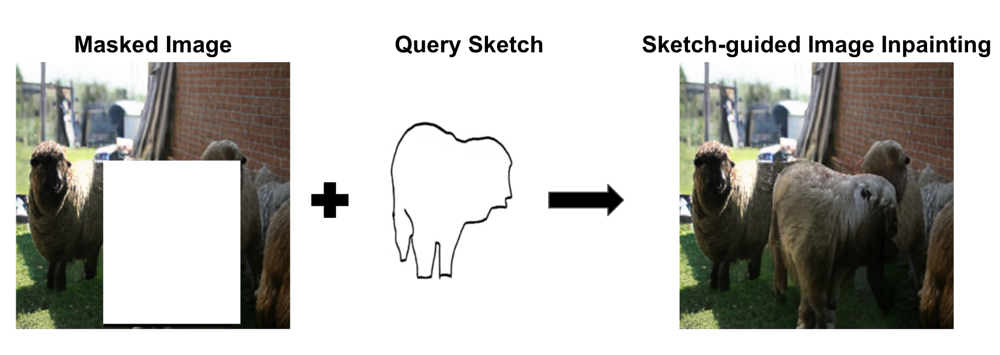
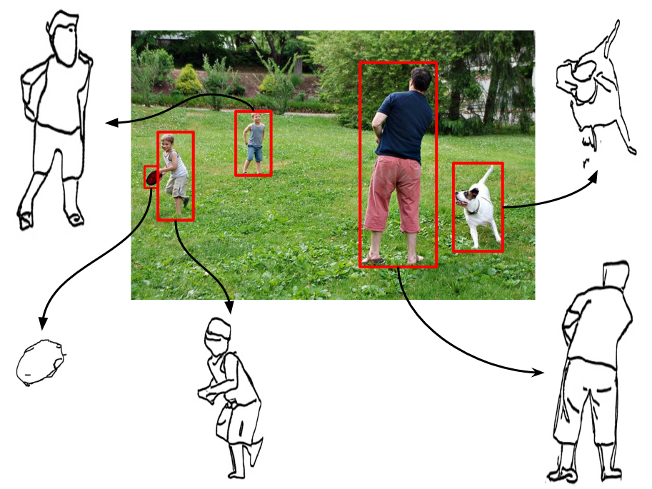

# 草图引导的图像修复技术，借助部分离散扩散过程实现

发布时间：2024年04月18日

`分类：RAG

这篇论文的主要内容是关于草图引导的图像修复技术，这是一种基于草图的图像修复方法，与自然语言引导的图像修复相比，它在确定修复对象的形状和姿态上给予了用户更大的控制自由度。论文提出了一种创新的部分离散扩散过程（PDDP），通过草图引导的双向变换器在反向传播阶段进行重建，有效弥合了草图与自然图像之间的差异，显著提升了修复质量。这篇论文的研究重点是图像修复技术，特别是草图引导的图像修复方法，因此应该归类为RAG（Retrieval-Augmented Generation）。` `图像处理` `计算机视觉`

> Sketch-guided Image Inpainting with Partial Discrete Diffusion Process

# 摘要

> 本研究聚焦于草图引导的图像修复技术。与利用自然语言引导的图像修复相比，草图引导的方法在确定修复对象的形状和姿态上给予了用户更大的控制自由度。我们提出了一种创新的部分离散扩散过程（PDDP），该过程在前向传播阶段对图像的遮罩区域进行损坏，并通过草图引导的双向变换器在反向传播阶段进行重建。这一新颖的变换模块能够处理包含待修复遮罩区域的图像和查询草图，有效弥合了草图与自然图像之间的差异，显著提升了修复质量。鉴于缺乏专门针对此任务的大规模数据集，我们自行合成了数据集，并基于此对提出的框架进行了训练和全面评估，与现有文献中的多种先进方法进行了比较。无论是从定性还是定量的角度，或是通过用户研究，结果都证明我们的方法能够修复出既真实又符合草图上下文的对象。为了推动该领域的进一步研究，我们的代码已在 https://github.com/vl2g/Sketch-Inpainting 上公开。

> In this work, we study the task of sketch-guided image inpainting. Unlike the well-explored natural language-guided image inpainting, which excels in capturing semantic details, the relatively less-studied sketch-guided inpainting offers greater user control in specifying the object's shape and pose to be inpainted. As one of the early solutions to this task, we introduce a novel partial discrete diffusion process (PDDP). The forward pass of the PDDP corrupts the masked regions of the image and the backward pass reconstructs these masked regions conditioned on hand-drawn sketches using our proposed sketch-guided bi-directional transformer. The proposed novel transformer module accepts two inputs -- the image containing the masked region to be inpainted and the query sketch to model the reverse diffusion process. This strategy effectively addresses the domain gap between sketches and natural images, thereby, enhancing the quality of inpainting results. In the absence of a large-scale dataset specific to this task, we synthesize a dataset from the MS-COCO to train and extensively evaluate our proposed framework against various competent approaches in the literature. The qualitative and quantitative results and user studies establish that the proposed method inpaints realistic objects that fit the context in terms of the visual appearance of the provided sketch. To aid further research, we have made our code publicly available at https://github.com/vl2g/Sketch-Inpainting .

[Arxiv](https://arxiv.org/abs/2404.11949)