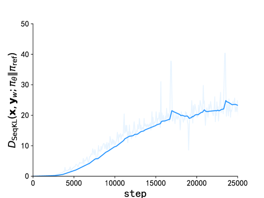
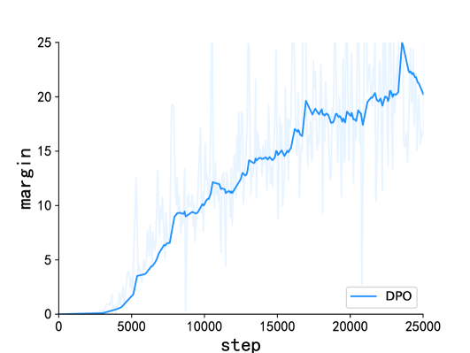
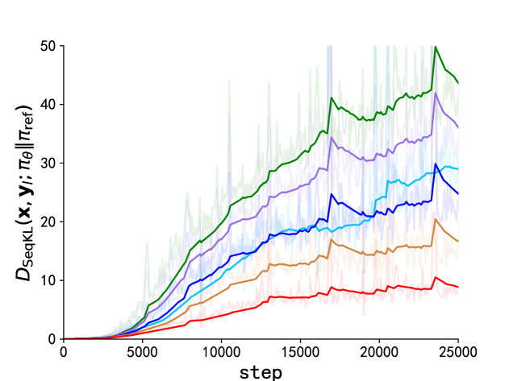
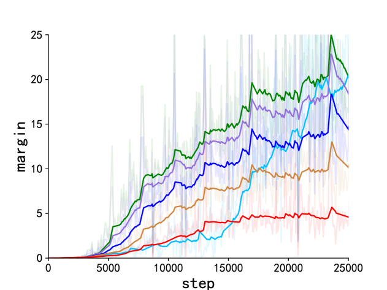
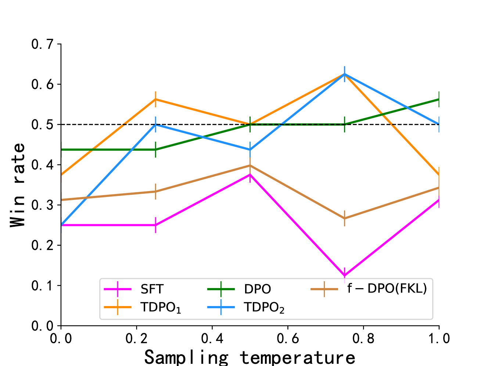
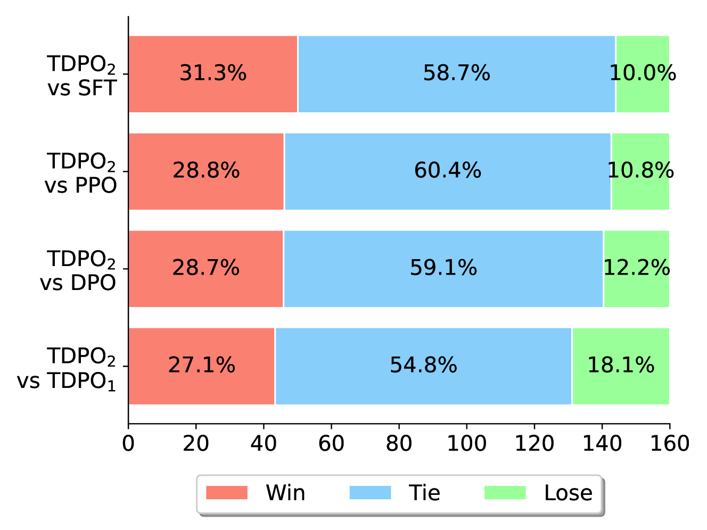
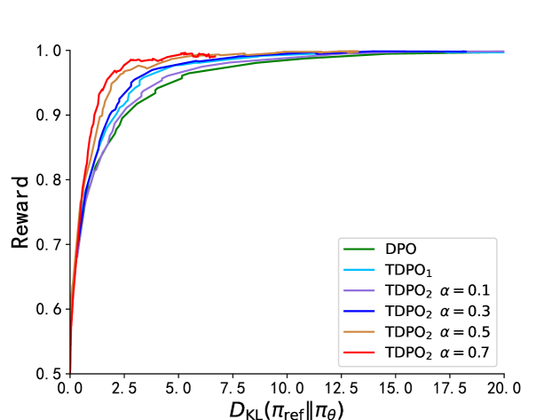
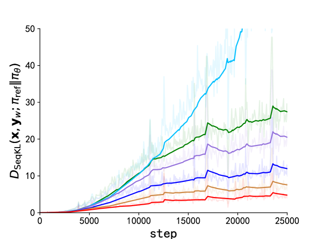
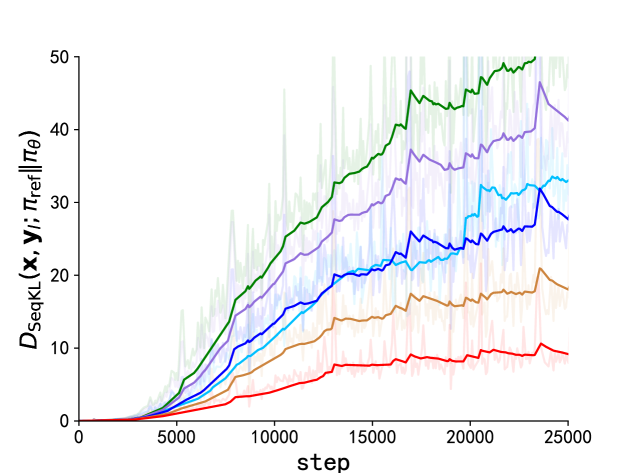
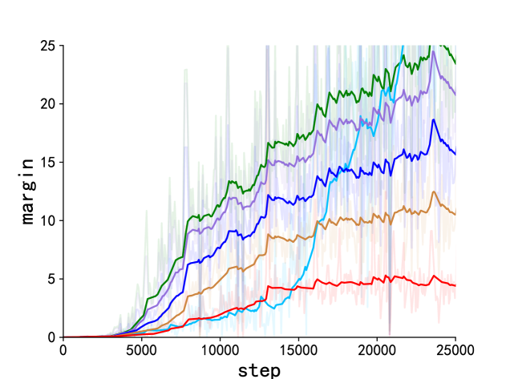

# 直接偏好优化（DPO）是一种在生成模型中针对用户偏好进行优化的策略，该策略通过微调模型产出的每个语义单元（标记）来精准实现。

发布时间：2024年04月18日

`LLM应用` `人工智能`

> Token-level Direct Preference Optimization

# 摘要

> 为了使大型语言模型（LLMs）更好地符合人类的价值观和意图，对其进行微调是必不可少的。常规的微调方法，如成对比较和参考模型的KL散度分析，主要评估模型产出的完整答案。但这些答案的生成实际上是在标记层面上，以一种顺序自回归的方式进行。本文提出了一种创新的标记级直接偏好优化（TDPO）方法，通过在标记层面上优化策略来调整LLMs，使其更贴合人类的偏好。与传统方法相比，TDPO通过为每个标记引入前向KL散度约束，有效提升了模型的一致性和多样性，同时避免了效率发散的问题。TDPO采用了Bradley-Terry模型作为基于标记的奖励机制，增强了KL散度的控制，简化了过程，无需复杂的奖励建模。在多项文本任务的实验中，TDPO在保持一致性的同时，展现了其在生成多样性上的优势。特别是在控制情感生成和单轮对话数据集的微调中，TDPO相比DPO方法取得了更佳的平衡，并且在生成响应的质量上显著超越了DPO和基于PPO的RLHF方法。我们的代码已在https://github.com/Vance0124/Token-level-Direct-Preference-Optimization上开放源代码。

> Fine-tuning pre-trained Large Language Models (LLMs) is essential to align them with human values and intentions. This process often utilizes methods like pairwise comparisons and KL divergence against a reference LLM, focusing on the evaluation of full answers generated by the models. However, the generation of these responses occurs in a token level, following a sequential, auto-regressive fashion. In this paper, we introduce Token-level Direct Preference Optimization (TDPO), a novel approach to align LLMs with human preferences by optimizing policy at the token level. Unlike previous methods, which face challenges in divergence efficiency, TDPO incorporates forward KL divergence constraints for each token, improving alignment and diversity. Utilizing the Bradley-Terry model for a token-based reward system, TDPO enhances the regulation of KL divergence, while preserving simplicity without the need for explicit reward modeling. Experimental results across various text tasks demonstrate TDPO's superior performance in balancing alignment with generation diversity. Notably, fine-tuning with TDPO strikes a better balance than DPO in the controlled sentiment generation and single-turn dialogue datasets, and significantly improves the quality of generated responses compared to both DPO and PPO-based RLHF methods. Our code is open-sourced at https://github.com/Vance0124/Token-level-Direct-Preference-Optimization.

[Arxiv](https://arxiv.org/abs/2404.11999)