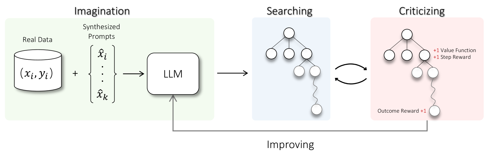

# 探索大型语言模型自我完善的路径：借助想象、搜索与批判。

发布时间：2024年04月18日

`LLM应用` `人工智能` `自我学习`

> Toward Self-Improvement of LLMs via Imagination, Searching, and Criticizing

# 摘要

> 大型语言模型（LLMs）虽然在众多任务上表现出色，但在处理需要复杂推理和规划的任务时仍显不足。近期研究提出了更高级的提示技巧和利用高质量数据进行微调的必要性，以提升LLMs的推理能力。不过，这些方法受限于数据的可用性和质量。因此，自我纠错与自我学习策略应运而生，使LLMs能够优化输出并从自我评估的奖励中学习。尽管如此，LLMs在自我改进响应方面的有效性，特别是在处理复杂推理和规划任务时，尚不明确。本文提出了AlphaLLM，旨在实现LLMs的自我提升，它结合了蒙特卡洛树搜索（MCTS）技术，形成了一个自我完善的循环，无需额外的标注即可增强LLMs的性能。AlphaLLM借鉴了AlphaGo的成功经验，应对了将MCTS与LLM结合以实现自我提升的挑战，包括数据稀缺性、语言任务的广阔搜索空间以及语言任务反馈的主观性。AlphaLLM由提示合成组件、专为语言任务设计的高效MCTS方法和三个精确反馈的批评模型组成。我们在数学推理任务中的实验结果显示，AlphaLLM显著提升了LLMs的性能，证明了LLMs自我提升的可能性。

> Despite the impressive capabilities of Large Language Models (LLMs) on various tasks, they still struggle with scenarios that involves complex reasoning and planning. Recent work proposed advanced prompting techniques and the necessity of fine-tuning with high-quality data to augment LLMs' reasoning abilities. However, these approaches are inherently constrained by data availability and quality. In light of this, self-correction and self-learning emerge as viable solutions, employing strategies that allow LLMs to refine their outputs and learn from self-assessed rewards. Yet, the efficacy of LLMs in self-refining its response, particularly in complex reasoning and planning task, remains dubious. In this paper, we introduce AlphaLLM for the self-improvements of LLMs, which integrates Monte Carlo Tree Search (MCTS) with LLMs to establish a self-improving loop, thereby enhancing the capabilities of LLMs without additional annotations. Drawing inspiration from the success of AlphaGo, AlphaLLM addresses the unique challenges of combining MCTS with LLM for self-improvement, including data scarcity, the vastness search spaces of language tasks, and the subjective nature of feedback in language tasks. AlphaLLM is comprised of prompt synthesis component, an efficient MCTS approach tailored for language tasks, and a trio of critic models for precise feedback. Our experimental results in mathematical reasoning tasks demonstrate that AlphaLLM significantly enhances the performance of LLMs without additional annotations, showing the potential for self-improvement in LLMs.

[Arxiv](https://arxiv.org/abs/2404.12253)