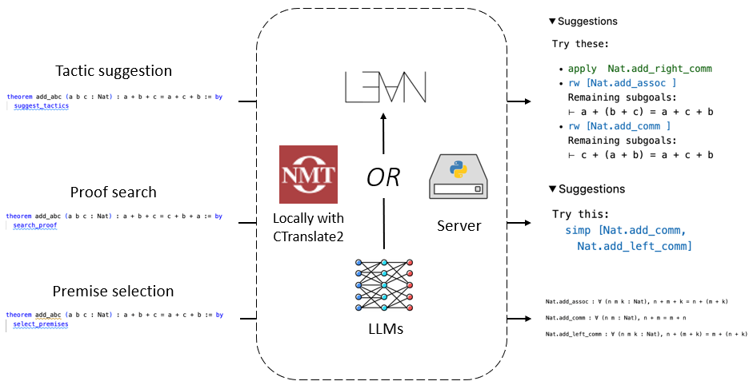
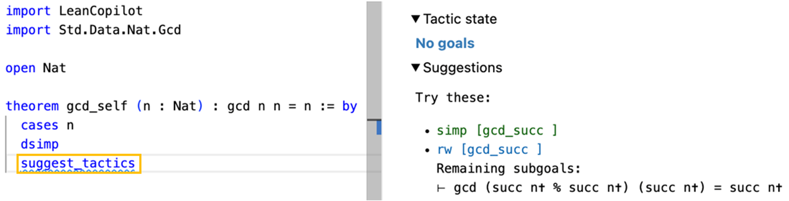
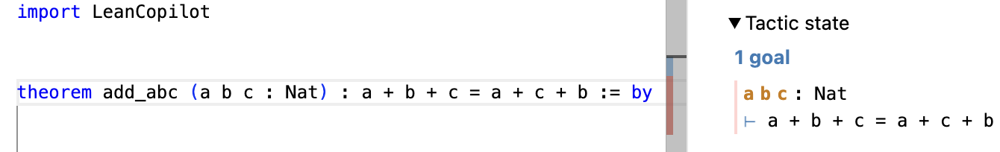
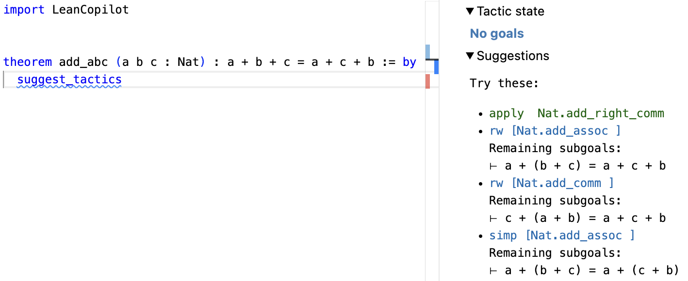
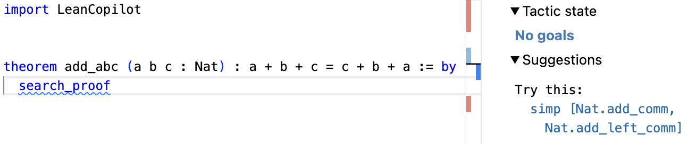
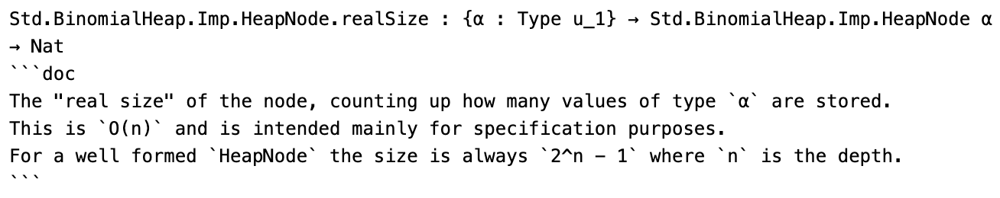
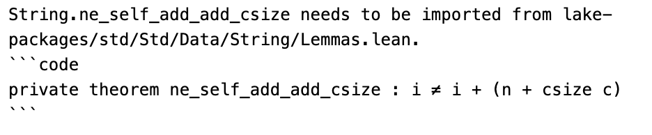
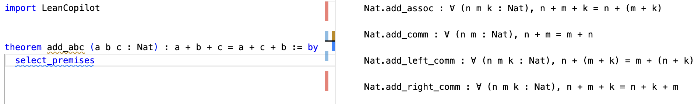
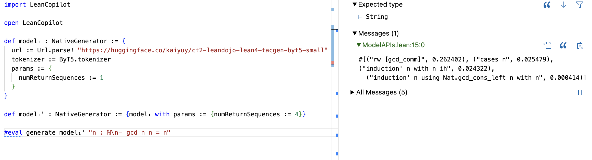
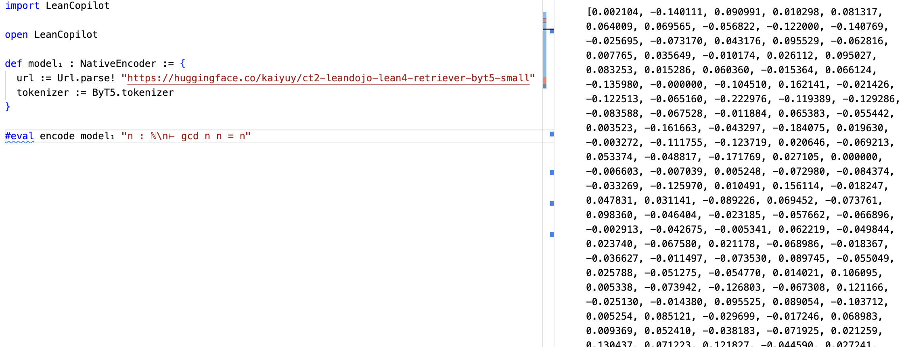

# 探索大型语言模型作为 Lean 定理证明的智能辅助工具

发布时间：2024年04月18日

`LLM应用` `定理证明` `软件开发`

> Towards Large Language Models as Copilots for Theorem Proving in Lean

# 摘要

> 定理证明在大型语言模型（LLMs）领域是一项关键挑战，因为证明助手如 Lean 能够严格验证形式化证明，杜绝了任何误判的可能。目前，基于 LLM 的证明工具尝试在无需人为介入的全自动化模式下进行定理证明，但面对新颖且难题重重的定理，这种模式显得力不从心，人类的直觉洞察在此时显得尤为关键。本文提出了 LLMs 作为人类证明定理过程中的辅助伙伴。我们引入了 Lean Copilot，这是一个在 Lean 环境中运行 LLM 推理的框架，允许开发者构建能够与 Lean 用户工作流程无缝对接的基于 LLM 的多种证明自动化工具。利用 Lean Copilot，我们开发了工具，用于提出证明步骤建议、完成中间证明目标以及选择相关前提，这些工具均基于 LLMs。用户可以选择使用我们提供的预训练模型，或者使用他们自己的模型，无论是在本地（有无 GPU 均可）还是云端运行。实验结果显示，与 Lean 中现有的基于规则的证明自动化相比，我们的方法在辅助人类证明定理和自动化证明过程方面具有显著效果。为了推动研究的进一步发展，我们以开放的 MIT 许可证开源了所有代码。

> Theorem proving is an important challenge for large language models (LLMs), as formal proofs can be checked rigorously by proof assistants such as Lean, leaving no room for hallucination. Existing LLM-based provers try to prove theorems in a fully autonomous mode without human intervention. In this mode, they struggle with novel and challenging theorems, for which human insights may be critical. In this paper, we explore LLMs as copilots that assist humans in proving theorems. We introduce Lean Copilot, a framework for running LLM inference in Lean. It enables programmers to build various LLM-based proof automation tools that integrate seamlessly into the workflow of Lean users. Using Lean Copilot, we build tools for suggesting proof steps (tactic suggestion), completing intermediate proof goals (proof search), and selecting relevant premises (premise selection) using LLMs. Users can use our pretrained models or bring their own ones that run either locally (with or without GPUs) or on the cloud. Experimental results demonstrate the effectiveness of our method in assisting humans and automating theorem proving process compared to existing rule-based proof automation in Lean. We open source all codes under a permissive MIT license to facilitate further research.

[Arxiv](https://arxiv.org/abs/2404.12534)