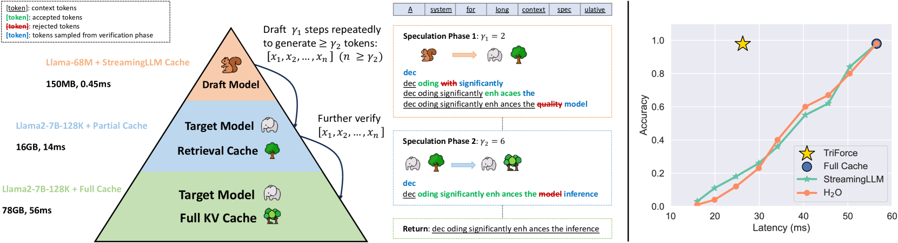
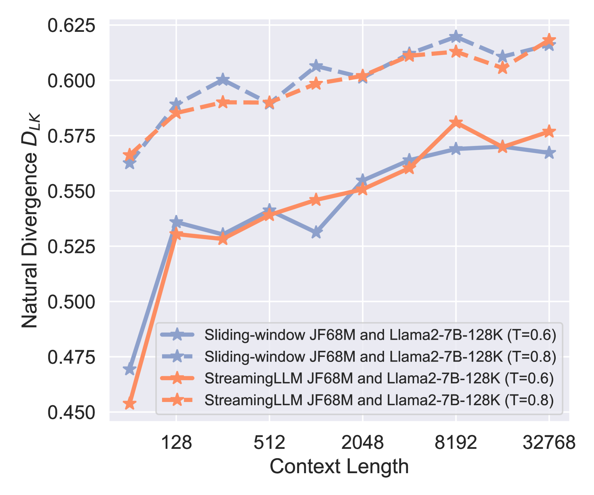
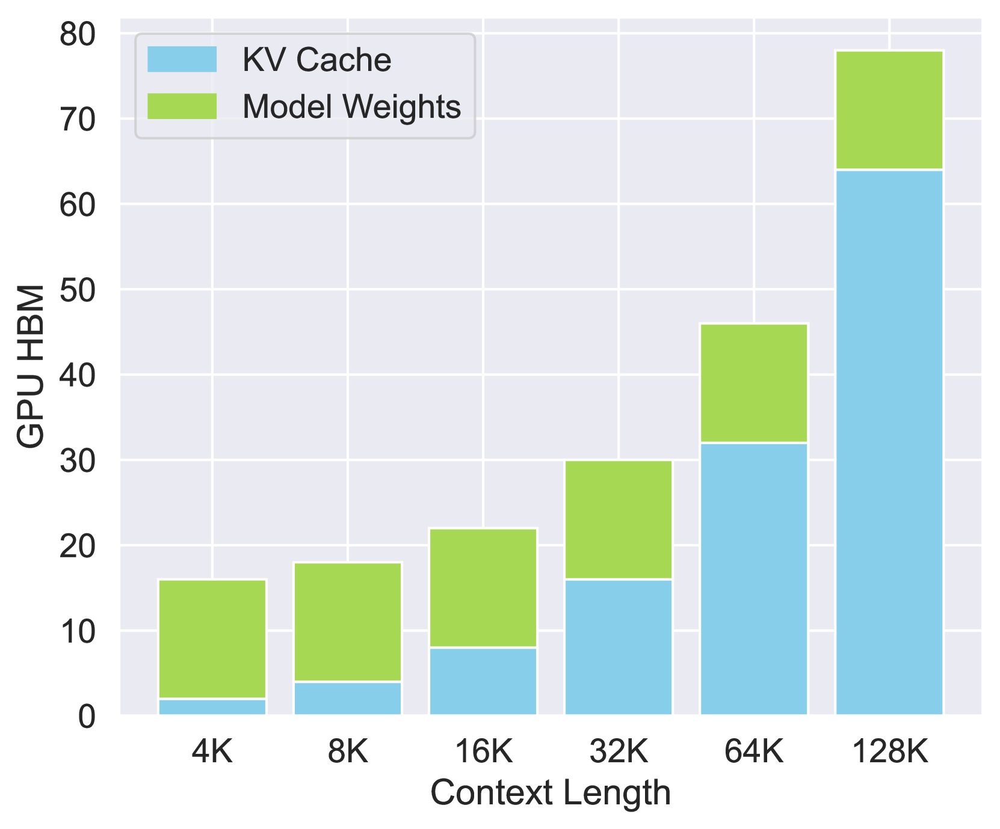
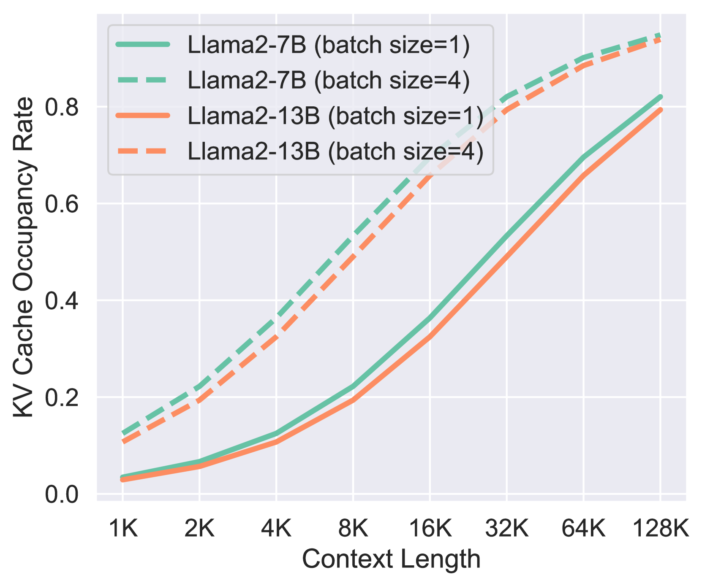
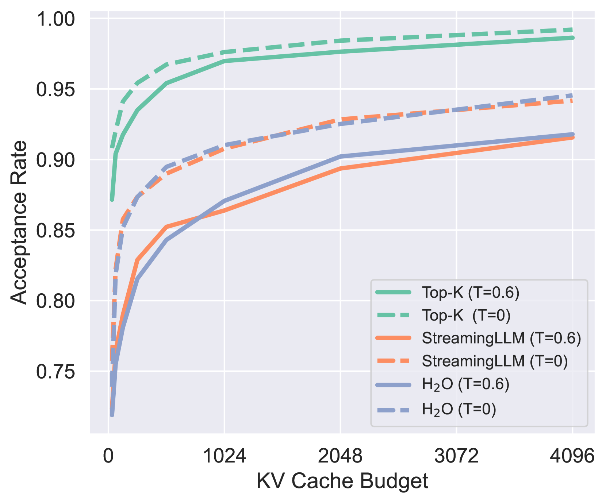
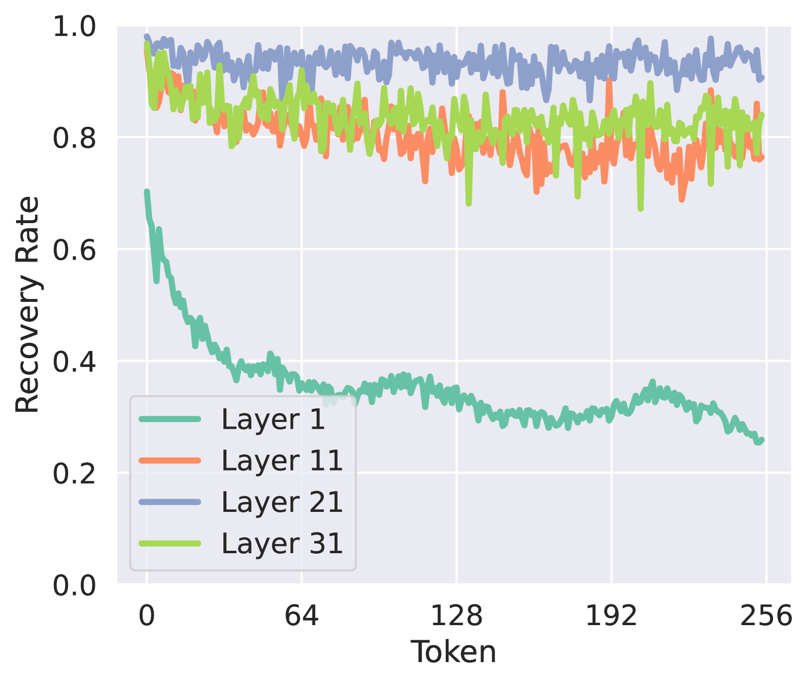
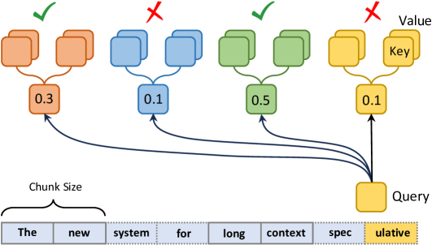
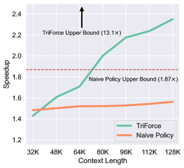
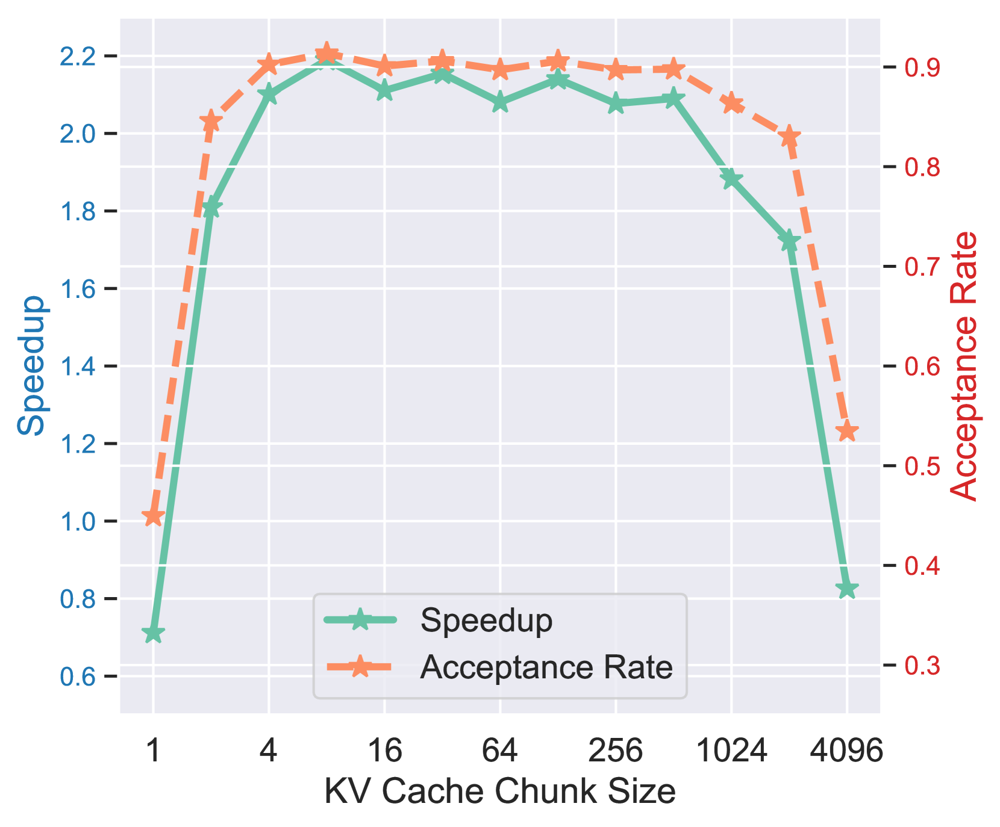
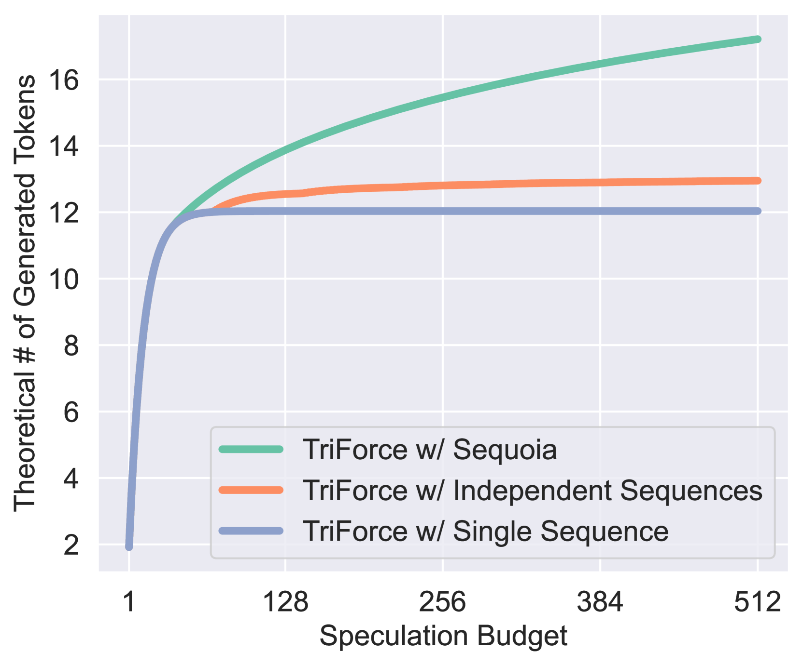

# TriForce：采用分层推测解码技术，实现长序列生成的高效无损加速。

发布时间：2024年04月18日

`LLM应用` `计算效率`

> TriForce: Lossless Acceleration of Long Sequence Generation with Hierarchical Speculative Decoding

# 摘要

> 随着大型语言模型（LLMs）在长篇内容创作中的广泛应用，对高效长序列推理的需求日益增长。然而，用于避免重复计算的键值（KV）缓存，随着序列长度的增加而成为其增长的瓶颈。LLMs的自回归特性意味着每个生成的词元都会加载整个KV缓存，这导致了计算资源的低效利用和高延迟。尽管已有多种KV缓存压缩技术被提出以解决这一问题，但它们往往会牺牲生成质量。我们提出了TriForce，这是一个可扩展的层次化推测解码系统，专门针对长序列生成而设计。该系统利用原始模型权重和动态稀疏KV缓存，通过检索作为草稿模型，作为层次结构的中间层，并由一个更小型的模型进一步推测，以减少草稿制作延迟。TriForce在Llama2-7B-128K上实现了显著的速度提升，在A100 GPU上速度提高了2.31倍，并且在处理更长文本时展现了良好的可扩展性。在两个RTX 4090 GPU的卸载设置中，TriForce的每个词元处理时间仅为0.108秒，比A100上的自回归基线快了一半，后者在我们的优化卸载系统上的速度提升了7.78倍。此外，TriForce在单个RTX 4090 GPU上的性能是DeepSpeed-Zero-Inference的4.86倍。TriForce在不同温度下均展现出卓越的性能稳定性。相关代码已在 https://github.com/Infini-AI-Lab/TriForce 上发布。

> With large language models (LLMs) widely deployed in long content generation recently, there has emerged an increasing demand for efficient long-sequence inference support. However, key-value (KV) cache, which is stored to avoid re-computation, has emerged as a critical bottleneck by growing linearly in size with the sequence length. Due to the auto-regressive nature of LLMs, the entire KV cache will be loaded for every generated token, resulting in low utilization of computational cores and high latency. While various compression methods for KV cache have been proposed to alleviate this issue, they suffer from degradation in generation quality. We introduce TriForce, a hierarchical speculative decoding system that is scalable to long sequence generation. This approach leverages the original model weights and dynamic sparse KV cache via retrieval as a draft model, which serves as an intermediate layer in the hierarchy and is further speculated by a smaller model to reduce its drafting latency. TriForce not only facilitates impressive speedups for Llama2-7B-128K, achieving up to 2.31$\times$ on an A100 GPU but also showcases scalability in handling even longer contexts. For the offloading setting on two RTX 4090 GPUs, TriForce achieves 0.108s/token$\unicode{x2014}$only half as slow as the auto-regressive baseline on an A100, which attains 7.78$\times$ on our optimized offloading system. Additionally, TriForce performs 4.86$\times$ than DeepSpeed-Zero-Inference on a single RTX 4090 GPU. TriForce's robustness is highlighted by its consistently outstanding performance across various temperatures. The code is available at https://github.com/Infini-AI-Lab/TriForce.

[Arxiv](https://arxiv.org/abs/2404.11912)