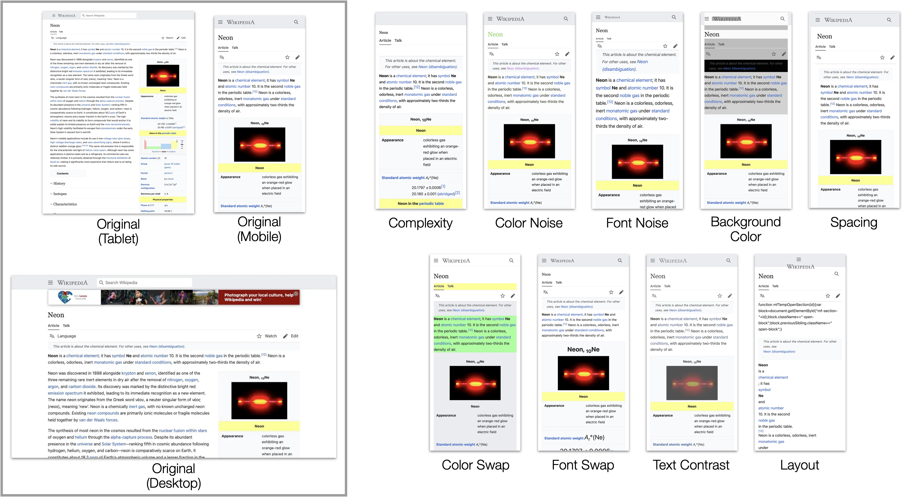
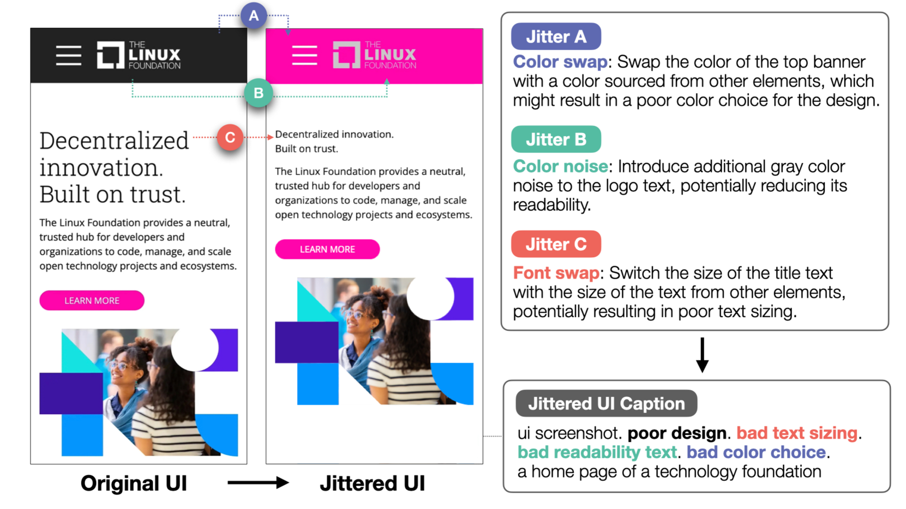
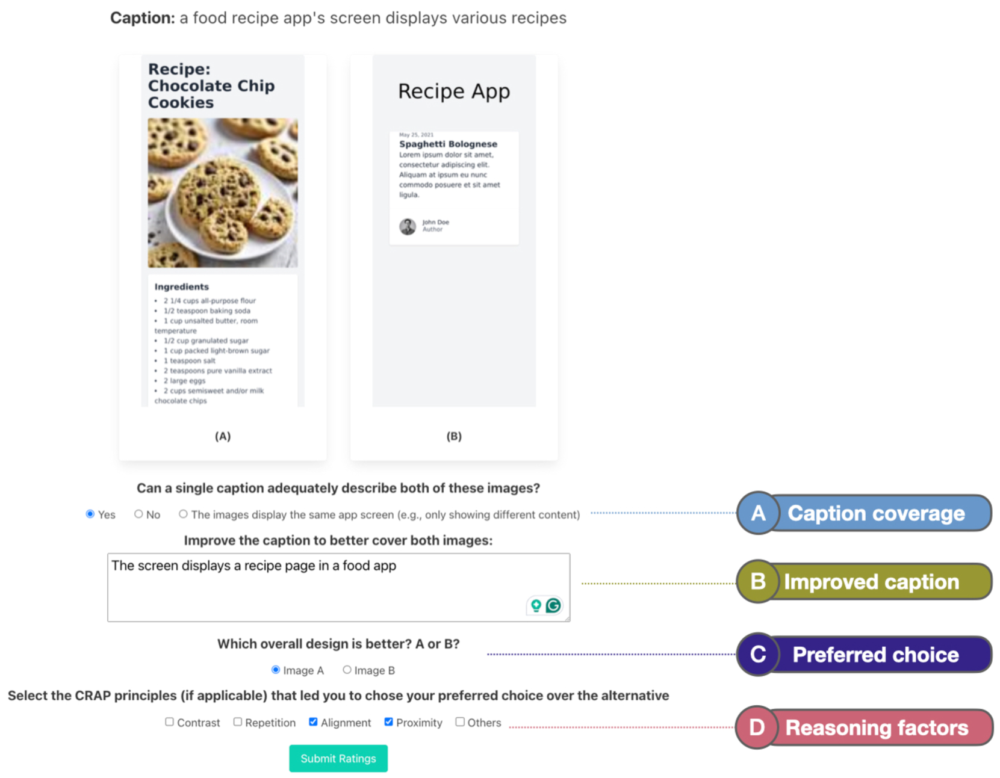
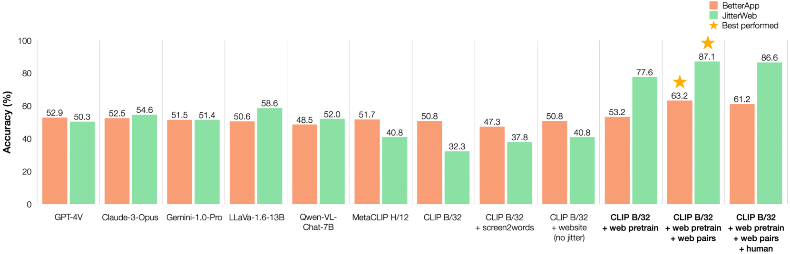
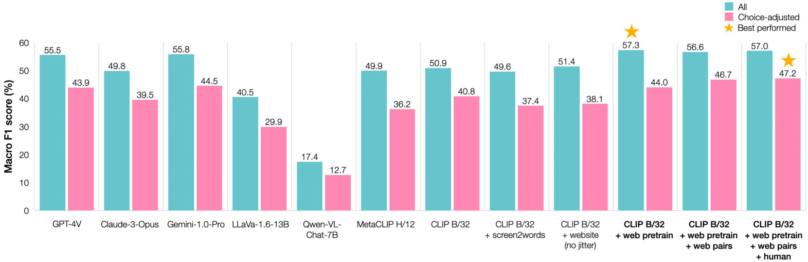
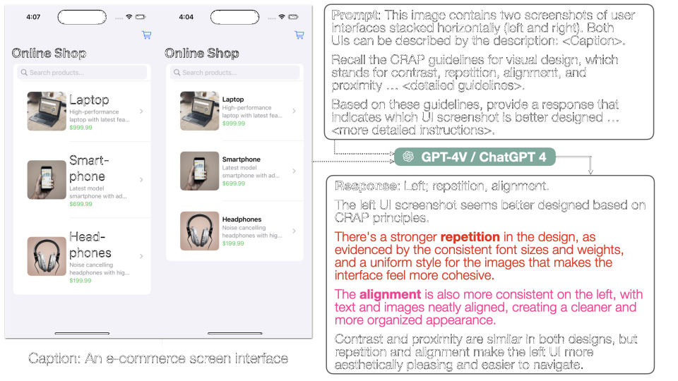
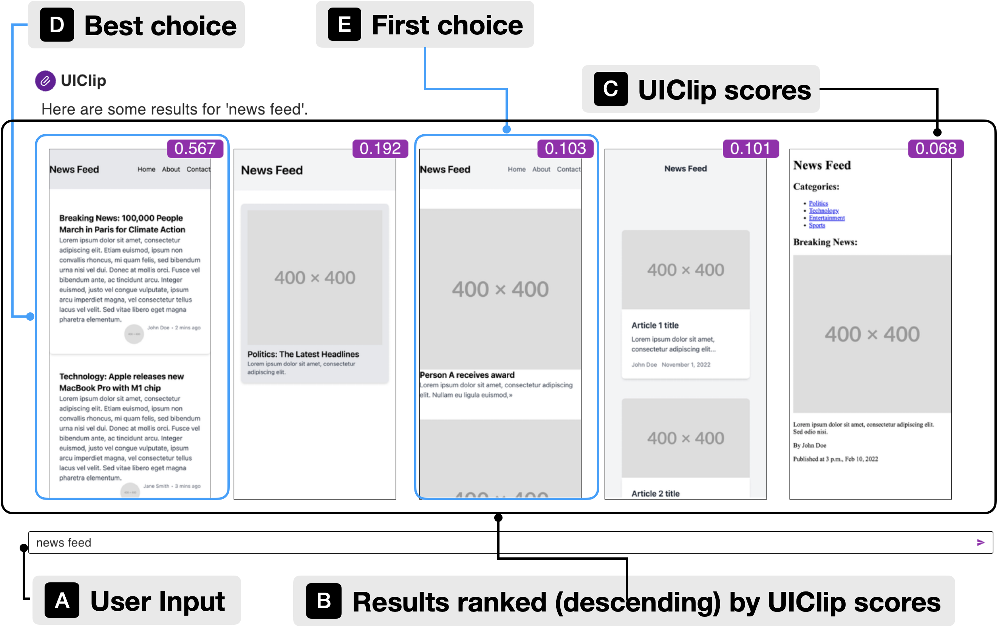
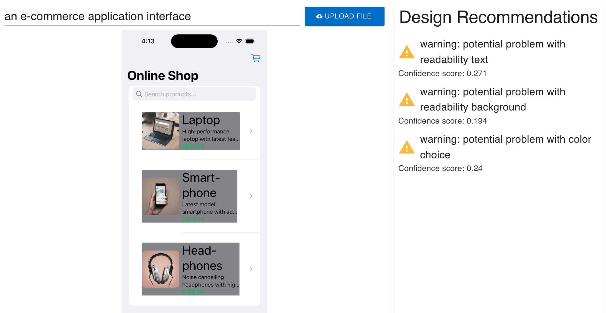
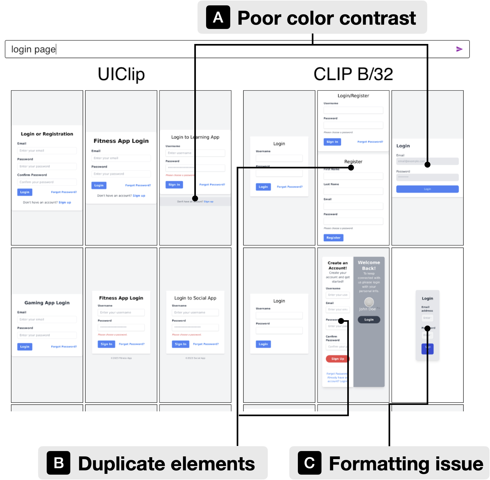

# UIClip：一种数据驱动的模型，专为评估用户界面设计而设计

发布时间：2024年04月18日

`Agent` `用户界面设计` `机器学习`

> UIClip: A Data-driven Model for Assessing User Interface Design

# 摘要

> 用户界面设计对于提升应用的可用性、可达性和美观度至关重要，但同时也是一项颇具挑战性的工作。本研究提出了一个名为 UIClip 的机器学习模型，旨在通过 UI 的截图和文字描述来评估其设计品质与视觉相关性。我们综合运用自动化抓取、合成增强和人工评价等手段，构建了一个包含大量用户界面数据集，这些数据集根据描述进行分类，并依据设计优劣进行排序。UIClip 在此数据集上的训练过程中，能够隐式掌握优秀与劣质设计的特征，它不仅能够为 UI 设计的相关性和品质打分，还能提供设计上的建议。在与12位人类设计师评定的 UI 进行比较的评估中，UIClip 显示出与真实评价最高的一致性。此外，我们还介绍了三个应用示例，展示了 UIClip 如何助力那些需要即时评估 UI 设计质量的下游应用，包括：i) 自动生成 UI 代码，ii) 提供 UI 设计建议，以及 iii) 执行质量感知的 UI 示例搜索。

> User interface (UI) design is a difficult yet important task for ensuring the usability, accessibility, and aesthetic qualities of applications. In our paper, we develop a machine-learned model, UIClip, for assessing the design quality and visual relevance of a UI given its screenshot and natural language description. To train UIClip, we used a combination of automated crawling, synthetic augmentation, and human ratings to construct a large-scale dataset of UIs, collated by description and ranked by design quality. Through training on the dataset, UIClip implicitly learns properties of good and bad designs by i) assigning a numerical score that represents a UI design's relevance and quality and ii) providing design suggestions. In an evaluation that compared the outputs of UIClip and other baselines to UIs rated by 12 human designers, we found that UIClip achieved the highest agreement with ground-truth rankings. Finally, we present three example applications that demonstrate how UIClip can facilitate downstream applications that rely on instantaneous assessment of UI design quality: i) UI code generation, ii) UI design tips generation, and iii) quality-aware UI example search.

[Arxiv](https://arxiv.org/abs/2404.12500)