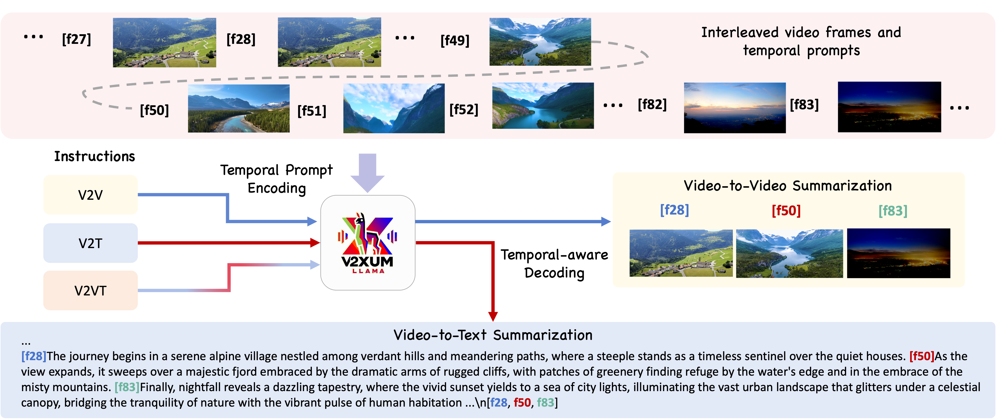
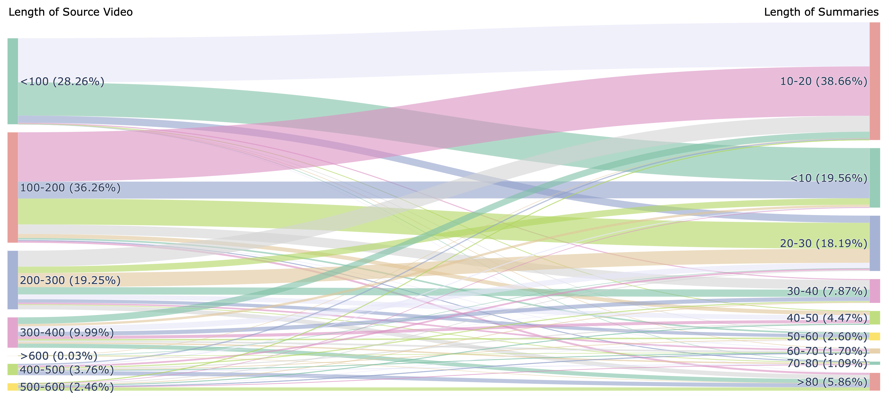
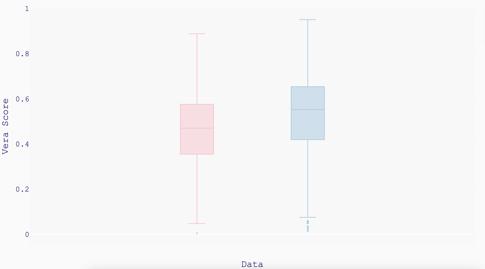
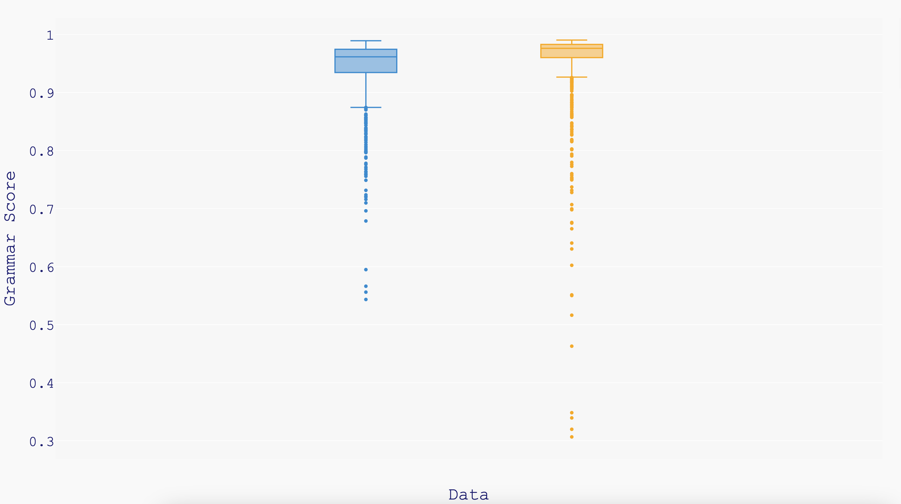
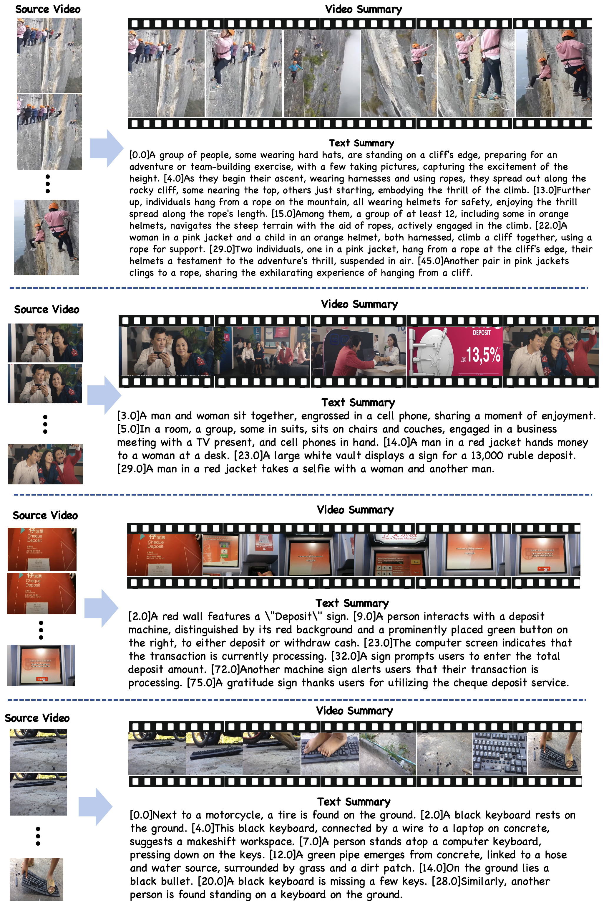

# V2Xum-LLM：利用时间提示指令优化的跨模态视频摘要技术

发布时间：2024年04月18日

`LLM应用` `视频摘要` `多模态学习`

> V2Xum-LLM: Cross-Modal Video Summarization with Temporal Prompt Instruction Tuning

# 摘要

> 视频摘要的目的是为长视频制作简短、精确且连贯的概述。尽管众多视频摘要数据集已经出现，但它们的一个明显短板是源视频数量不足，这限制了高级大型视觉-语言模型（VLMs）的有效微调。而且，大多数现有数据集都是为视频到视频摘要设计的，忽略了对多模态视频内容摘要的现代需求。近期，人们已经开始尝试从单模态向多模态视频摘要转变，将任务分为三个子任务：视频到视频（V2V）、视频到文本（V2T）以及视频和文本结合摘要（V2VT）。但是，以往的多模态数据集在文本摘要方面还不够完善。为了应对这些挑战，我们推出了Instruct-V2Xum，这是一个包含30,000个多样化视频的跨模态视频摘要数据集，这些视频源自YouTube，时长介于40至940秒之间，平均摘要率为16.39%。Instruct-V2Xum的每个视频摘要都与一个引用特定帧索引的文本摘要配对，这有助于生成同步的视频和文本摘要。此外，我们提出了一个名为V2Xum-LLM的新视频摘要框架。在本研究中，特别是V2Xum-LLaMA，是首个将不同视频摘要任务整合到一个大型语言模型（LLM）的文本解码器中，并利用时间提示和任务指令实现可控制的视频摘要任务的框架。实验结果表明，V2Xum-LLaMA在多个视频摘要任务上超越了强大的基线模型。而且，我们还为V2V和V2VT摘要任务提出了一个改进的评估指标。

> Video summarization aims to create short, accurate, and cohesive summaries of longer videos. Despite the existence of various video summarization datasets, a notable limitation is their limited amount of source videos, which hampers the effective fine-tuning of advanced large vision-language models (VLMs). Additionally, most existing datasets are created for video-to-video summarization, overlooking the contemporary need for multimodal video content summarization. Recent efforts have been made to expand from unimodal to multimodal video summarization, categorizing the task into three sub-tasks based on the summary's modality: video-to-video (V2V), video-to-text (V2T), and a combination of video and text summarization (V2VT). However, the textual summaries in previous multimodal datasets are inadequate. To address these issues, we introduce Instruct-V2Xum, a cross-modal video summarization dataset featuring 30,000 diverse videos sourced from YouTube, with lengths ranging from 40 to 940 seconds and an average summarization ratio of 16.39\%. Each video summary in Instruct-V2Xum is paired with a textual summary that references specific frame indexes, facilitating the generation of aligned video and textual summaries. In addition, we propose a new video summarization framework named V2Xum-LLM. V2Xum-LLM, specifically V2Xum-LLaMA in this study, is the first framework that unifies different video summarization tasks into one large language model's (LLM) text decoder and achieves task-controllable video summarization with temporal prompts and task instructions. Experiments show that V2Xum-LLaMA outperforms strong baseline models on multiple video summarization tasks. Furthermore, we propose an enhanced evaluation metric for V2V and V2VT summarization tasks.

[Arxiv](https://arxiv.org/abs/2404.12353)