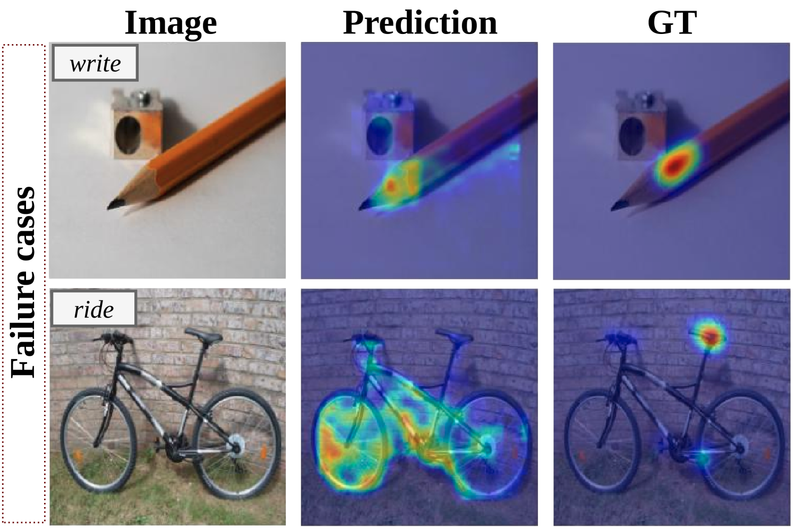

# CLIP 对于如何剥香蕉有何认知？

发布时间：2024年04月18日

`分类：Agent` `机器人技术` `人工智能`

> What does CLIP know about peeling a banana?

# 摘要

> 人类天生能够识别工具以执行特定动作，这种能力被称为“可供性”。智能机器人要能使用日常物品，关键在于能够根据物品支持的任务来区分其不同部分。传统的监督学习方法需要昂贵的像素级标注，而弱监督方法虽然要求不高，但依然依赖于交互样本，并且局限于固定的动作集合。这些限制影响了模型的扩展性，可能带来偏见，通常将模型局限于少数预设动作。本文提出的 AffordanceCLIP 旨在通过利用大型预训练视觉-语言模型（例如 CLIP）中的隐含可供性知识，来突破这些局限。实验表明，CLIP 虽未专门训练以识别可供性，却能保留对任务有益的信息。AffordanceCLIP 在零样本性能上与专门训练的方法相媲美，并具有多项优势：i) 它能够响应任何动作提示，不仅限于预设集；ii) 相较于现有方法，它只需训练少量额外参数；iii) 无需对动作-对象对进行直接监督，为模型的功能推理开辟了新路径。

> Humans show an innate capability to identify tools to support specific actions. The association between objects parts and the actions they facilitate is usually named affordance. Being able to segment objects parts depending on the tasks they afford is crucial to enable intelligent robots to use objects of daily living. Traditional supervised learning methods for affordance segmentation require costly pixel-level annotations, while weakly supervised approaches, though less demanding, still rely on object-interaction examples and support a closed set of actions. These limitations hinder scalability, may introduce biases, and usually restrict models to a limited set of predefined actions. This paper proposes AffordanceCLIP, to overcome these limitations by leveraging the implicit affordance knowledge embedded within large pre-trained Vision-Language models like CLIP. We experimentally demonstrate that CLIP, although not explicitly trained for affordances detection, retains valuable information for the task. Our AffordanceCLIP achieves competitive zero-shot performance compared to methods with specialized training, while offering several advantages: i) it works with any action prompt, not just a predefined set; ii) it requires training only a small number of additional parameters compared to existing solutions and iii) eliminates the need for direct supervision on action-object pairs, opening new perspectives for functionality-based reasoning of models.

[Arxiv](https://arxiv.org/abs/2404.12015)