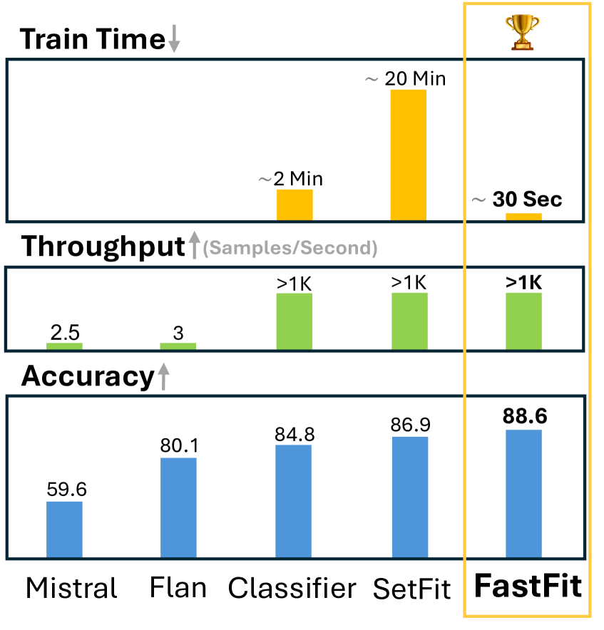
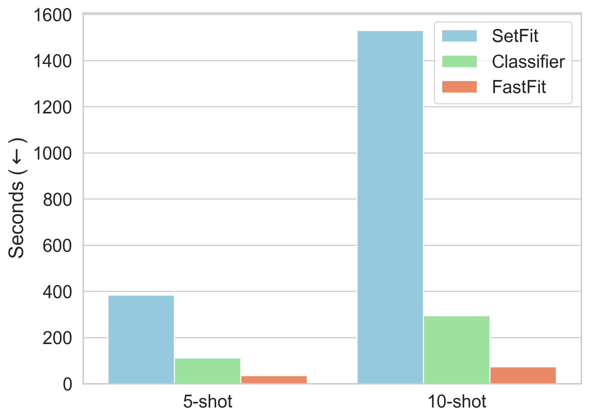
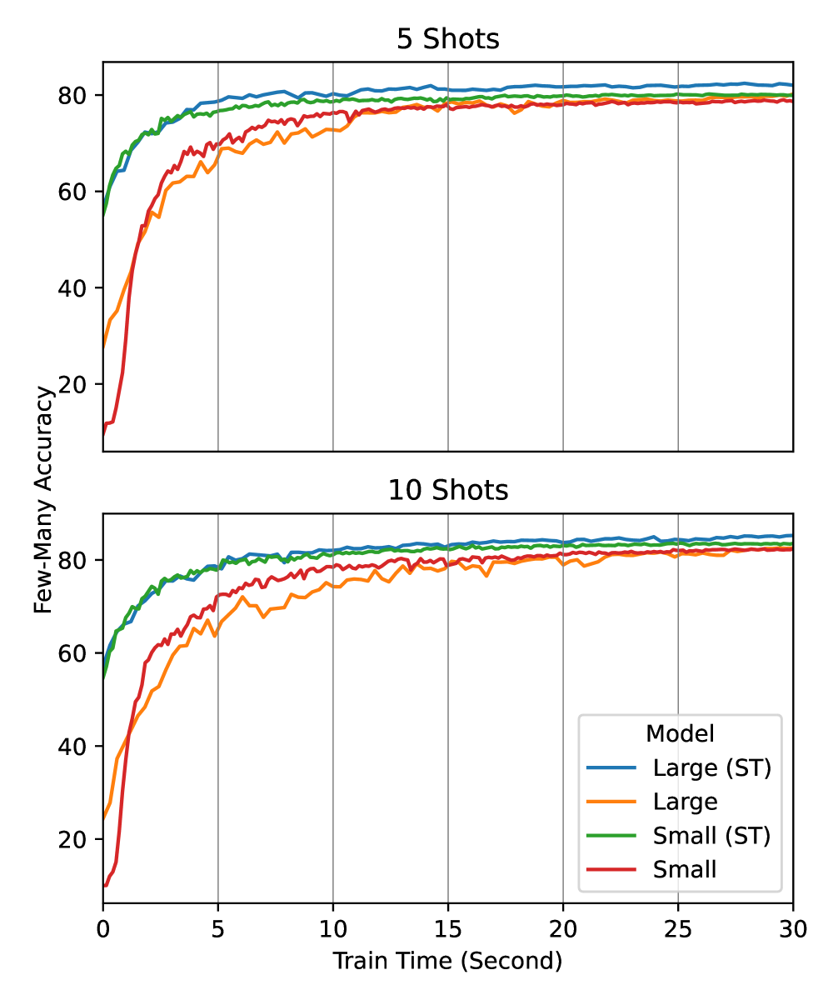
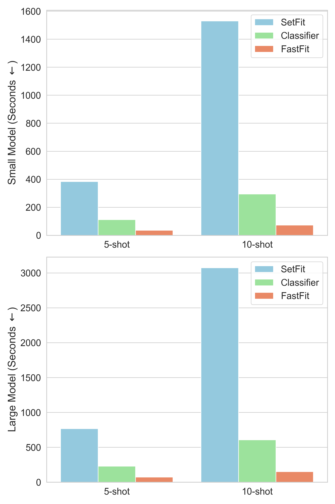

# 在大型语言模型（LLMs）不适宜的情况下，不妨试试 FastFit，这是一种高效且迅速的文本分类技术，尤其适用于多类别场景。

发布时间：2024年04月18日

`LLM应用` `机器学习`

> When LLMs are Unfit Use FastFit: Fast and Effective Text Classification with Many Classes

# 摘要

> 我们推出了 FastFit，这是一款旨在实现快速精准的少样本分类的 Python 工具包，尤其适用于包含大量语义相近类别的情况。FastFit 创新性地结合了批量对比学习和词级相似度评分技术。相较于其他少样本学习工具，如 SetFit、Transformers 或通过 API 对大型语言模型进行少样本提示，FastFit 在 FewMany（我们新近构建的英语基准测试）和多语言数据集上的多类分类任务中，在速度和精确度上均有显著提升。FastFit 将训练速度提高了 3 到 20 倍，仅需数秒即可完成训练。目前，FastFit 工具包已在 GitHub 和 PyPi 上发布，为自然语言处理（NLP）从业者提供了一个易于使用的解决方案。

> We present FastFit, a method, and a Python package design to provide fast and accurate few-shot classification, especially for scenarios with many semantically similar classes. FastFit utilizes a novel approach integrating batch contrastive learning and token-level similarity score. Compared to existing few-shot learning packages, such as SetFit, Transformers, or few-shot prompting of large language models via API calls, FastFit significantly improves multiclass classification performance in speed and accuracy across FewMany, our newly curated English benchmark, and Multilingual datasets. FastFit demonstrates a 3-20x improvement in training speed, completing training in just a few seconds. The FastFit package is now available on GitHub and PyPi, presenting a user-friendly solution for NLP practitioners.

[Arxiv](https://arxiv.org/abs/2404.12365)