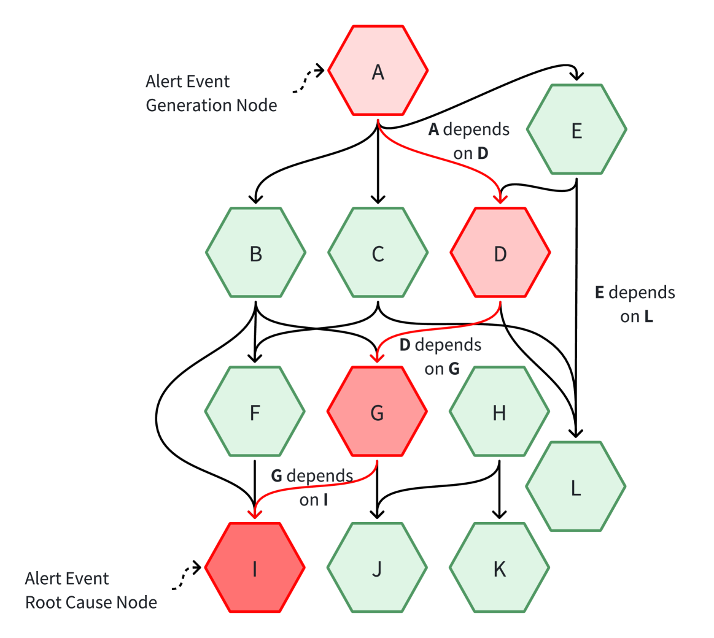
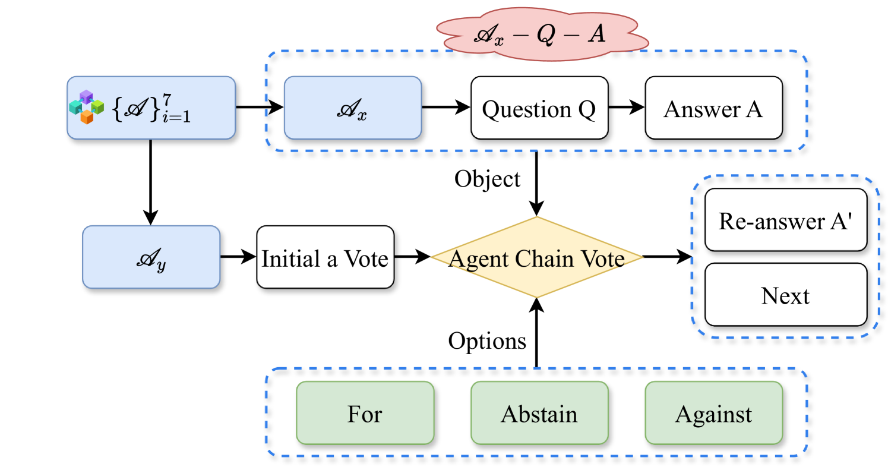
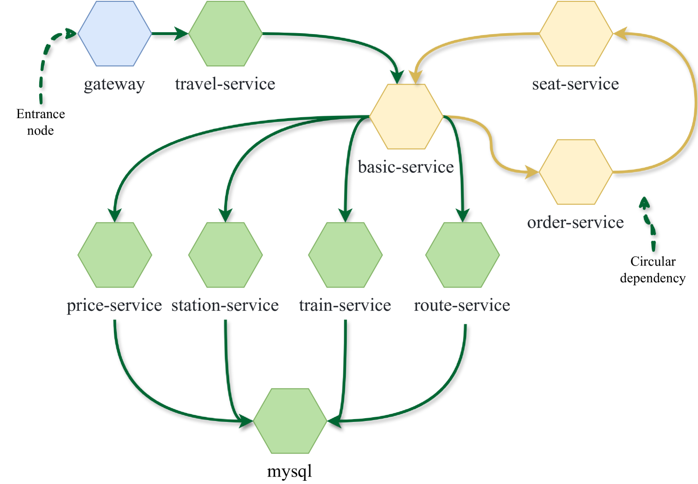

# mABC：一种受区块链启发的多代理协作机制，专为微服务架构中的根本原因分析而设计。

发布时间：2024年04月18日

`Agent` `云计算` `人工智能运维`

> mABC: multi-Agent Blockchain-Inspired Collaboration for root cause analysis in micro-services architecture

# 摘要

> 随着云原生技术中微服务架构的复杂性不断增加，维护系统的稳定性和效率变得越来越困难。为了深入分析问题根源并解决警报事件，我们提出了一个创新的框架——微服务架构根本原因分析的多代理区块链启发式协作（mABC），这一框架有望彻底改变AI运维（AIOps）领域。在这一框架中，多个基于先进的大型语言模型（LLMs）的代理通过区块链技术的投票机制，遵循标准化流程，共同处理由代理工作流提供的任务和查询，以达成共识。特别地，源自代理工作流的七位专业代理，依托其专业知识和LLMs的内在软件理解，为根本原因分析提供了独到的见解。mABC采用了区块链治理原则启发的决策流程，同时兼顾每位代理的贡献度和专业度，以避免LLMs的潜在不稳定因素，并充分利用去中心化结构的透明和公平优势。在公共AIOps挑战数据集和我们自行构建的火车票数据集上的实验结果显示，mABC在准确定位问题根源和制定有效解决方案方面，相较于传统方法有着显著的性能提升。进一步的消融研究强调了mABC中每个组成部分的重要性，其中代理工作流、多代理系统和区块链启发式投票对于实现最优性能至关重要。mABC为微服务架构提供了全面的自动化根本原因分析与解决方案，与现有技术相比，在AIOps领域实现了重大进步。

> The escalating complexity of micro-services architecture in cloud-native technologies poses significant challenges for maintaining system stability and efficiency. To conduct root cause analysis (RCA) and resolution of alert events, we propose a pioneering framework, multi-Agent Blockchain-inspired Collaboration for root cause analysis in micro-services architecture (mABC), to revolutionize the AI for IT operations (AIOps) domain, where multiple agents based on the powerful large language models (LLMs) perform blockchain-inspired voting to reach a final agreement following a standardized process for processing tasks and queries provided by Agent Workflow. Specifically, seven specialized agents derived from Agent Workflow each provide valuable insights towards root cause analysis based on their expertise and the intrinsic software knowledge of LLMs collaborating within a decentralized chain. To avoid potential instability issues in LLMs and fully leverage the transparent and egalitarian advantages inherent in a decentralized structure, mABC adopts a decision-making process inspired by blockchain governance principles while considering the contribution index and expertise index of each agent. Experimental results on the public benchmark AIOps challenge dataset and our created train-ticket dataset demonstrate superior performance in accurately identifying root causes and formulating effective solutions, compared to previous strong baselines. The ablation study further highlights the significance of each component within mABC, with Agent Workflow, multi-agent, and blockchain-inspired voting being crucial for achieving optimal performance. mABC offers a comprehensive automated root cause analysis and resolution in micro-services architecture and achieves a significant improvement in the AIOps domain compared to existing baselines

[Arxiv](https://arxiv.org/abs/2404.12135)