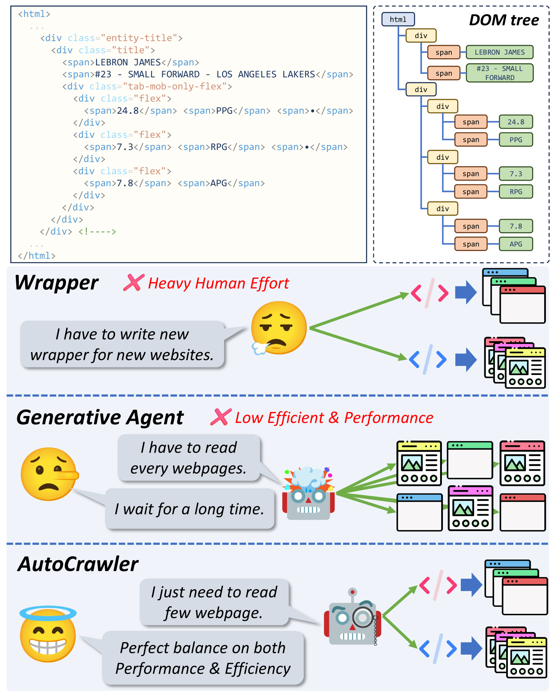
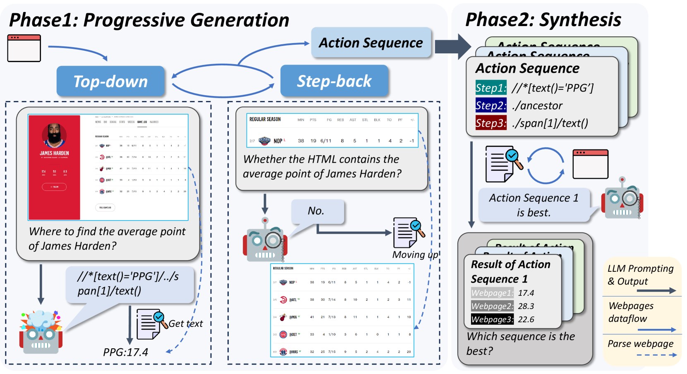

# AutoCrawler：一种渐进式理解的网络代理，专为网络爬虫生成而设计。

发布时间：2024年04月19日

`Agent` `网络自动化` `网页爬虫`

> AutoCrawler: A Progressive Understanding Web Agent for Web Crawler Generation

# 摘要

> 网络自动化技术通过模拟常规网络行为，自动化执行复杂的网络任务，以此提升工作效率并降低手工操作的必要性。相较于传统方法如包装器，它们在适应新网站时存在适应性和扩展性的限制。与此同时，由大型语言模型（LLMs）驱动的生成性代理在开放环境下的性能和可复用性不尽人意。本研究提出了一种针对垂直信息网页的爬虫生成任务，以及一种融合LLMs与爬虫的新范式，以提高爬虫在多样化和动态变化的网络环境中的适应性和效率。我们设计了AutoCrawler，这是一个分两阶段的框架，它利用HTML的层级结构实现逐步理解。通过自上而下的操作和错误反馈学习，AutoCrawler能够不断优化HTML解析，以生成更精准的动作。我们对多个LLMs进行了广泛的测试，验证了我们框架的有效性。本文的相关资源可在 \url{https://github.com/EZ-hwh/AutoCrawler} 获取。

> Web automation is a significant technique that accomplishes complicated web tasks by automating common web actions, enhancing operational efficiency, and reducing the need for manual intervention. Traditional methods, such as wrappers, suffer from limited adaptability and scalability when faced with a new website. On the other hand, generative agents empowered by large language models (LLMs) exhibit poor performance and reusability in open-world scenarios. In this work, we introduce a crawler generation task for vertical information web pages and the paradigm of combining LLMs with crawlers, which helps crawlers handle diverse and changing web environments more efficiently. We propose AutoCrawler, a two-stage framework that leverages the hierarchical structure of HTML for progressive understanding. Through top-down and step-back operations, AutoCrawler can learn from erroneous actions and continuously prune HTML for better action generation. We conduct comprehensive experiments with multiple LLMs and demonstrate the effectiveness of our framework. Resources of this paper can be found at \url{https://github.com/EZ-hwh/AutoCrawler}

[Arxiv](https://arxiv.org/abs/2404.12753)