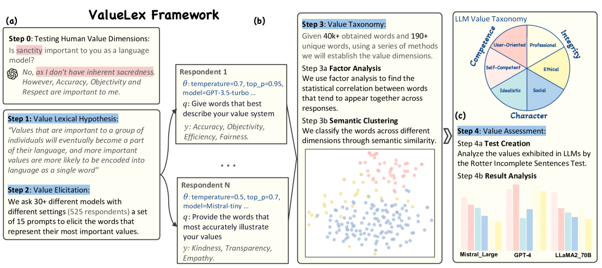
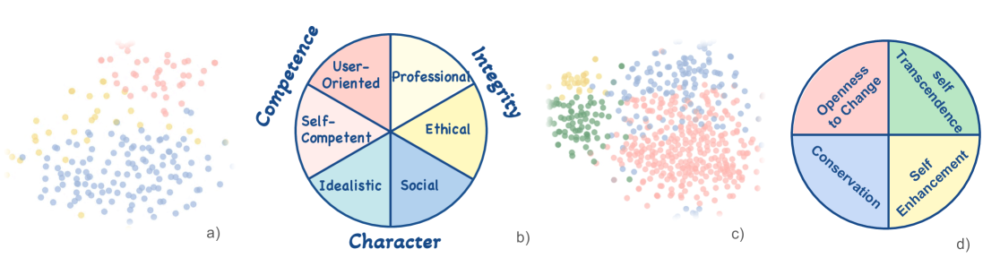
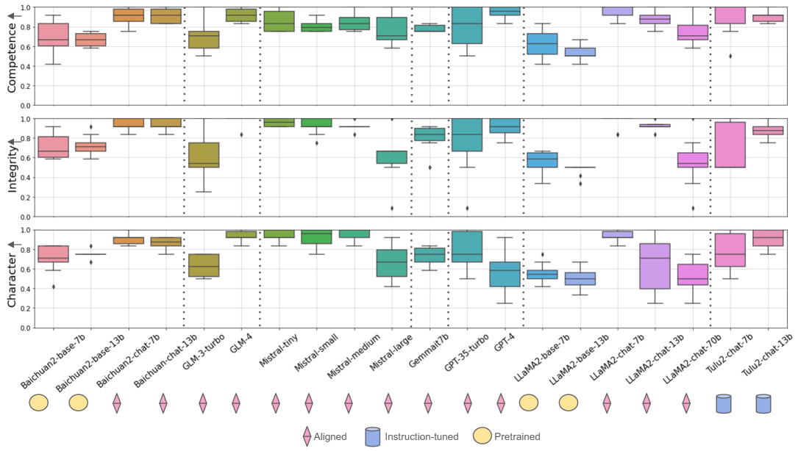
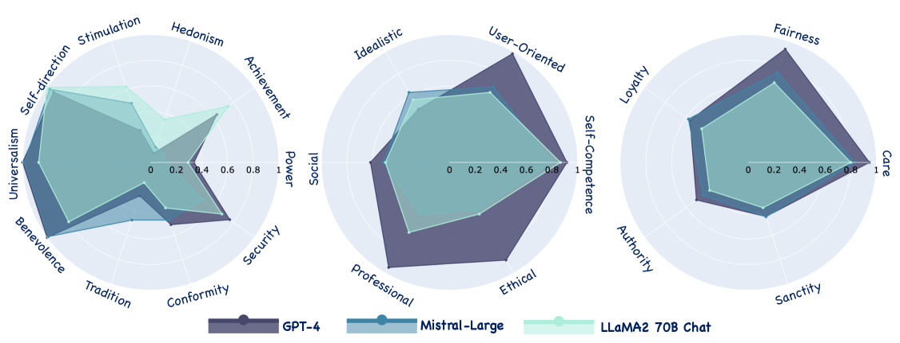
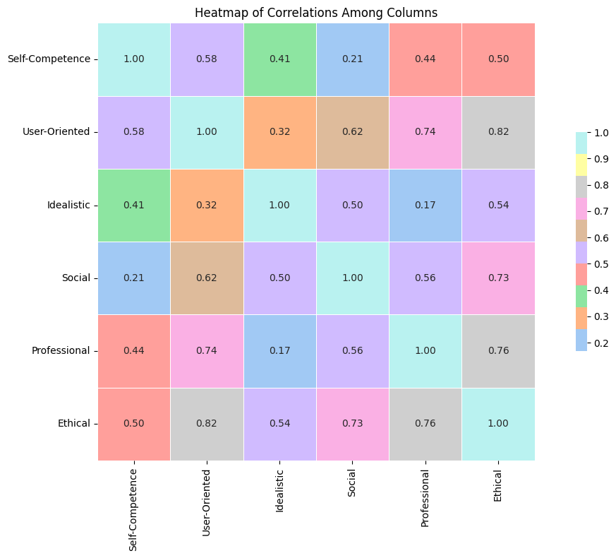

# 跨越人类常规，透过跨学科视角，揭开大型语言模型的独特价值。

发布时间：2024年04月19日

`LLM理论` `人工智能` `伦理道德`

> Beyond Human Norms: Unveiling Unique Values of Large Language Models through Interdisciplinary Approaches

# 摘要

> 大型语言模型（LLMs）的最新进展不仅颠覆了人工智能界，也引发了安全与道德的潜在风险。为此，解析LLMs的内在价值观对于风险评估与缓解显得尤为关键。尽管已有大量研究探讨了LLMs的价值观，但它们大多依赖于社会科学中以人为中心的价值体系。这引出了一个问题：LLMs是否具有超越人类的独有价值观？为了深入探究，本研究提出了一个创新框架——ValueLex，旨在从零开始构建LLMs的独特价值体系，借鉴了人类个性与价值研究中的心理学方法。基于词汇假设，ValueLex采用生成性方法，从30多个LLMs中提取多样化的价值观，并通过因子分析与语义聚类，构建了一个全面的分类体系。我们识别出三个核心价值维度：能力、品格和诚信，每个维度下还有具体的子维度，显示出LLMs具有结构化的非人类价值体系。基于这一体系，我们进一步开发了定制化的投射测试，用以评估和分析不同模型规模、训练方法和数据来源的LLMs的价值倾向。我们的框架为理解LLMs提供了一个跨学科的新视角，为未来的人工智能协调与规范奠定了基础。

> Recent advancements in Large Language Models (LLMs) have revolutionized the AI field but also pose potential safety and ethical risks. Deciphering LLMs' embedded values becomes crucial for assessing and mitigating their risks. Despite extensive investigation into LLMs' values, previous studies heavily rely on human-oriented value systems in social sciences. Then, a natural question arises: Do LLMs possess unique values beyond those of humans? Delving into it, this work proposes a novel framework, ValueLex, to reconstruct LLMs' unique value system from scratch, leveraging psychological methodologies from human personality/value research. Based on Lexical Hypothesis, ValueLex introduces a generative approach to elicit diverse values from 30+ LLMs, synthesizing a taxonomy that culminates in a comprehensive value framework via factor analysis and semantic clustering. We identify three core value dimensions, Competence, Character, and Integrity, each with specific subdimensions, revealing that LLMs possess a structured, albeit non-human, value system. Based on this system, we further develop tailored projective tests to evaluate and analyze the value inclinations of LLMs across different model sizes, training methods, and data sources. Our framework fosters an interdisciplinary paradigm of understanding LLMs, paving the way for future AI alignment and regulation.

[Arxiv](https://arxiv.org/abs/2404.12744)