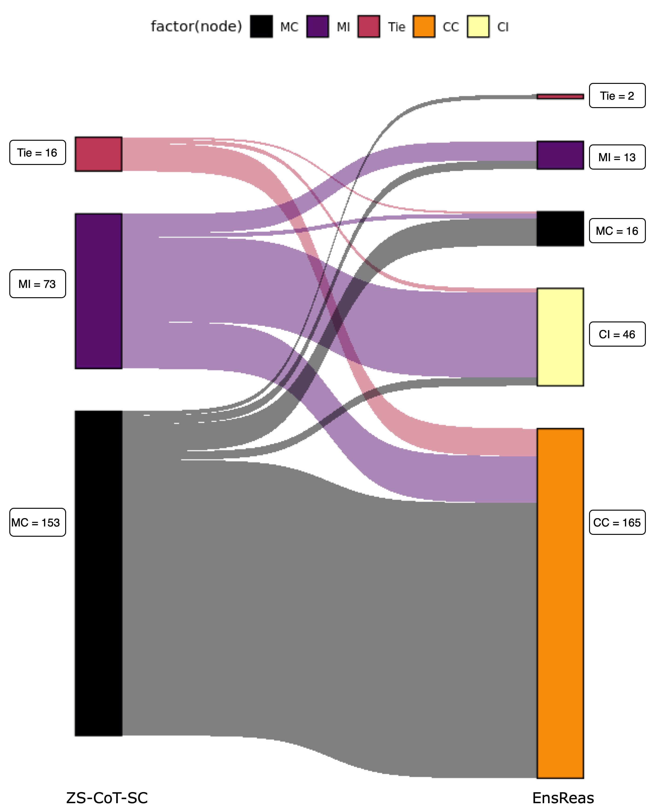
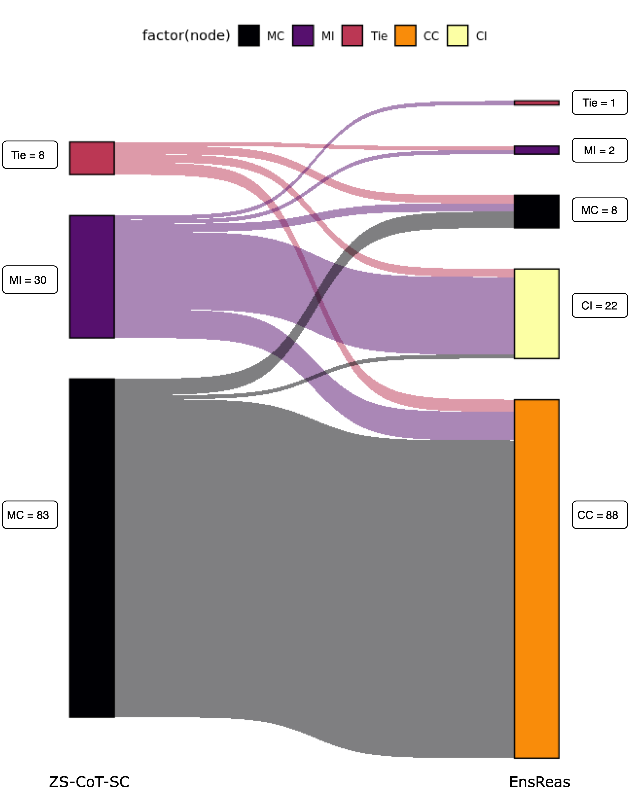

# 超越单一自洽：通过集成推理，大型语言模型在癌症分期任务中的一致性和准确性得到显著提升。

发布时间：2024年04月19日

`LLM应用` `医疗保健`

> Beyond Self-Consistency: Ensemble Reasoning Boosts Consistency and Accuracy of LLMs in Cancer Staging

# 摘要

> 随着大型语言模型（LLMs）技术的不断进步，其在医疗保健行业的应用日益广泛，尤其是在处理包含关键临床信息的非结构化笔记时。例如，临床报告中虽记录了癌症分期状态，但需借助自然语言处理技术来提取这些信息。临床专用的LLMs的发展，让我们看到了在减少算法训练工作量的同时，高效提取此类信息的希望。通过预训练的LLMs的提示方法，如思维链，可以激发模型的推理过程，从而提升生成结果的可信度。此外，自洽性的应用虽然增强了模型的表现，但也可能导致不同推理路径上的结果不一致。本研究提出了一种集成推理方法，以提升模型生成结果的一致性。我们利用一个开放获取的临床大型语言模型，对真实世界的病理报告进行分析，以确定病理癌症分期。研究结果表明，集成推理方法不仅提高了模型在癌症分期判断上的一致性和准确性，也证明了这类模型在临床及其他对可靠性和信任度要求极高的领域中的应用潜力。

> Advances in large language models (LLMs) have encouraged their adoption in the healthcare domain where vital clinical information is often contained in unstructured notes. Cancer staging status is available in clinical reports, but it requires natural language processing to extract the status from the unstructured text. With the advance in clinical-oriented LLMs, it is promising to extract such status without extensive efforts in training the algorithms. Prompting approaches of the pre-trained LLMs that elicit a model's reasoning process, such as chain-of-thought, may help to improve the trustworthiness of the generated responses. Using self-consistency further improves model performance, but often results in inconsistent generations across the multiple reasoning paths. In this study, we propose an ensemble reasoning approach with the aim of improving the consistency of the model generations. Using an open access clinical large language model to determine the pathologic cancer stage from real-world pathology reports, we show that the ensemble reasoning approach is able to improve both the consistency and performance of the LLM in determining cancer stage, thereby demonstrating the potential to use these models in clinical or other domains where reliability and trustworthiness are critical.

[Arxiv](https://arxiv.org/abs/2404.13149)