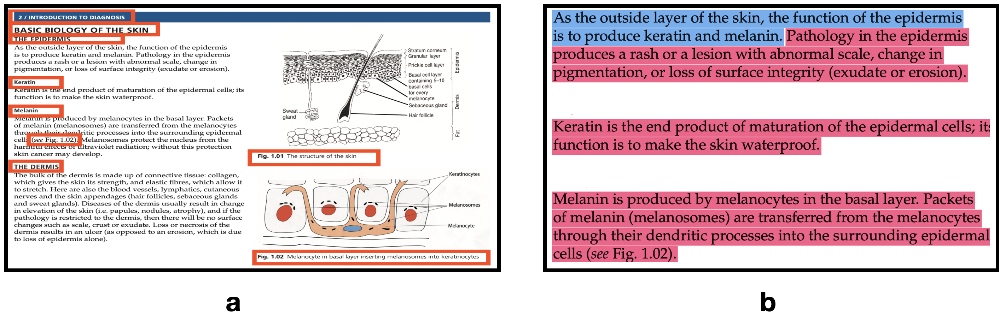

# 为皮肤科学AI中的零样本概念生成进行数据对齐。

发布时间：2024年04月19日

`LLM应用` `皮肤科` `人工智能`

> Data Alignment for Zero-Shot Concept Generation in Dermatology AI

# 摘要

> AI在皮肤科的应用正迅速进步，但高质量数据的匮乏仍是训练可靠分类器的瓶颈。这些数据需要具备对人类有意义的、精确到概念层面的标签。CLIP等基础模型凭借其零样本功能，通过利用网络上海量的图像与标题配对，为这一难题提供了解决方案。通过特定领域的图像与标题配对对CLIP进行微调，可以有效提升分类准确度。尽管如此，CLIP的预训练数据与医生诊断时使用的医学术语并不完全吻合。幸运的是，近年来大型语言模型（LLM）的兴起，让我们看到了利用这些模型的强大表达力来创造丰富文本的希望。我们计划利用这些模型生成既贴近临床词汇，又符合CLIP预训练数据中自然人类语言习惯的标题文本。具体来说，我们首先选取PubMed文献中的图像标题，然后通过在该领域教科书上微调的LLM对这些原始标题进行扩展。实验结果表明，使用经过微调的表达力强的LLM，如GPT-3.5，生成的标题能够显著提升零样本概念分类的性能。

> AI in dermatology is evolving at a rapid pace but the major limitation to training trustworthy classifiers is the scarcity of data with ground-truth concept level labels, which are meta-labels semantically meaningful to humans. Foundation models like CLIP providing zero-shot capabilities can help alleviate this challenge by leveraging vast amounts of image-caption pairs available on the internet. CLIP can be fine-tuned using domain specific image-caption pairs to improve classification performance. However, CLIP's pre-training data is not well-aligned with the medical jargon that clinicians use to perform diagnoses. The development of large language models (LLMs) in recent years has led to the possibility of leveraging the expressive nature of these models to generate rich text. Our goal is to use these models to generate caption text that aligns well with both the clinical lexicon and with the natural human language used in CLIP's pre-training data. Starting with captions used for images in PubMed articles, we extend them by passing the raw captions through an LLM fine-tuned on the field's several textbooks. We find that using captions generated by an expressive fine-tuned LLM like GPT-3.5 improves downstream zero-shot concept classification performance.

[Arxiv](https://arxiv.org/abs/2404.13043)