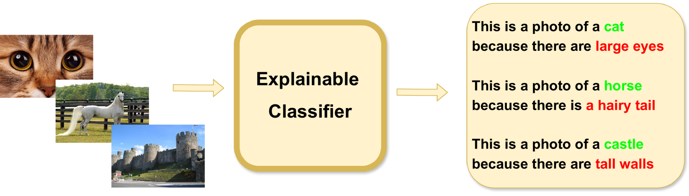
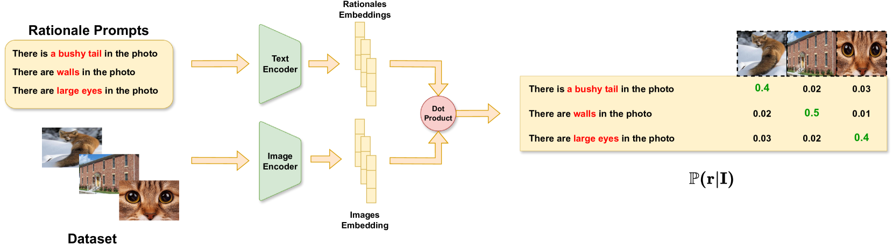
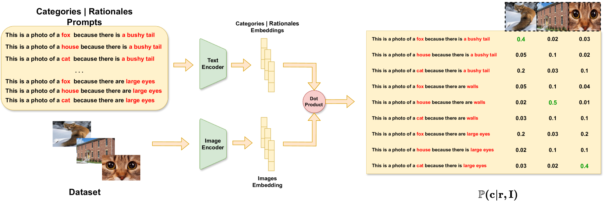
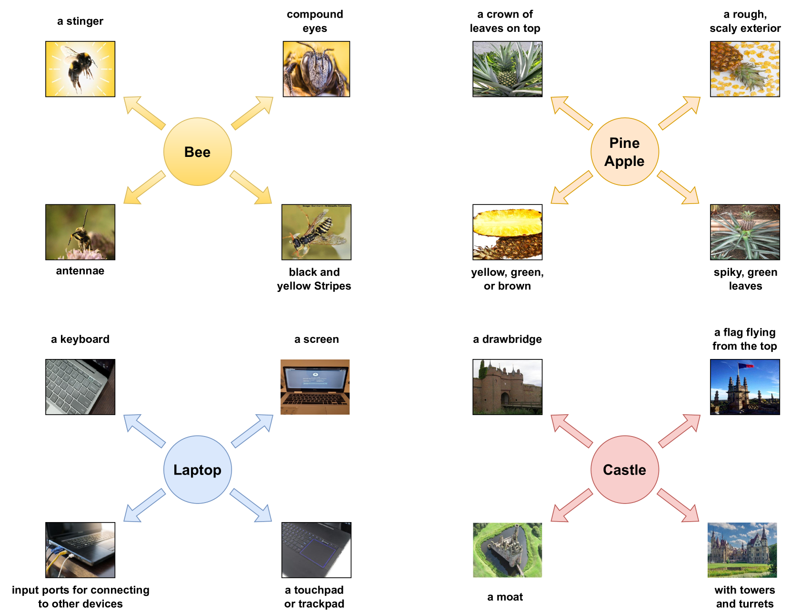
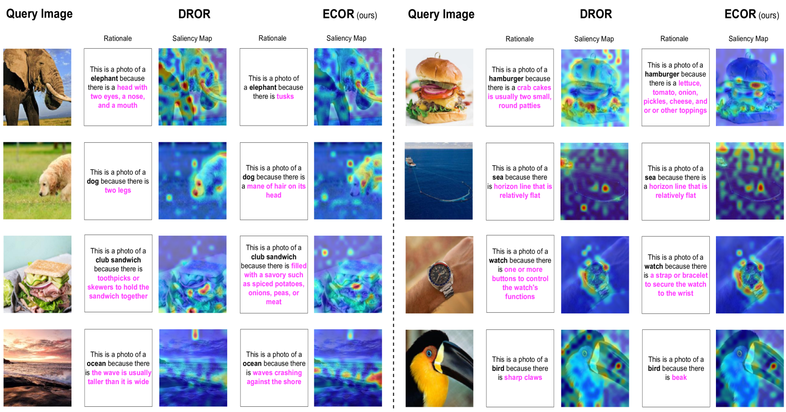

# ECOR：为对象识别提供可解释性的 CLIP

发布时间：2024年04月19日

`分类：LLM应用` `计算机视觉` `可解释性`

> ECOR: Explainable CLIP for Object Recognition

# 摘要

> 诸如 CLIP 这样的大型视觉语言模型（VLMs）在计算机视觉领域，包括物体识别和检测任务中，取得了显著成就，其开放词汇特性进一步提升了它们的实用性。然而，这些模型的黑箱特性和预测的不透明性，在关键领域中引发了信任问题。近期，研究者已尝试让 VLMs 在物体识别中提供更合理的解释，但这往往以牺牲准确率为代价。本文首先提出了一种基于类别和解释的联合概率分布的可解释性数学定义，随后利用这一定义对 CLIP 进行了可解释性的微调。在多个数据集上的评估显示，我们的方法在可解释分类任务上达到了行业领先水平，尤其在零样本场景下表现卓越，显示了其强大的适应性。这一进展不仅提升了物体识别的可解释性，也增强了在多样化应用中的信任度。相关代码将在论文发表后公开提供。

> Large Vision Language Models (VLMs), such as CLIP, have significantly contributed to various computer vision tasks, including object recognition and object detection. Their open vocabulary feature enhances their value. However, their black-box nature and lack of explainability in predictions make them less trustworthy in critical domains. Recently, some work has been done to force VLMs to provide reasonable rationales for object recognition, but this often comes at the expense of classification accuracy. In this paper, we first propose a mathematical definition of explainability in the object recognition task based on the joint probability distribution of categories and rationales, then leverage this definition to fine-tune CLIP in an explainable manner. Through evaluations of different datasets, our method demonstrates state-of-the-art performance in explainable classification. Notably, it excels in zero-shot settings, showcasing its adaptability. This advancement improves explainable object recognition, enhancing trust across diverse applications. The code will be made available online upon publication.

[Arxiv](https://arxiv.org/abs/2404.12839)