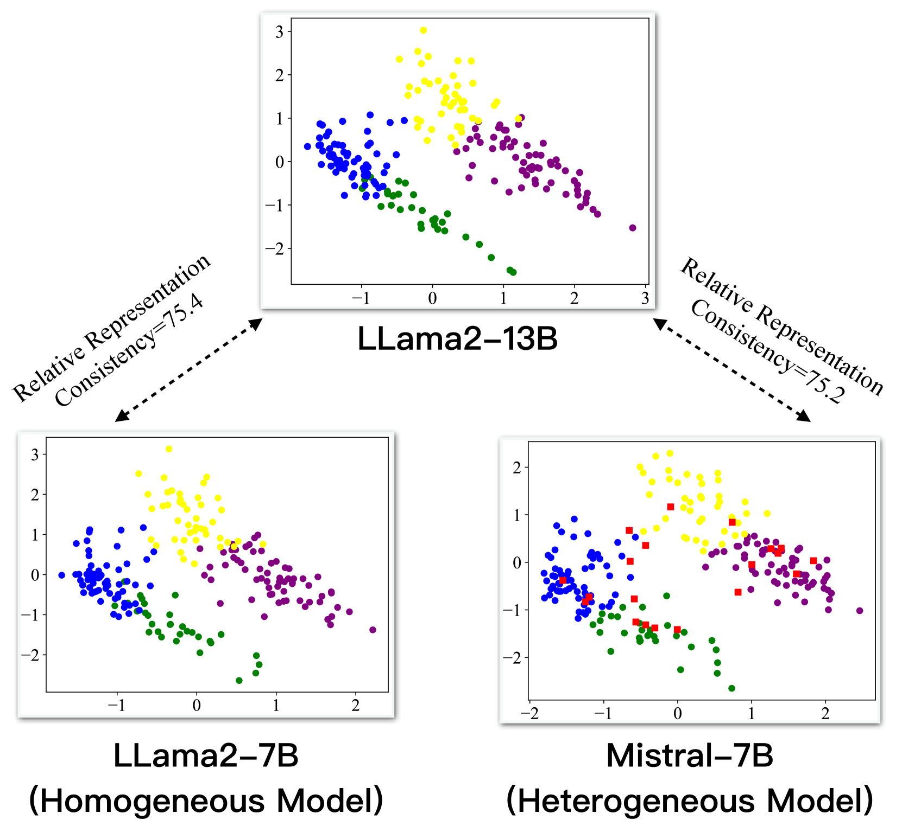
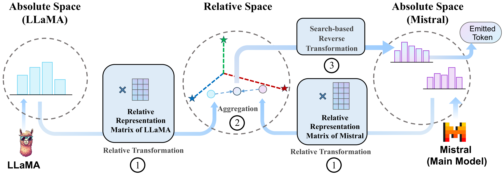
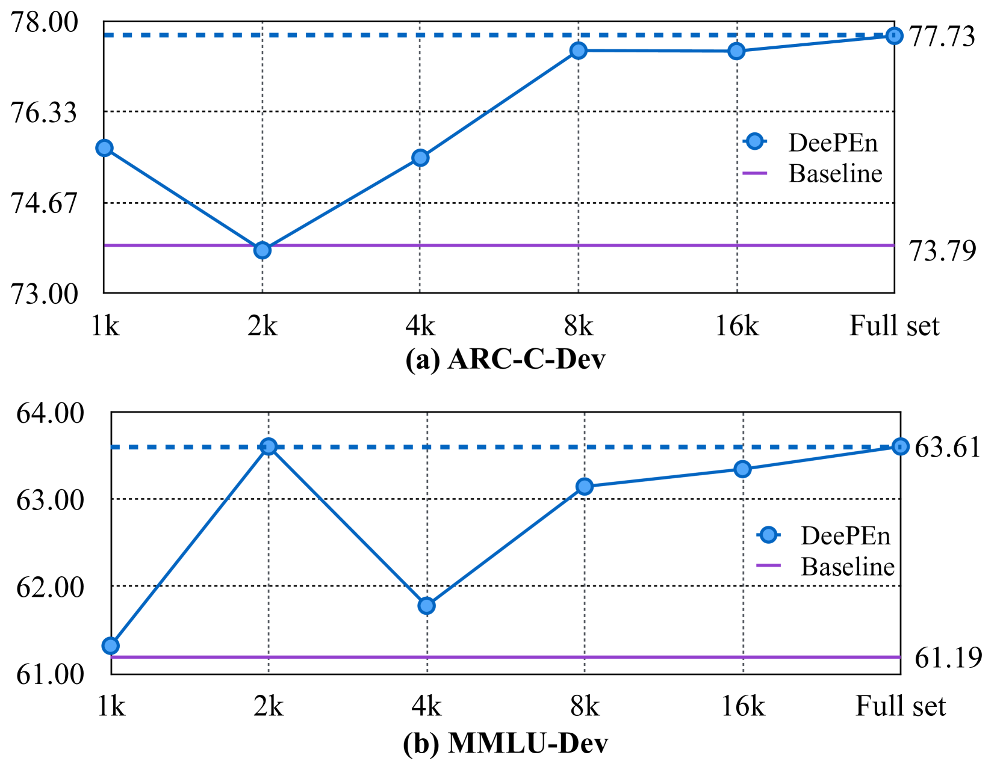
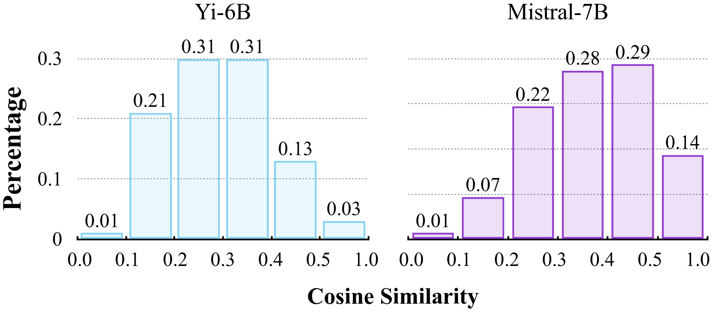
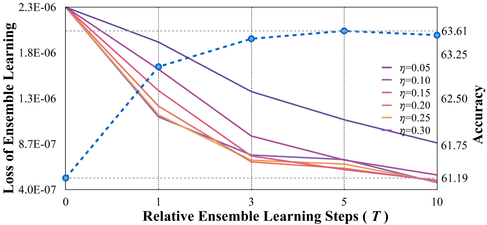

# 通过深度并行合作，实现异构大型语言模型的集成学习。

发布时间：2024年04月19日

`LLM应用` `人工智能`

> Enabling Ensemble Learning for Heterogeneous Large Language Models with Deep Parallel Collaboration

# 摘要

> 大型语言模型（LLMs）在多样化的任务和场景中展现了各自的独到之处，这激发了集合这些模型的研究热情，旨在借助群体智慧的力量，进一步拓展技术的边界。目前的研究尝试通过训练额外的奖励模型或融合模型来筛选或整合所有可能的答案，但这些方法对模型的泛化能力提出了严峻的考验。而且，现有技术多以文本回答作为交互媒介，未能充分利用神经网络内部表示的丰富信息。为此，我们提出了一种无需训练的集合框架DEEPEN，通过平均多个LLMs输出的概率分布来实现。在这一框架中，不同模型间词汇的差异是一个主要挑战，它妨碍了概率分布的平均化操作。DEEPEN通过将每个模型的概率分布从概率空间映射到基于相对表示理论的宇宙相对空间，并在此空间中进行聚合，从而解决了这一问题。聚合后的结果再通过搜索式的逆变换映射回某个LLM的概率空间，以确定生成的令牌。我们在6B至70B规模的多种LLMs集合上进行了实验，实验结果显示DEEPEN在六个广泛认可的基准测试中均取得了显著提升，这些测试涵盖了主题检查、推理和知识问答等领域，从而验证了我们方法的有效性。

> Large language models (LLMs) have shown complementary strengths in various tasks and instances, motivating the research of ensembling LLMs to push the frontier leveraging the wisdom of the crowd. Existing work achieves this objective via training the extra reward model or fusion model to select or fuse all candidate answers. However, these methods pose a great challenge to the generalizability of the trained models. Besides, existing methods use the textual responses as communication media, ignoring the rich information in the inner representations of neural networks. Therefore, we propose a training-free ensemble framework DEEPEN, averaging the probability distributions outputted by different LLMs. A key challenge in this paradigm is the vocabulary discrepancy between heterogeneous LLMs, which hinders the operation of probability distribution averaging. To address this challenge, DEEPEN maps the probability distribution of each model from the probability space to a universe relative space based on the relative representation theory, and performs aggregation. Then, the result of aggregation is mapped back to the probability space of one LLM via a search-based inverse transformation to determine the generated token. We conduct experiments on the ensemble of various LLMs of 6B to 70B. Experimental results show that DEEPEN achieves consistent improvements across six popular benchmarks involving subject examination, reasoning and knowledge-QA, proving the effectiveness of our approach.

[Arxiv](https://arxiv.org/abs/2404.12715)