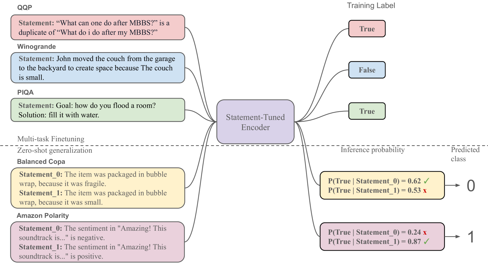
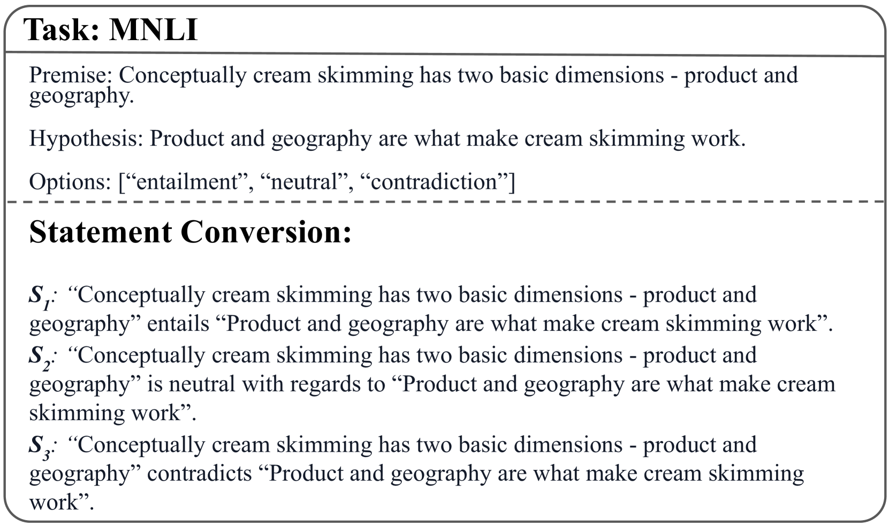
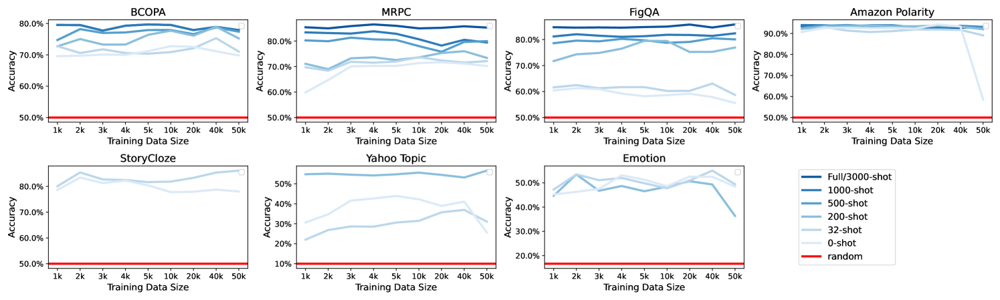
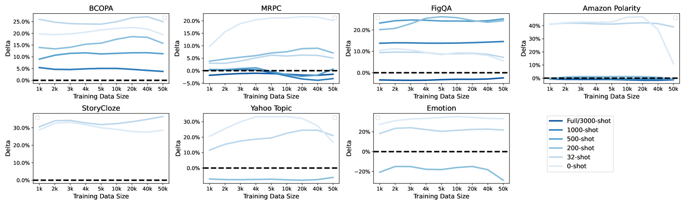
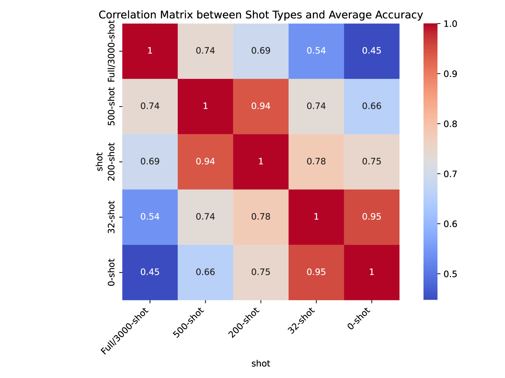
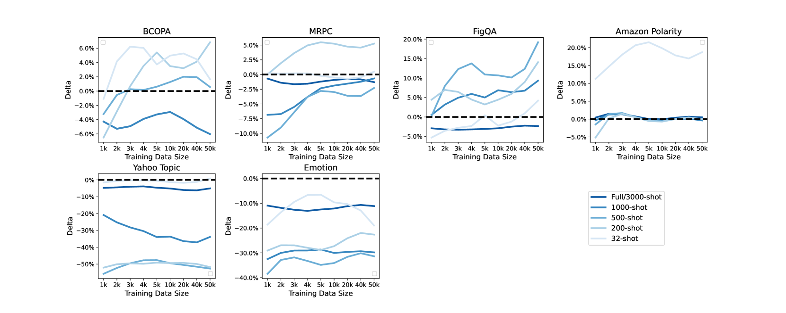

# 通过声明调优技术，实现了在编码器模型上的自然零样本提示功能。

发布时间：2024年04月19日

`LLM应用` `机器学习`

> Enabling Natural Zero-Shot Prompting on Encoder Models via Statement-Tuning

# 摘要

> 大型语言模型（LLMs）在零样本和少样本情境下表现出色，但往往需要巨大的计算资源。与此同时，小型的掩蔽语言模型（MLMs），如BERT和RoBERTa，虽然通过微调达到了顶尖成绩，却因架构限制在扩展至少样本和零样本场景时表现不佳。为此，我们引入了一种名为“声明调整”（Statement-Tuning）的技术，它将区分性任务视作一系列有限的陈述，通过训练编码器模型来辨别这些陈述，从而确定标签。我们对多项任务实施了声明调整，以促进任务间的泛化。实验结果显示，声明调整在参数数量显著减少的情况下，与顶级的LLMs相比，仍能展现出匹敌的性能。此外，研究还考察了不同设计选择对少样本和零样本泛化的影响，发现声明调整在适度的训练数据下就能达到足够的性能，并能从任务和陈述的多样性中获益，从而提高对未见任务的泛化能力。

> While Large Language Models (LLMs) exhibit remarkable capabilities in zero-shot and few-shot scenarios, they often require computationally prohibitive sizes. Conversely, smaller Masked Language Models (MLMs) like BERT and RoBERTa achieve state-of-the-art results through fine-tuning but struggle with extending to few-shot and zero-shot settings due to their architectural constraints. Hence, we propose Statement-Tuning, a technique that models discriminative tasks as a set of finite statements and trains an Encoder model to discriminate between the potential statements to determine the label. We do Statement-Tuning on multiple tasks to enable cross-task generalization. Experimental results demonstrate that Statement Tuning achieves competitive performance compared to state-of-the-art LLMs with significantly fewer parameters. Moreover, the study investigates the impact of several design choices on few-shot and zero-shot generalization, revealing that Statement Tuning can achieve sufficient performance with modest training data and benefits from task and statement diversity for unseen task generalizability.

[Arxiv](https://arxiv.org/abs/2404.12897)