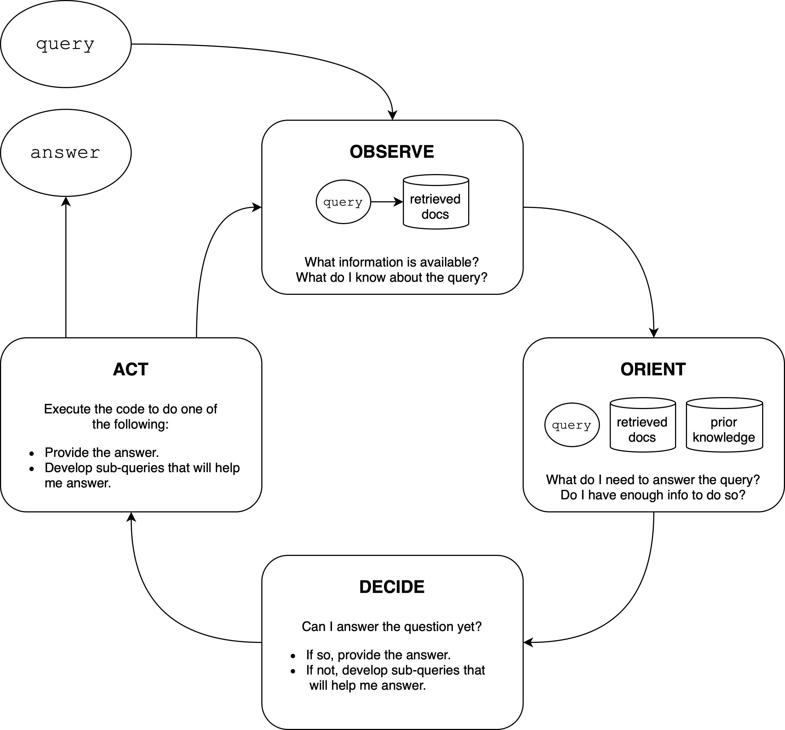
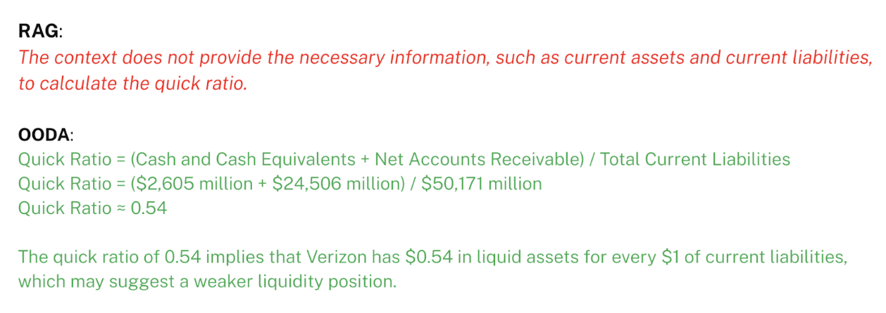
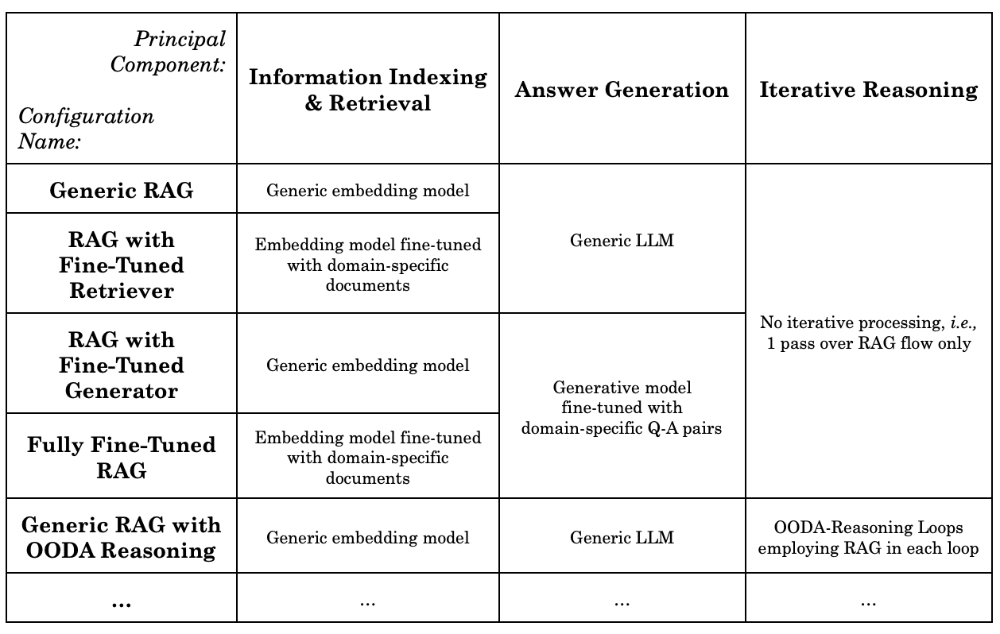
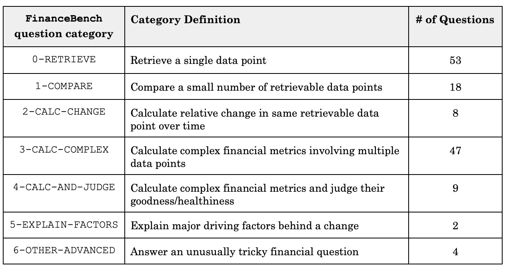

# 通过针对性领域微调和循环推理，提升问答系统性能：一项对比分析

发布时间：2024年04月19日

`分类：RAG

这篇论文主要探讨了基于大型语言模型（LLMs）和增强检索生成（RAG）技术的问答（Q&A）系统性能的影响。论文中提到了领域定制化模型微调和推理机制对于系统性能的提升，以及通过FinanceBench SEC财务文件数据集的分析得出的结论。此外，论文还讨论了技术设计框架和为AI团队提供实用的指导。这些内容都与RAG技术紧密相关，因此将这篇论文归类为RAG。` `问答系统`

> Enhancing Q&A with Domain-Specific Fine-Tuning and Iterative Reasoning: A Comparative Study

# 摘要

> 本研究探讨了领域定制化模型微调和推理机制对于基于大型语言模型（LLMs）和增强检索生成（RAG）技术的问答（Q&A）系统性能的影响。通过FinanceBench SEC财务文件数据集的分析，我们发现，在RAG系统中，结合领域定制化的嵌入模型与LLM可以显著提升准确性，尤其是定制化嵌入模型的贡献更为显著。进一步地，引入推理迭代机制能够显著提升性能，使得Q&A系统的表现更接近人类专家水平。文章还讨论了这些发现的意义，提出了一个涵盖Q&A AI主要技术组件的结构化技术设计框架，并为这些组件的技术选择提供了指导建议。我们将继续开展工作，为AI团队提供实用的指导，并深入研究RAG中领域定制化增强的影响以及代理AI的能力，如高级规划和推理。

> This paper investigates the impact of domain-specific model fine-tuning and of reasoning mechanisms on the performance of question-answering (Q&A) systems powered by large language models (LLMs) and Retrieval-Augmented Generation (RAG). Using the FinanceBench SEC financial filings dataset, we observe that, for RAG, combining a fine-tuned embedding model with a fine-tuned LLM achieves better accuracy than generic models, with relatively greater gains attributable to fine-tuned embedding models. Additionally, employing reasoning iterations on top of RAG delivers an even bigger jump in performance, enabling the Q&A systems to get closer to human-expert quality. We discuss the implications of such findings, propose a structured technical design space capturing major technical components of Q&A AI, and provide recommendations for making high-impact technical choices for such components. We plan to follow up on this work with actionable guides for AI teams and further investigations into the impact of domain-specific augmentation in RAG and into agentic AI capabilities such as advanced planning and reasoning.

[Arxiv](https://arxiv.org/abs/2404.11792)