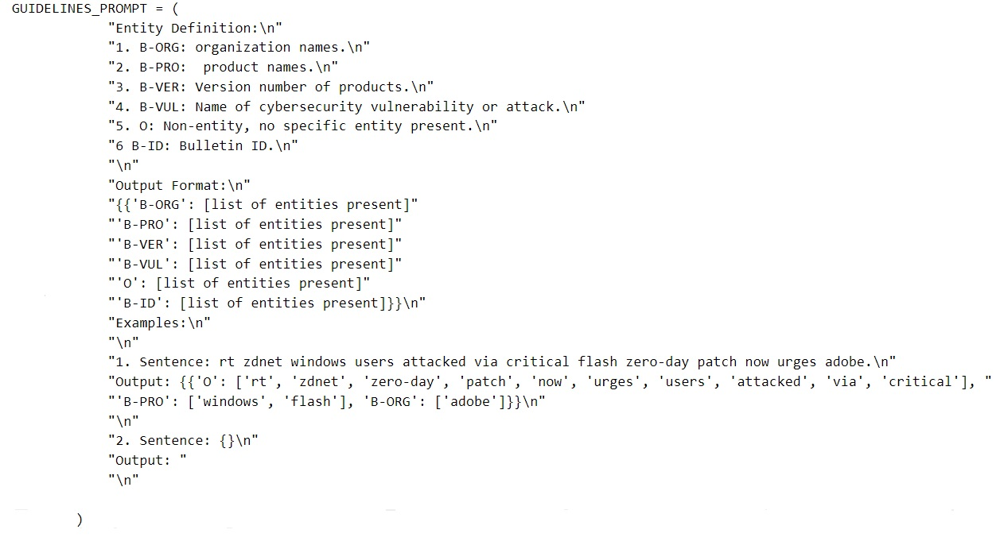
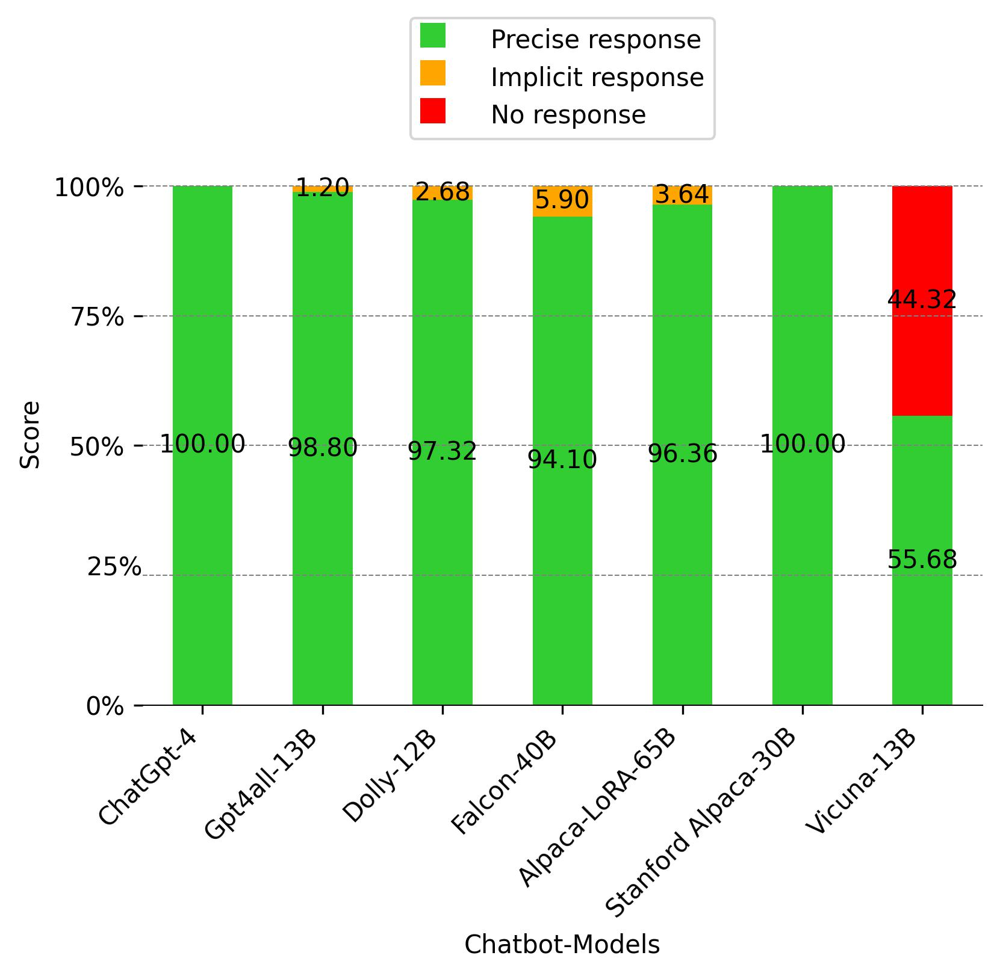
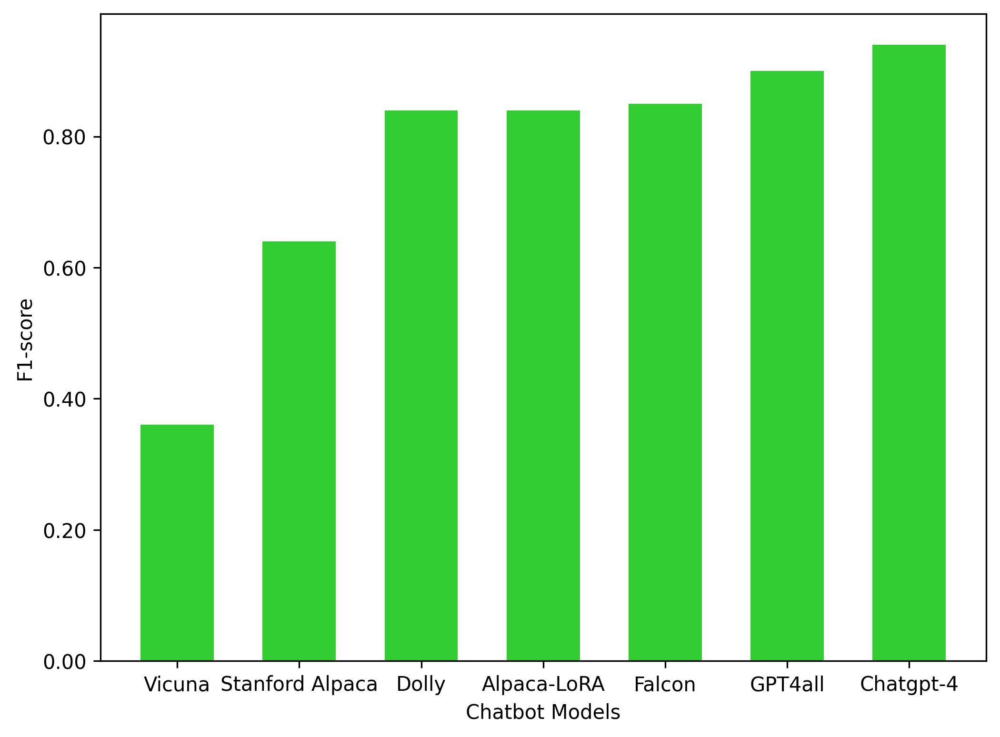

# 大型语言模型聊天机器人在开源情报驱动的网络威胁意识评估

发布时间：2024年04月19日

`LLM应用

这篇论文主要探讨了大型语言模型（LLM）在网络安全领域的应用，特别是在网络威胁情报（CTI）的构建中，通过评估多个聊天机器人在开源情报（OSINT）的二元分类和命名实体识别（NER）任务中的表现。研究比较了这些聊天机器人与专门训练的模型之间的竞争力，并指出了LLM聊天机器人在NER任务上的不足，提出了改进方向。因此，这篇论文属于LLM应用分类。` `网络安全` `情报分析`

> Evaluation of LLM Chatbots for OSINT-based Cyber Threat Awareness

# 摘要

> 在网络安全领域，快速分享新兴威胁的知识至关重要，这是构建网络威胁情报（CTI）的基石。大型语言模型在此领域的重要性日益凸显，为各种应用提供了广阔前景。本研究评估了ChatGPT、GPT4all、Dolly、Stanford Alpaca、Alpaca-LoRA、Falcon和Vicuna等聊天机器人在利用开源情报（OSINT）进行二元分类和命名实体识别（NER）任务中的表现。通过分析先前研究中从Twitter收集的数据，我们比较了这些聊天机器人与专门训练的模型之间的竞争力。在二元分类测试中，商业模型Chatbot GPT-4的F1分数达到0.94，而开源模型GPT4all为0.90。但在网络安全实体识别方面，所有聊天机器人的表现均不尽如人意。研究显示，尽管聊天机器人在OSINT二元分类上表现出色，但在NER任务上仍需提升，以替代专业模型。我们的发现揭示了LLM聊天机器人在与专业模型对比时的不足，为研究人员提供了改进方向，旨在简化基于OSINT的CTI工具中机器学习的集成过程。

> Knowledge sharing about emerging threats is crucial in the rapidly advancing field of cybersecurity and forms the foundation of Cyber Threat Intelligence (CTI). In this context, Large Language Models are becoming increasingly significant in the field of cybersecurity, presenting a wide range of opportunities. This study surveys the performance of ChatGPT, GPT4all, Dolly, Stanford Alpaca, Alpaca-LoRA, Falcon, and Vicuna chatbots in binary classification and Named Entity Recognition (NER) tasks performed using Open Source INTelligence (OSINT). We utilize well-established data collected in previous research from Twitter to assess the competitiveness of these chatbots when compared to specialized models trained for those tasks. In binary classification experiments, Chatbot GPT-4 as a commercial model achieved an acceptable F1 score of 0.94, and the open-source GPT4all model achieved an F1 score of 0.90. However, concerning cybersecurity entity recognition, all evaluated chatbots have limitations and are less effective. This study demonstrates the capability of chatbots for OSINT binary classification and shows that they require further improvement in NER to effectively replace specially trained models. Our results shed light on the limitations of the LLM chatbots when compared to specialized models, and can help researchers improve chatbots technology with the objective to reduce the required effort to integrate machine learning in OSINT-based CTI tools.

[Arxiv](https://arxiv.org/abs/2401.15127)