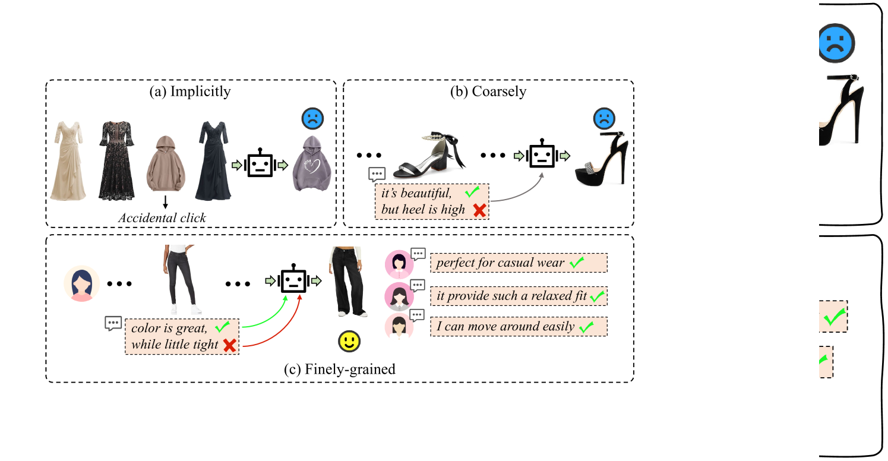
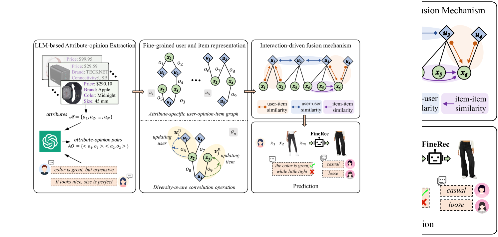
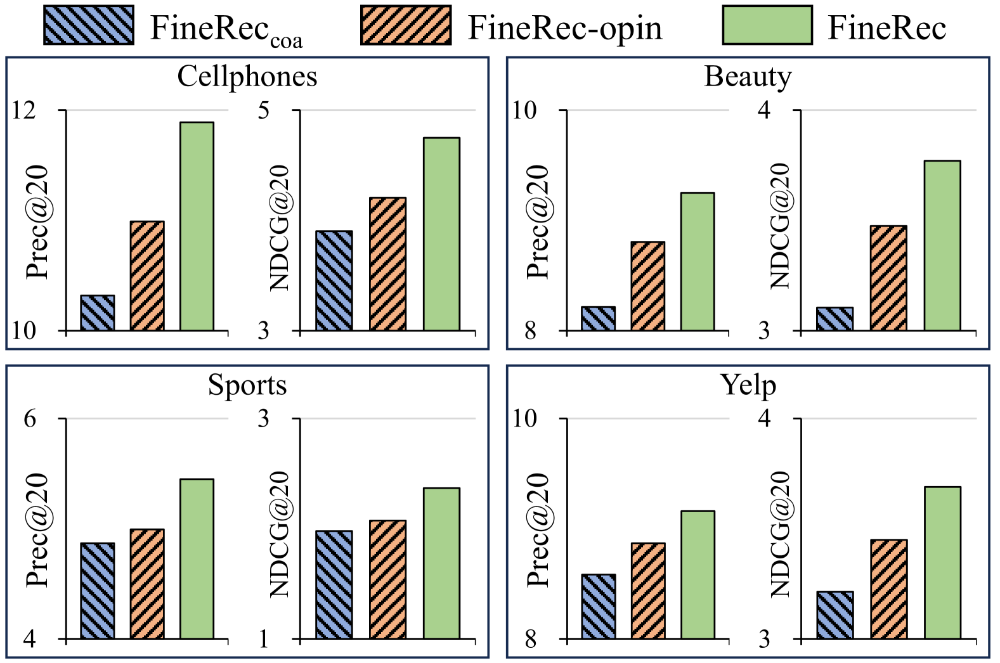
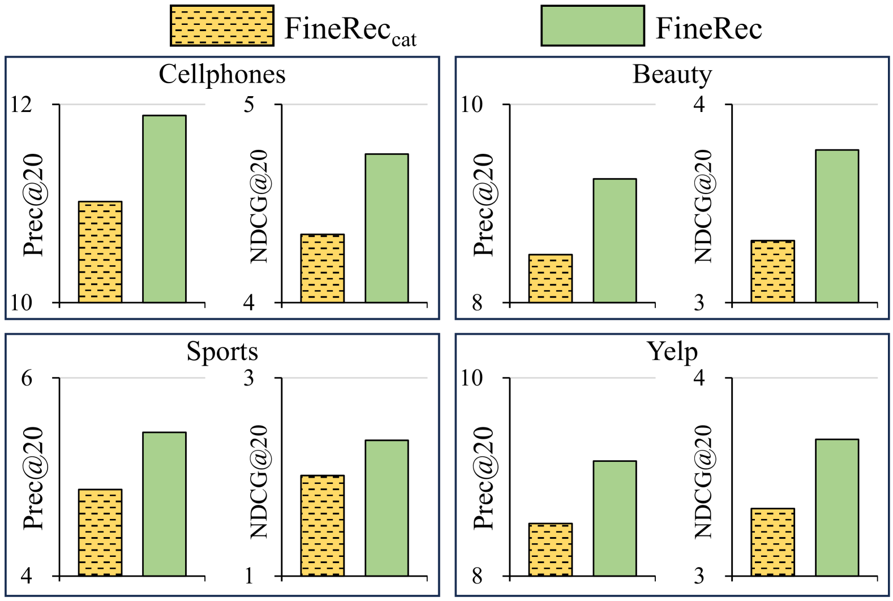
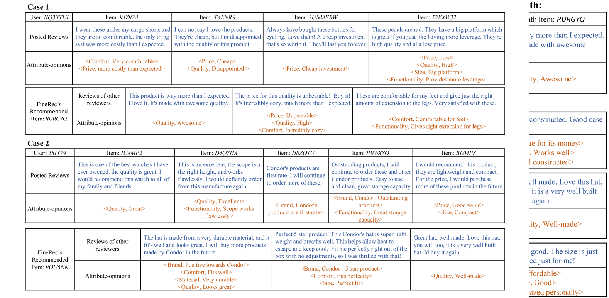

# FineRec：深入挖掘细粒度的序列化推荐技术

发布时间：2024年04月19日

`LLM应用` `电子商务` `推荐系统`

> FineRec:Exploring Fine-grained Sequential Recommendation

# 摘要

> 序列推荐旨在根据用户过往行为推荐他们可能感兴趣的商品。用户在商品评论中表达的属性-观点配对，能够细致捕捉用户的偏好和商品特征。为此，我们设计了一种创新的框架——FineRec，它利用评论中的属性-观点配对进行细致的序列推荐处理。具体而言，我们利用大型语言模型从评论中提炼出属性-观点配对。针对每个属性，构建一个独特的用户-观点-商品图谱，其中相关观点作为连接不同用户和商品节点的纽带。为了处理观点的多样性，我们开发了一种注重多样性的卷积运算，以在图谱内部聚合信息，实现针对特定属性的用户和商品表示学习。最终，我们引入了一个由交互驱动的融合机制，整合所有属性中的特定用户/商品表示，以生成推荐。在多个真实世界数据集上的广泛实验证明了FineRec相较于现有顶尖方法的优越性。进一步的分析也证实了我们细致处理任务方法的有效性。

> Sequential recommendation is dedicated to offering items of interest for users based on their history behaviors. The attribute-opinion pairs, expressed by users in their reviews for items, provide the potentials to capture user preferences and item characteristics at a fine-grained level. To this end, we propose a novel framework FineRec that explores the attribute-opinion pairs of reviews to finely handle sequential recommendation. Specifically, we utilize a large language model to extract attribute-opinion pairs from reviews. For each attribute, a unique attribute-specific user-opinion-item graph is created, where corresponding opinions serve as the edges linking heterogeneous user and item nodes. To tackle the diversity of opinions, we devise a diversity-aware convolution operation to aggregate information within the graphs, enabling attribute-specific user and item representation learning. Ultimately, we present an interaction-driven fusion mechanism to integrate attribute-specific user/item representations across all attributes for generating recommendations. Extensive experiments conducted on several realworld datasets demonstrate the superiority of our FineRec over existing state-of-the-art methods. Further analysis also verifies the effectiveness of our fine-grained manner in handling the task.

[Arxiv](https://arxiv.org/abs/2404.12975)