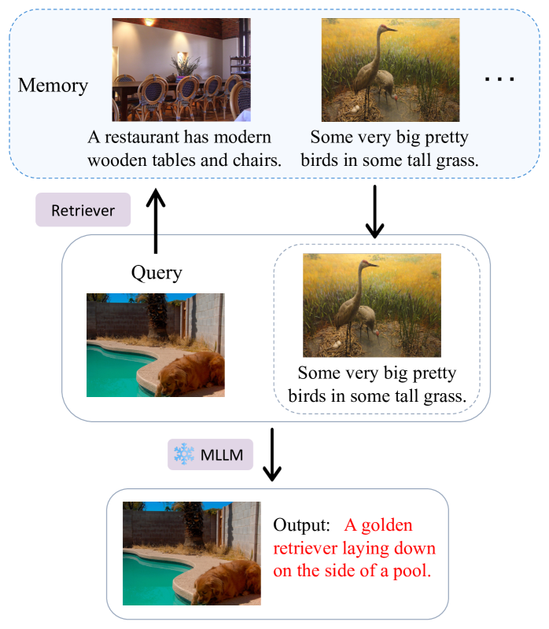
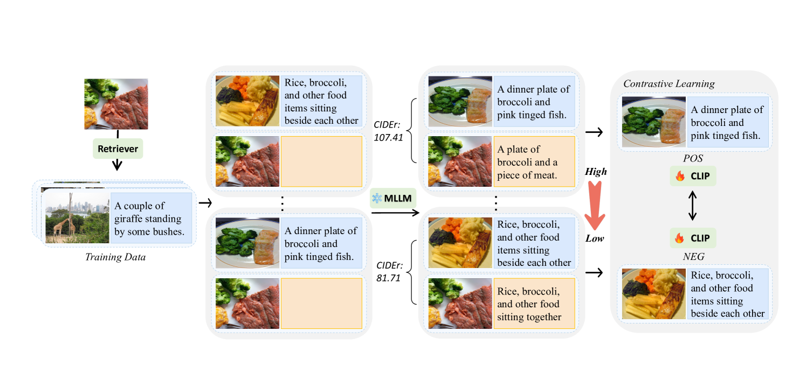
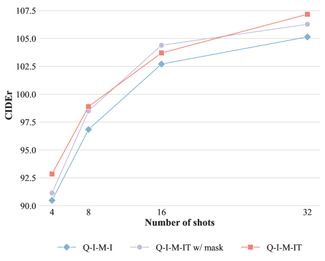
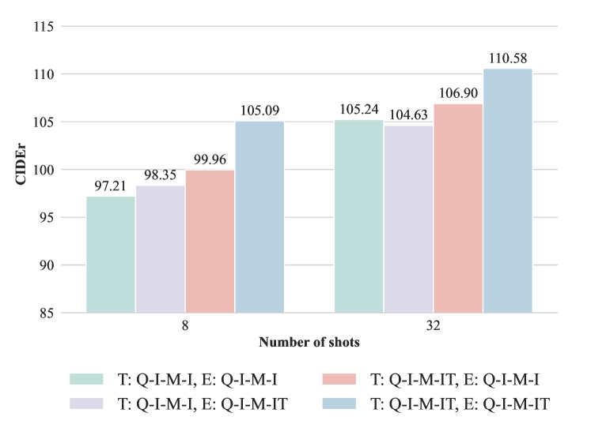
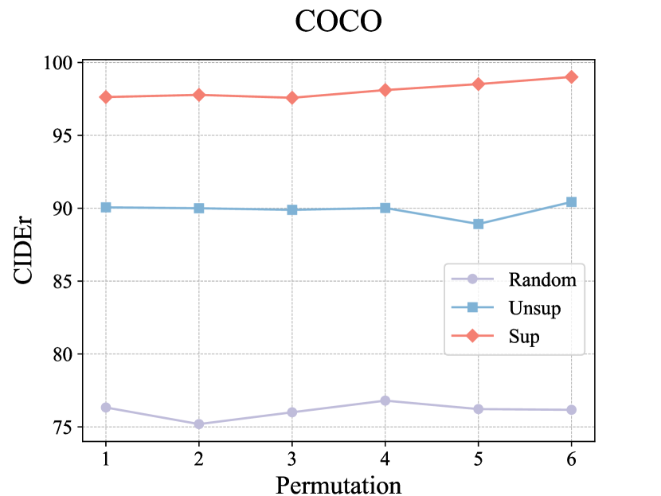
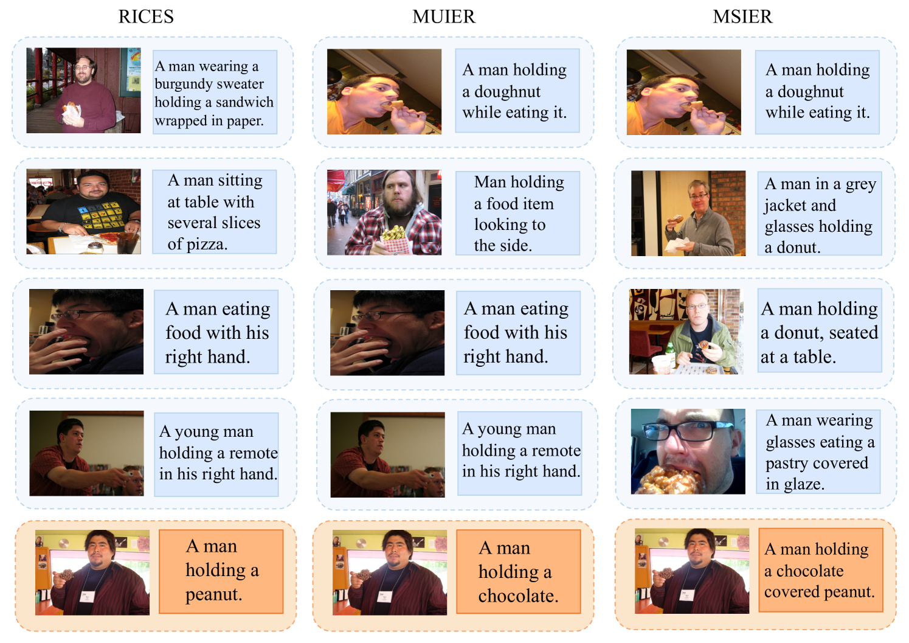

# 文本信息对多模态上下文内学习的信息检索有何影响？

发布时间：2024年04月19日

`LLM应用` `人工智能` `多模态学习`

> How Does the Textual Information Affect the Retrieval of Multimodal In-Context Learning?

# 摘要

> 随着多模态大型语言模型（MLLMs）参数规模的提升，它们在上下文学习方面展现出了显著的学习能力，尤其是在无需调整预训练参数的情况下，就能提升任务执行效率。然而，这种效率的提升在很大程度上依赖于对上下文示例的正确选择，目前这一选择过程存在偏差，更倾向于视觉数据，而忽略了文本信息。对于优化上下文示例选择至关重要的监督检索器领域，在MLLMs中的应用尚未得到充分研究。本研究深入分析了文本信息对多模态上下文中无监督选取示例的影响，发现检索器的性能对所采用的信息类型极为敏感。为此，我们提出了一种创新的监督MLLM-检索器MSIER，该检索器利用神经网络挑选能够提升多模态上下文学习效率的示例。这一方法经过三个不同任务的广泛测试，证实了其有效性。同时，我们还探讨了模态对我们监督检索方法训练的影响，并识别了促进模型成功的关键因素。这项研究为未来的技术进步提供了新的方向，展示了通过策略性地运用多模态数据，MLLMs在上下文学习方面的精细化潜力。

> The increase in parameter size of multimodal large language models (MLLMs) introduces significant capabilities, particularly in-context learning, where MLLMs enhance task performance without updating pre-trained parameters. This effectiveness, however, hinges on the appropriate selection of in-context examples, a process that is currently biased towards visual data, overlooking textual information. Furthermore, the area of supervised retrievers for MLLMs, crucial for optimal in-context example selection, continues to be uninvestigated. Our study offers an in-depth evaluation of the impact of textual information on the unsupervised selection of in-context examples in multimodal contexts, uncovering a notable sensitivity of retriever performance to the employed modalities. Responding to this, we introduce a novel supervised MLLM-retriever MSIER that employs a neural network to select examples that enhance multimodal in-context learning efficiency. This approach is validated through extensive testing across three distinct tasks, demonstrating the method's effectiveness. Additionally, we investigate the influence of modalities on our supervised retrieval method's training and pinpoint factors contributing to our model's success. This exploration paves the way for future advancements, highlighting the potential for refined in-context learning in MLLMs through the strategic use of multimodal data.

[Arxiv](https://arxiv.org/abs/2404.12866)