# 实用的函数级程序修复能带我们走多远？

发布时间：2024年04月19日

`LLM应用` `软件工程` `自动化程序修复`

> How Far Can We Go with Practical Function-Level Program Repair?

# 摘要

> 近期，基于大型语言模型（LLMs）的多种自动化程序修复（APR）技术应运而生，旨在提升修复效能。这些技术虽集中于单行或局部代码块的修复，却因修复范围有限和成本高昂的语句级故障定位而在现实世界应用中遭遇挑战。相较于此，更为实际的函数级APR技术，它将APR任务的视野扩展至修复整个问题函数，并仅需经济的函数级故障定位，这一领域尚未得到充分挖掘。在本篇论文中，我们首度全面审视了基于LLM的函数级APR，探究了少量学习机制和辅助性修复信息的影响。具体而言，我们选取了六种广泛研究的LLMs，并在Defects4J 1.2和2.0数据集上构建了基准测试。研究发现，采用零样本学习机制的LLMs本身已是高效的函数级APR技术，而引入少量学习机制则导致修复效果的显著差异。此外，我们将辅助性修复信息直接应用于LLMs，显著提升了函数级修复的效果。基于这些发现，我们提出了一种名为SRepair的基于LLM的函数级APR技术，该技术采用双LLM架构，充分利用辅助性修复信息以提升修复效能。评估结果显示，SRepair能够准确修复Defects4J数据集中的300个单一函数缺陷，修复成功率远超此前所有APR技术至少85%，且无需进行成本高昂的语句级故障定位。更进一步，SRepair还成功修复了Defects4J数据集中的32个多函数缺陷，据我们所知，这是APR技术首次达到的成就。

> Recently, multiple Automated Program Repair (APR) techniques based on Large Language Models (LLMs) have been proposed to enhance the repair performance. While these techniques mainly focus on the single-line or hunk-level repair, they face significant challenges in real-world application due to the limited repair task scope and costly statement-level fault localization. However, the more practical function-level APR, which broadens the scope of APR task to fix entire buggy functions and requires only cost-efficient function-level fault localization, remains underexplored. In this paper, we conduct the first comprehensive study of LLM-based function-level APR including investigating the effect of the few-shot learning mechanism and the auxiliary repair-relevant information. Specifically, we adopt six widely-studied LLMs and construct a benchmark in both the Defects4J 1.2 and 2.0 datasets. Our study demonstrates that LLMs with zero-shot learning are already powerful function-level APR techniques, while applying the few-shot learning mechanism leads to disparate repair performance. Moreover, we find that directly applying the auxiliary repair-relevant information to LLMs significantly increases function-level repair performance. Inspired by our findings, we propose an LLM-based function-level APR technique, namely SRepair, which adopts a dual-LLM framework to leverage the power of the auxiliary repair-relevant information for advancing the repair performance. The evaluation results demonstrate that SRepair can correctly fix 300 single-function bugs in the Defects4J dataset, largely surpassing all previous APR techniques by at least 85%, without the need for the costly statement-level fault location information. Furthermore, SRepair successfully fixes 32 multi-function bugs in the Defects4J dataset, which is the first time achieved by any APR technique ever to our best knowledge.

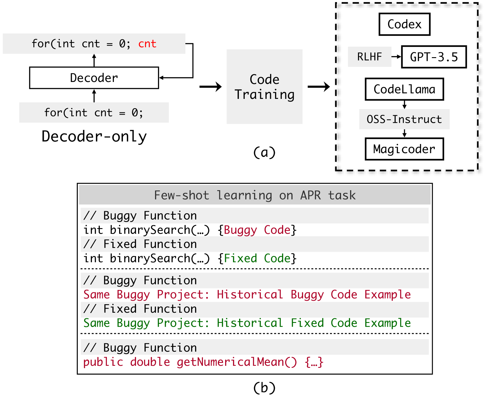

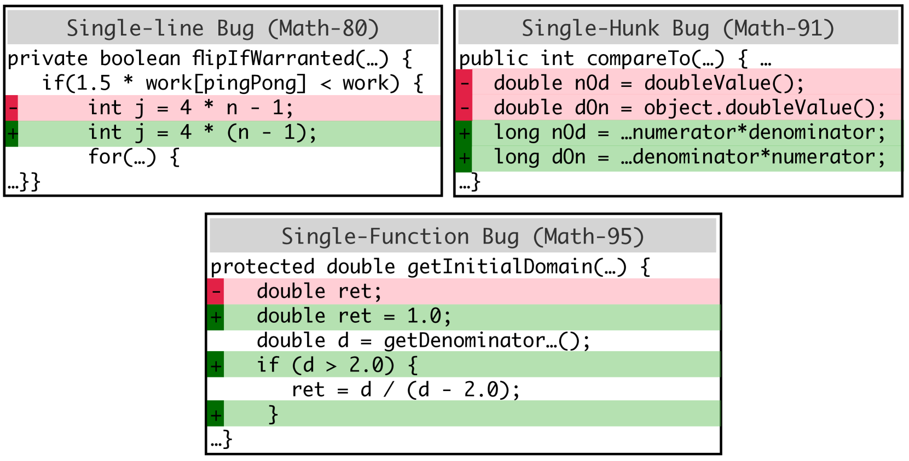

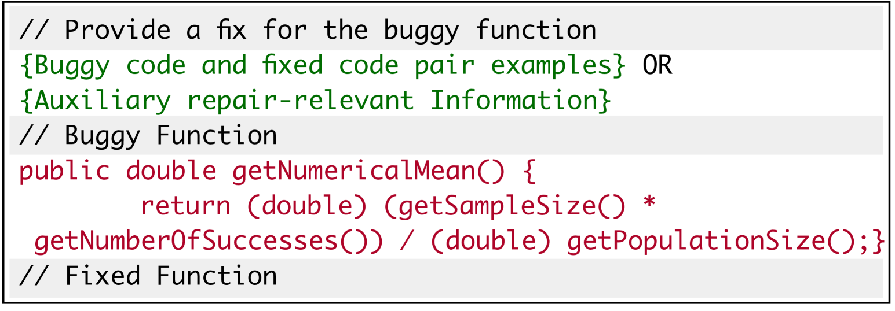

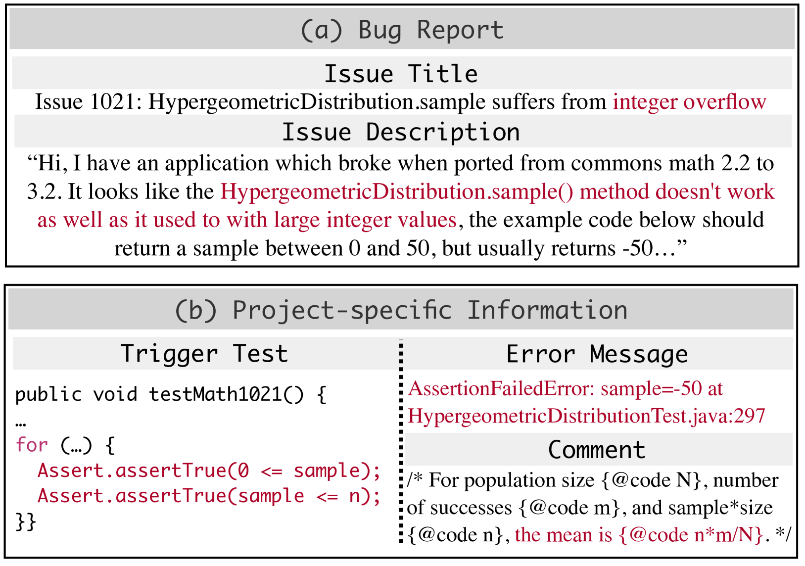

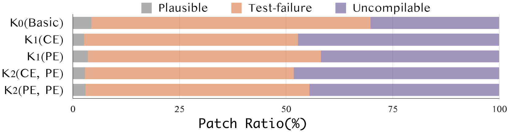

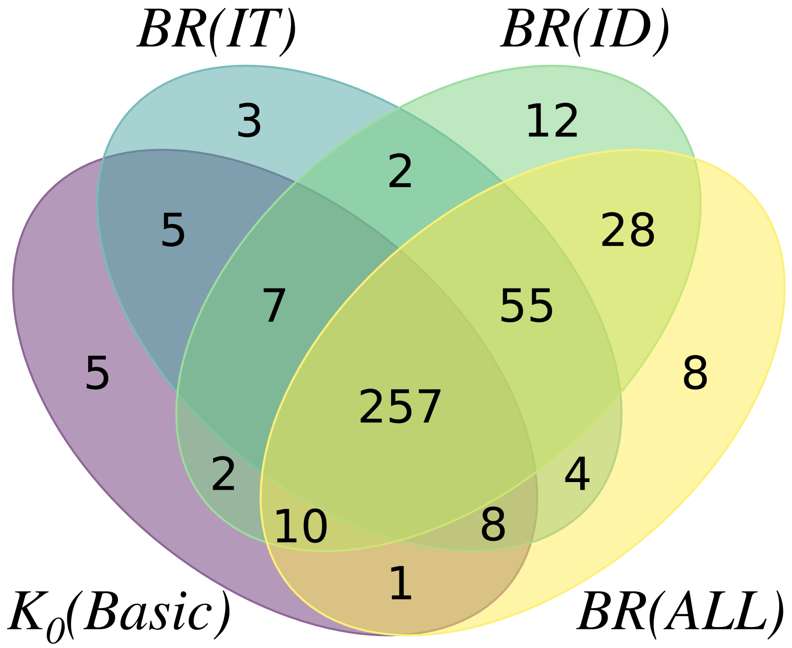

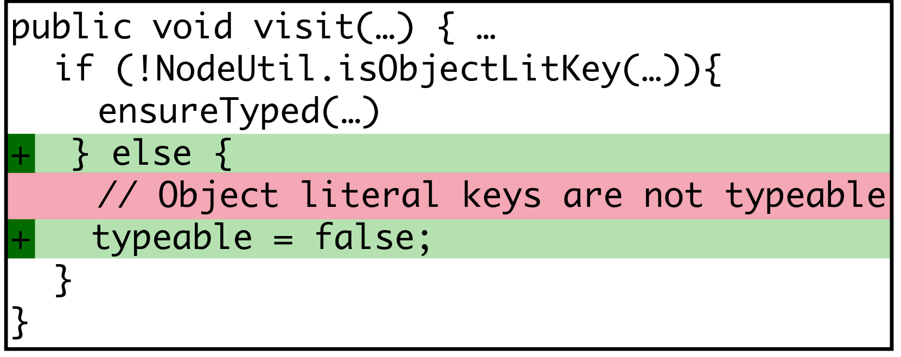

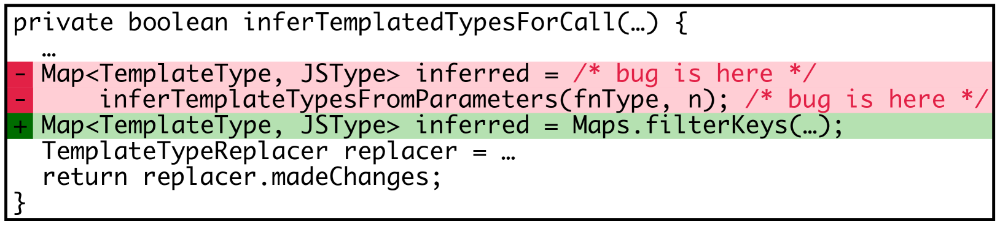

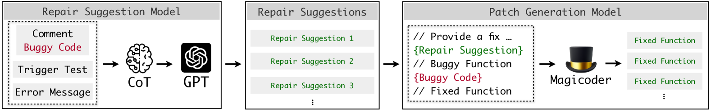

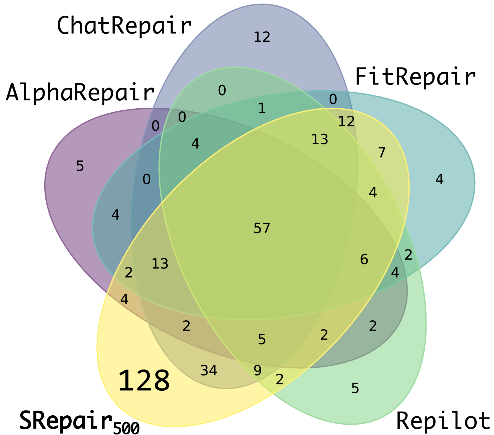

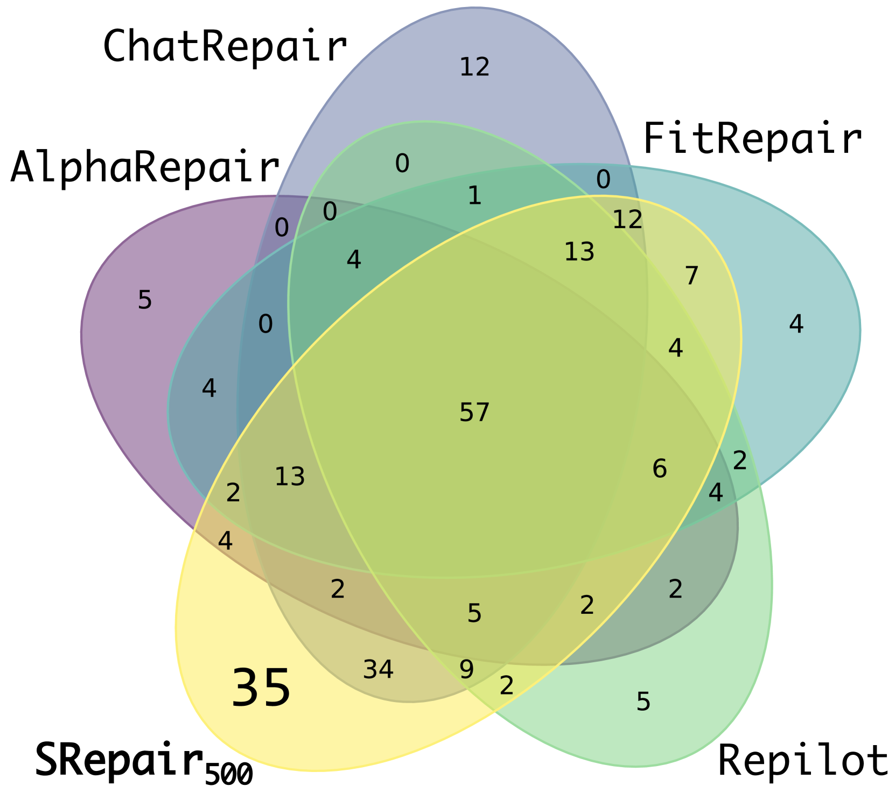

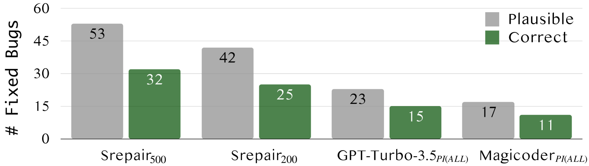

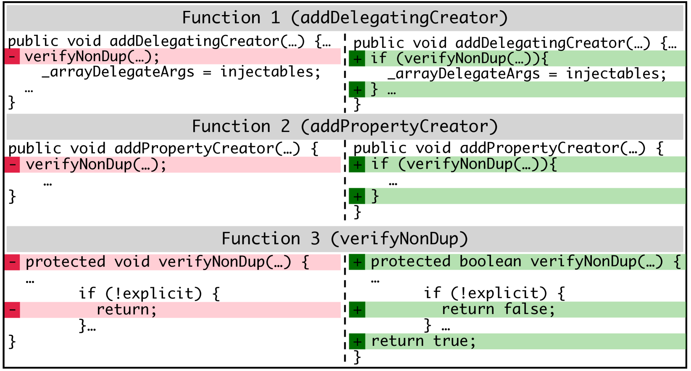

[Arxiv](https://arxiv.org/abs/2404.12833)