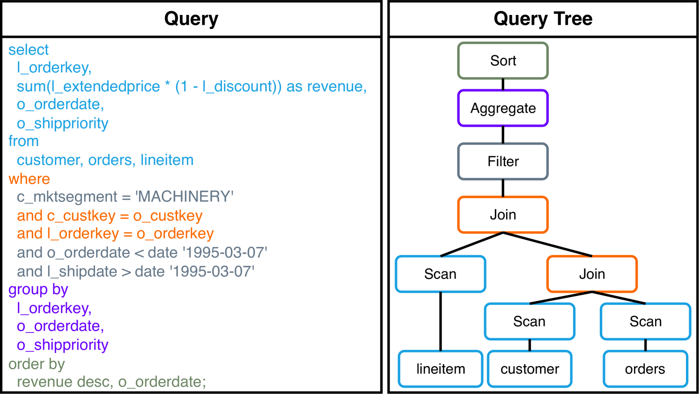
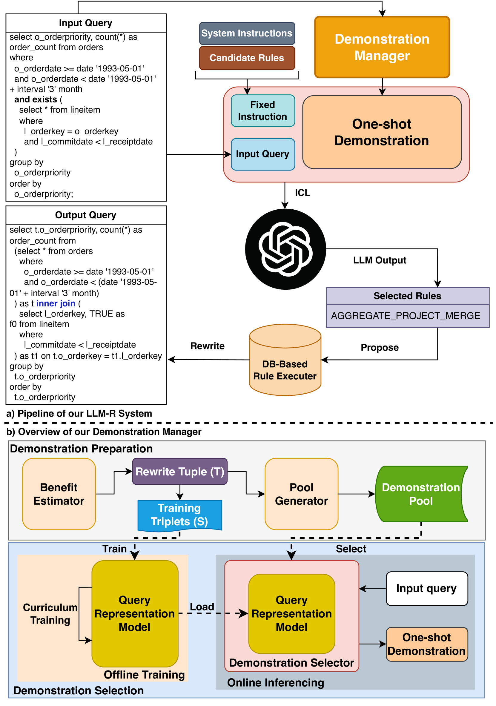
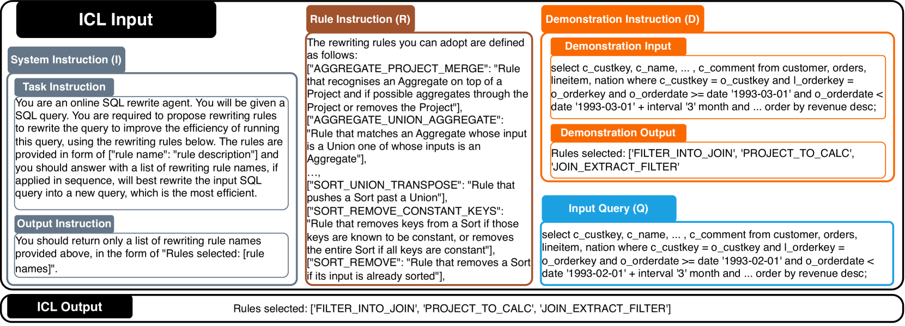
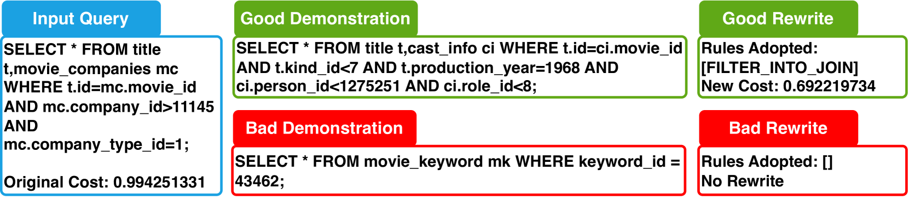
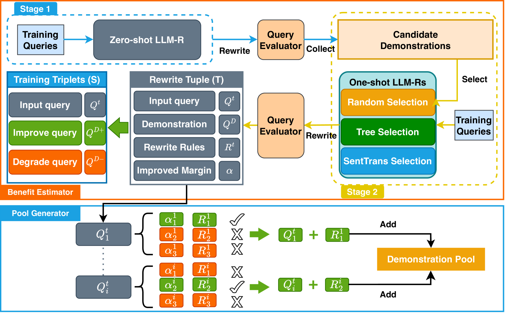
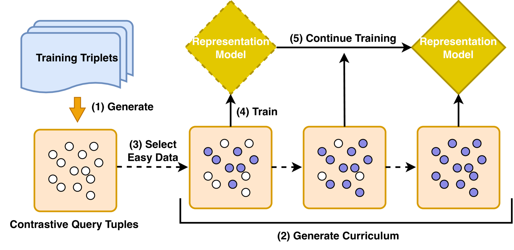
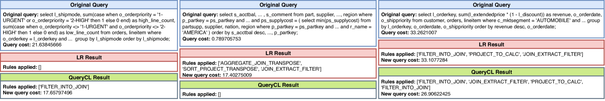

# LLM-R2：一款搭载强化规则重写系统的大型语言模型，旨在提升查询性能。

发布时间：2024年04月19日

`LLM应用` `数据库管理` `查询优化`

> LLM-R2: A Large Language Model Enhanced Rule-based Rewrite System for Boosting Query Efficiency

# 摘要

> 查询重写技术通过优化 SQL 查询结构以提升查询效率，同时保证结果不变，是数据库研究领域的关键议题。传统方法遵循固定规则进行查询重写，以确保新旧查询结果的一致性。但这种方法存在两大难题：一是寻找最优重写规则或规则序列的效率不高，且资源消耗巨大；二是新规则的发现往往需要复杂的逻辑证明或用户大量参与。此外，现有技术过度依赖于 DBMS 成本估算器，而这些估算器的准确性往往不足。本文提出了一种创新的查询重写方法——LLM-R2，利用大型语言模型（LLM）为数据库系统生成潜在的重写规则。我们还训练了一个对比模型，通过课程学习来提升 LLM 对查询表示的理解和选择有效查询示例的能力。实验结果显示，该方法显著提升了查询执行的效率，超越了传统基线方法，并且在不同数据集上展现了出色的稳定性。

> Query rewrite, which aims to generate more efficient queries by altering a SQL query's structure without changing the query result, has been an important research problem. In order to maintain equivalence between the rewritten query and the original one during rewriting, traditional query rewrite methods always rewrite the queries following certain rewrite rules. However, some problems still remain. Firstly, existing methods of finding the optimal choice or sequence of rewrite rules are still limited and the process always costs a lot of resources. Methods involving discovering new rewrite rules typically require complicated proofs of structural logic or extensive user interactions. Secondly, current query rewrite methods usually rely highly on DBMS cost estimators which are often not accurate. In this paper, we address these problems by proposing a novel method of query rewrite named LLM-R2, adopting a large language model (LLM) to propose possible rewrite rules for a database rewrite system. To further improve the inference ability of LLM in recommending rewrite rules, we train a contrastive model by curriculum to learn query representations and select effective query demonstrations for the LLM. Experimental results have shown that our method can significantly improve the query execution efficiency and outperform the baseline methods. In addition, our method enjoys high robustness across different datasets.

[Arxiv](https://arxiv.org/abs/2404.12872)