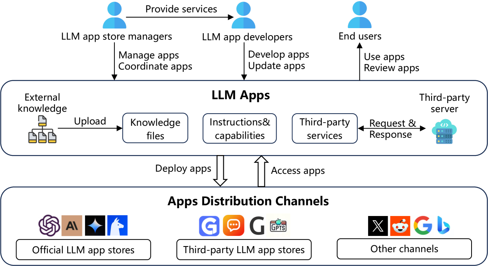
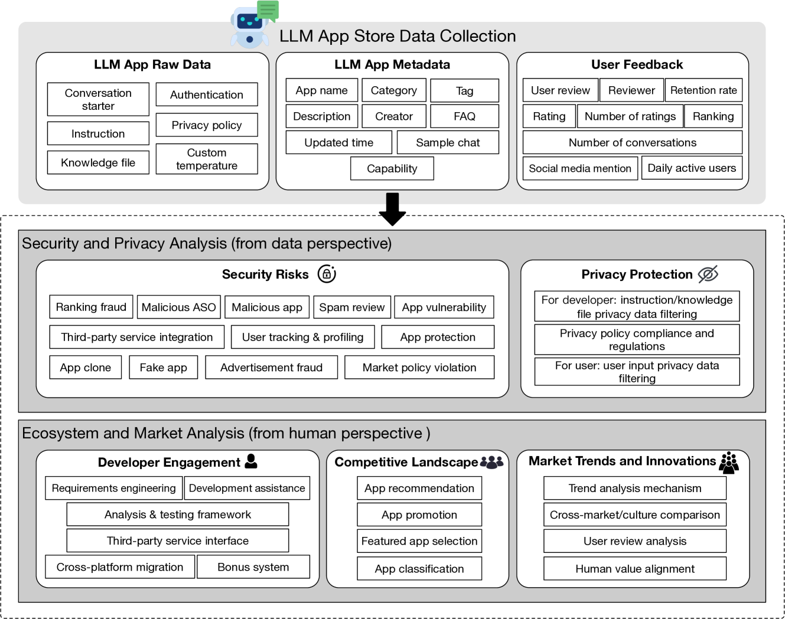

# 大型语言模型应用商店解析：展望与规划蓝图

发布时间：2024年04月19日

`LLM应用` `数据挖掘` `安全风险辨识`

> LLM App Store Analysis: A Vision and Roadmap

# 摘要

> 大型语言模型（LLM）应用商店的迅猛发展和广泛受欢迎，为各方参与者带来了前所未有的机遇与挑战。随着这一生态系统的持续演进，深入理解当前态势并探索未来研究与开发的可能方向显得尤为关键。本篇论文对LLM应用商店进行了深入的前瞻性剖析，集中探讨了数据挖掘、安全风险辨识、开发支持等核心议题。我们通过细致审视这些关键点，旨在为未来的研究路径提供清晰的视角，并强调了各利益相关方协作的重要性，以便共同应对LLM应用生态系统中的挑战与机遇。本文提出的洞见和建议，旨在成为推动创新、确保负责任开发、并构建一个充满活力、以用户为中心的LLM应用环境的坚实基石。

> The rapid growth and popularity of large language model (LLM) app stores have created new opportunities and challenges for researchers, developers, users, and app store managers. As the LLM app ecosystem continues to evolve, it is crucial to understand the current landscape and identify potential areas for future research and development. This paper presents a forward-looking analysis of LLM app stores, focusing on key aspects such as data mining, security risk identification, development assistance, etc. By examining these aspects, we aim to provide a vision for future research directions and highlight the importance of collaboration among stakeholders to address the challenges and opportunities within the LLM app ecosystem. The insights and recommendations provided in this paper serve as a foundation for driving innovation, ensuring responsible development, and creating a thriving, user-centric LLM app landscape.

[Arxiv](https://arxiv.org/abs/2404.12737)