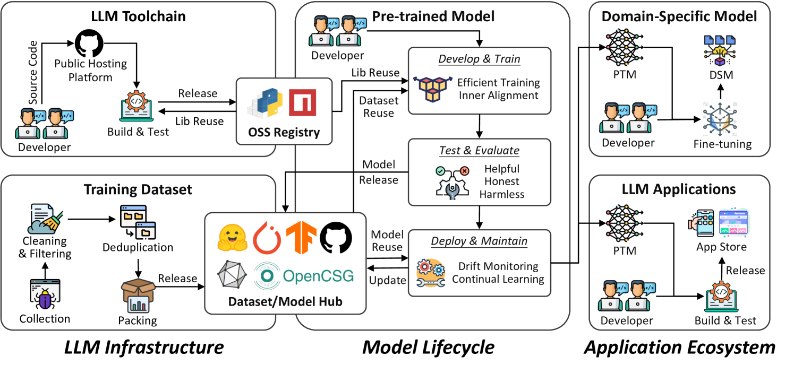

# 探索大型语言模型的供应链：制定研究路线图

发布时间：2024年04月19日

`LLM理论` `人工智能`

> Large Language Model Supply Chain: A Research Agenda

# 摘要

> 随着预训练的大型语言模型（LLMs）和大型多模态模型（LMMs）的突飞猛进，智能应用迎来了新纪元，从自然语言处理到内容创作等多个领域都经历了革新。LLM供应链作为现代人工智能领域的关键一环，涵盖了预训练模型从研发、训练到部署和跨领域应用的完整周期。本文深入探讨了LLM供应链的三大核心要素：模型架构、模型生命周期以及下游应用生态，强调了从数据集到工具链的全方位覆盖。尽管如此，这一迅猛发展的领域在数据隐私、模型透明度、基础设施扩展性以及法规遵循等方面仍面临诸多挑战。应对这些挑战对于释放LLMs的全部潜能并确保其合理、道德使用具有重要意义。文章还为LLM供应链的未来研究方向提出了议程，旨在推动这些变革性模型的持续发展和负责任的应用。

> The rapid advancements in pre-trained Large Language Models (LLMs) and Large Multimodal Models (LMMs) have ushered in a new era of intelligent applications, transforming fields ranging from natural language processing to content generation. The LLM supply chain represents a crucial aspect of the contemporary artificial intelligence landscape. It encompasses the entire lifecycle of pre-trained models, from its initial development and training to its final deployment and application in various domains. This paper presents a comprehensive overview of the LLM supply chain, highlighting its three core elements: 1) the model infrastructure, encompassing datasets and toolchain for training, optimization, and deployment; 2) the model lifecycle, covering training, testing, releasing, and ongoing maintenance; and 3) the downstream application ecosystem, enabling the integration of pre-trained models into a wide range of intelligent applications. However, this rapidly evolving field faces numerous challenges across these key components, including data privacy and security, model interpretability and fairness, infrastructure scalability, and regulatory compliance. Addressing these challenges is essential for harnessing the full potential of LLMs and ensuring their ethical and responsible use. This paper provides a future research agenda for the LLM supply chain, aiming at driving the continued advancement and responsible deployment of these transformative LLMs.

[Arxiv](https://arxiv.org/abs/2404.12736)