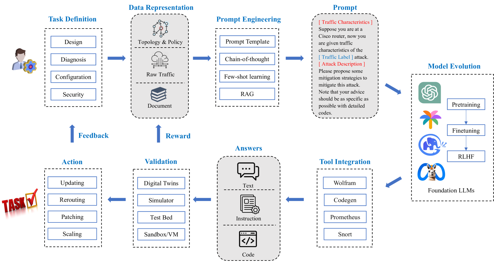

# 探索网络领域中的大规模语言模型：工作流程、最新进展与面临的挑战。

发布时间：2024年04月19日

`LLM应用` `机器学习`

> Large Language Models for Networking: Workflow, Advances and Challenges

# 摘要

> 网络行业以其复杂性高、更新迭代快而著称，完成从设计到安全等网络任务需要深厚的专业知识。这些任务的复杂本质与网络技术的不断演进相结合，给传统机器学习方法带来了不小的挑战。这些方法在泛化和自动化网络中的复杂任务时常常力不从心，它们需要大量标记数据、领域特定的特征工程，并且需要频繁地重新训练以适应新环境。但是，大型语言模型（LLMs）的崛起为解决这些问题开辟了新的可能。LLMs在自然语言的理解、生成和推理方面展现了非凡的才能。这些经过海量数据训练的模型，对网络领域大有裨益。已有研究探索了LLMs在网络领域的应用，并取得了初步成果。本文综述了最近的进展，并提出了一个抽象的工作流程来概述将LLM应用于网络的基本过程。我们分类总结了现有工作的亮点，并详细说明了它们在工作流程各阶段的运作方式。此外，我们深入分析了所遇到的挑战，讨论了可能的解决方案，并提出了未来研究的方向。我们期望本综述能够为研究人员和从业者提供有价值的见解，推动这一跨学科研究领域的发展。

> The networking field is characterized by its high complexity and rapid iteration, requiring extensive expertise to accomplish network tasks, ranging from network design, diagnosis, configuration and security. The inherent complexity of these tasks, coupled with the ever-changing landscape of networking technologies and protocols, poses significant hurdles for traditional machine learning-based methods. These methods often struggle to generalize and automate complex tasks in networking, as they require extensive labeled data, domain-specific feature engineering, and frequent retraining to adapt to new scenarios. However, the recent emergence of large language models (LLMs) has sparked a new wave of possibilities in addressing these challenges. LLMs have demonstrated remarkable capabilities in natural language understanding, generation, and reasoning. These models, trained on extensive data, can benefit the networking domain. Some efforts have already explored the application of LLMs in the networking domain and revealed promising results. By reviewing recent advances, we present an abstract workflow to describe the fundamental process involved in applying LLM for Networking. We introduce the highlights of existing works by category and explain in detail how they operate at different stages of the workflow. Furthermore, we delve into the challenges encountered, discuss potential solutions, and outline future research prospects. We hope that this survey will provide insight for researchers and practitioners, promoting the development of this interdisciplinary research field.

[Arxiv](https://arxiv.org/abs/2404.12901)