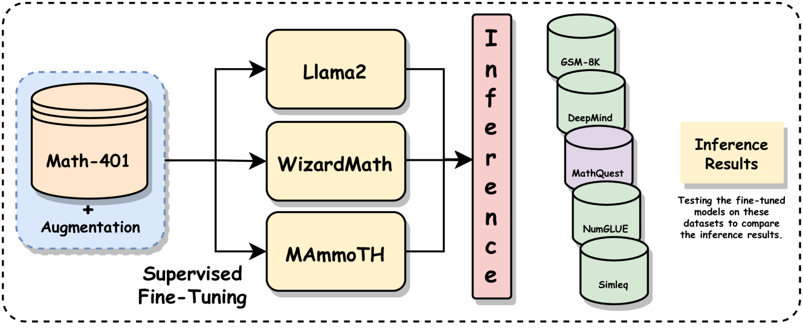
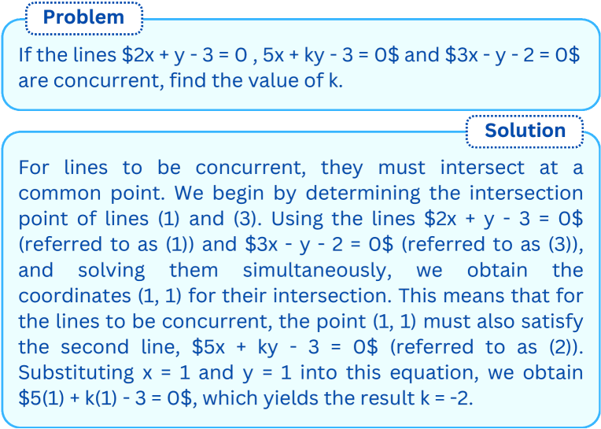
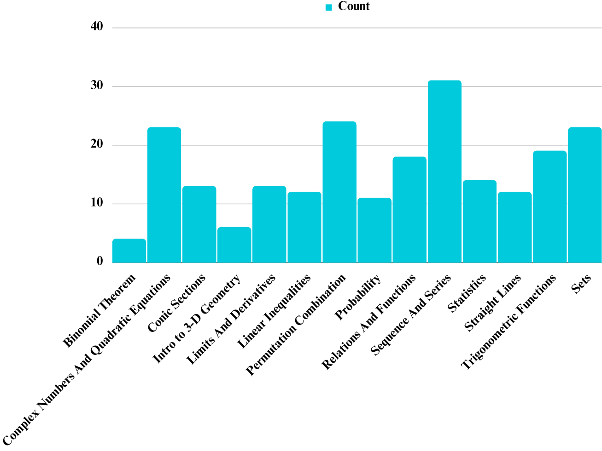

# Mathify：探究大型语言模型在数学问题解决任务上的应用与效能

发布时间：2024年04月19日

`LLM应用`

> Mathify: Evaluating Large Language Models on Mathematical Problem Solving Tasks

# 摘要

> 自然语言处理技术的突飞猛进及大型语言模型的不断扩展，为教育领域带来了无限可能。这些技术进步不仅能够提供个性化的学习体验和即时反馈，而且还能以一种易于获取且经济高效的方式实现。特别是在数学问题求解方面，这一技术的应用尤为引人注目。数学问题求解不仅考验着对复杂问题描述的解读能力，还考验着在解题过程中每一步进行精确计算的技能。尽管如此，对于大型语言模型在算术能力方面的评估，目前还鲜有研究。为了填补这一空白，我们推出了一个名为“MathQuest”的广泛数学数据集，该数据集源自11至12年级的数学NCERT教科书。它包含了不同难度级别的数学挑战，并覆盖了众多数学概念。我们利用这个数据集对三款知名的大型语言模型——LLaMA-2、WizardMath和MAmmoTH进行了细致的微调实验。这些经过微调的模型成为了评估它们在该数据集上表现的基准。实验结果显示，在这三者之中，MAmmoTH-13B模型表现最为出色，解决了所提出数学问题的最高水平。因此，MAmmoTH-13B成为了解决NCERT数学问题的一个强大且可靠的参考标准。

> The rapid progress in the field of natural language processing (NLP) systems and the expansion of large language models (LLMs) have opened up numerous opportunities in the field of education and instructional methods. These advancements offer the potential for tailored learning experiences and immediate feedback, all delivered through accessible and cost-effective services. One notable application area for this technological advancement is in the realm of solving mathematical problems. Mathematical problem-solving not only requires the ability to decipher complex problem statements but also the skill to perform precise arithmetic calculations at each step of the problem-solving process. However, the evaluation of the arithmetic capabilities of large language models remains an area that has received relatively little attention. In response, we introduce an extensive mathematics dataset called "MathQuest" sourced from the 11th and 12th standard Mathematics NCERT textbooks. This dataset encompasses mathematical challenges of varying complexity and covers a wide range of mathematical concepts. Utilizing this dataset, we conduct fine-tuning experiments with three prominent LLMs: LLaMA-2, WizardMath, and MAmmoTH. These fine-tuned models serve as benchmarks for evaluating their performance on our dataset. Our experiments reveal that among the three models, MAmmoTH-13B emerges as the most proficient, achieving the highest level of competence in solving the presented mathematical problems. Consequently, MAmmoTH-13B establishes itself as a robust and dependable benchmark for addressing NCERT mathematics problems.

[Arxiv](https://arxiv.org/abs/2404.13099)