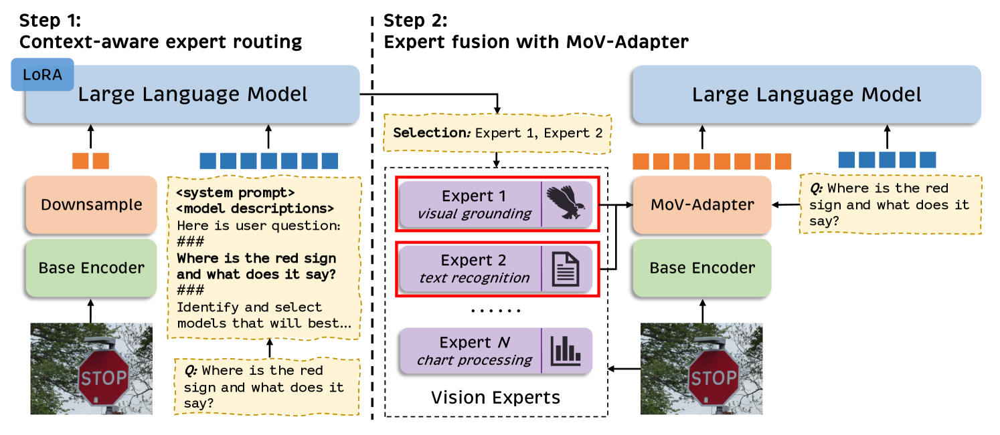
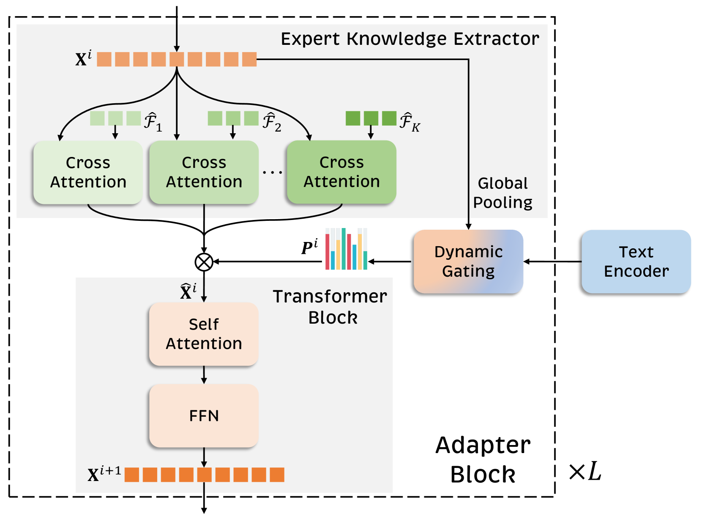
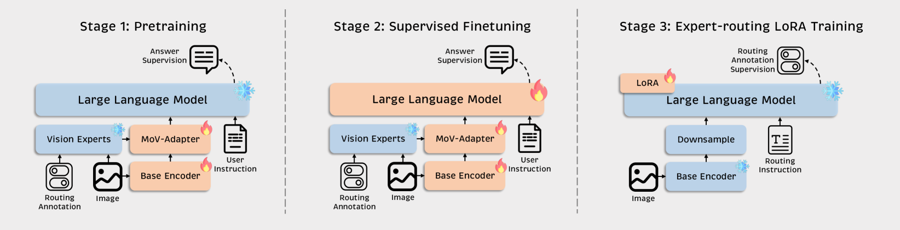
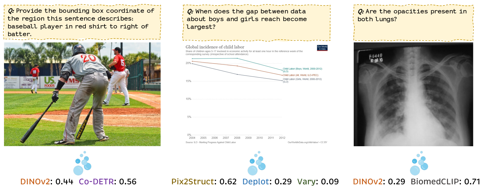

# MoVA：为多模态情境量身定制的视觉专家混合模型

发布时间：2024年04月19日

`分类：LLM应用` `计算机视觉`

> MoVA: Adapting Mixture of Vision Experts to Multimodal Context

# 摘要

> 在多模态大型语言模型（MLLMs）中，视觉编码器扮演着核心角色，对模型理解丰富图像内容的能力起着决定性作用。尽管大规模预训练视觉编码器，如CLIP和DINOv2的视觉编码器，已经展现出了振奋人心的性能，但仍未出现能够全面领先于各种图像内容理解任务的单一编码器。例如，CLIP的视觉编码器在常规图像理解任务上表现出色，但在处理文档或图表内容时则不尽人意。为了解决CLIP视觉编码器的局限性，我们首先深入分析了不同预训练视觉编码器的内在特性，并提出了MoVA，这是一种创新的MLLM，能够通过从粗到细的机制，智能地路由并整合特定任务的视觉专家。在粗粒度层面，我们设计了一种基于上下文的专家路由策略，能够根据用户指令、输入图像以及视觉专家的专长，动态选择最合适的视觉专家。这一策略得益于配备了专家路由低秩适应（LoRA）功能的大型语言模型（LLM）的强大功能理解能力。在细粒度层面，我们精心打造了混合视觉专家适配器（MoV-Adapter），用于从多位专家中提取并融合特定任务的关键知识。这种由粗到细的处理模式充分利用了多模态上下文和模型专长，有效提升了模型的泛化能力。我们通过广泛的实验验证了这一方法的有效性，MoVA在众多具有挑战性的多模态基准测试中，无需任何复杂设置，便能显著超越当前最先进方法的性能。相关代码和模型将在 https://github.com/TempleX98/MoVA 上发布。

> As the key component in multimodal large language models (MLLMs), the ability of the visual encoder greatly affects MLLM's understanding on diverse image content. Although some large-scale pretrained vision encoders such as vision encoders in CLIP and DINOv2 have brought promising performance, we found that there is still no single vision encoder that can dominate various image content understanding, e.g., the CLIP vision encoder leads to outstanding results on general image understanding but poor performance on document or chart content. To alleviate the bias of CLIP vision encoder, we first delve into the inherent behavior of different pre-trained vision encoders and then propose the MoVA, a powerful and novel MLLM, adaptively routing and fusing task-specific vision experts with a coarse-to-fine mechanism. In the coarse-grained stage, we design a context-aware expert routing strategy to dynamically select the most suitable vision experts according to the user instruction, input image, and expertise of vision experts. This benefits from the powerful model function understanding ability of the large language model (LLM) equipped with expert-routing low-rank adaptation (LoRA). In the fine-grained stage, we elaborately conduct the mixture-of-vision-expert adapter (MoV-Adapter) to extract and fuse task-specific knowledge from various experts. This coarse-to-fine paradigm effectively leverages representations from experts based on multimodal context and model expertise, further enhancing the generalization ability. We conduct extensive experiments to evaluate the effectiveness of the proposed approach. Without any bells and whistles, MoVA can achieve significant performance gains over current state-of-the-art methods in a wide range of challenging multimodal benchmarks. Codes and models will be available at https://github.com/TempleX98/MoVA.

[Arxiv](https://arxiv.org/abs/2404.13046)