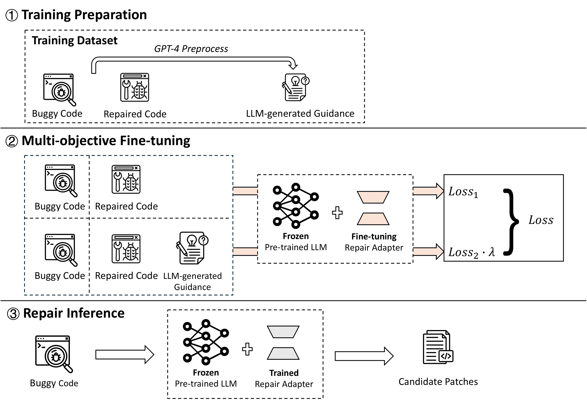

# 通过多目标微调，我们提升了利用大型语言模型进行程序修复的能力。

发布时间：2024年04月19日

`LLM应用` `软件工程` `程序修复`

> Multi-Objective Fine-Tuning for Enhanced Program Repair with LLMs

# 摘要

> 大型语言模型（LLMs）在多样化的下游任务上展现了非凡的才能。在软件工程这一领域，尤其是代码相关的特定任务如程序修复，带来了特别的挑战，这通常需要精细调整才能达到顶尖的性能水平。不过，学术文献中提出的LLMs程序修复任务的微调方法往往忽略了对代码变更背后逻辑的深入理解，而不仅仅是停留在数据的句法模式上。此外，那些表现优异的微调实验往往需要付出巨大的计算资源。我们通过MORepair提出了一种新的视角，专注于LLMs在程序修复任务上的微调学习重点：我们不仅让LLMs的参数适应于代码转换任务的句法细节（目标一），同时也特别针对训练数据中代码变更的逻辑原因进行微调（目标二）。这种双目标微调方法将引导LLMs产出更高质量的修复补丁。我们在四种不同规模和架构的开源LLMs上应用了MORepair进行微调。在C++和Java修复基准上的实验结果显示，这种微调方法有效提升了LLMs在Top-10修复建议中的修复性能，提升幅度在7.6%到10%之间。此外，我们还证明了我们的微调策略在与当前最先进的微调模型Fine-tune-CoT和RepairLLaMA相比时，展现出了更优的性能。

> Large language models (LLMs) have demonstrated remarkable capabilities on a broad spectrum of downstream tasks. Within the realm of software engineering, specialized tasks on code, such as program repair, present unique challenges, necessitating fine-tuning to unlock state-of-the-art performance. Fine-tuning approaches proposed in the literature for LLMs on program repair tasks are however generally overlooking the need to reason about the logic behind code changes, beyond syntactic patterns in the data. High-performing fine-tuning experiments also usually come at very high computational costs. With MORepair, we propose a novel perspective on the learning focus of LLM fine-tuning for program repair: we not only adapt the LLM parameters to the syntactic nuances of the task of code transformation (objective 1), but we also specifically fine-tune the LLM with respect to the logical reason behind the code change in the training data (objective 2). Such a multi-objective fine-tuning will instruct LLMs to generate high-quality patches.
  We apply MORepair to fine-tune four open-source LLMs with different sizes and architectures. Experimental results on C++ and Java repair benchmarks show that the implemented fine-tuning effectively boosts LLM repair performance by 7.6% to 10% in Top-10 repair suggestions. We further show that our fine-tuning strategy yields superior performance compared to the incumbent state-of-the-art in fine-tuned models for program repair, Fine-tune-CoT and RepairLLaMA.

[Arxiv](https://arxiv.org/abs/2404.12636)