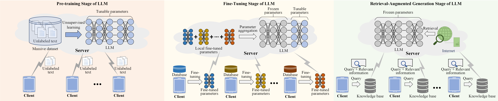
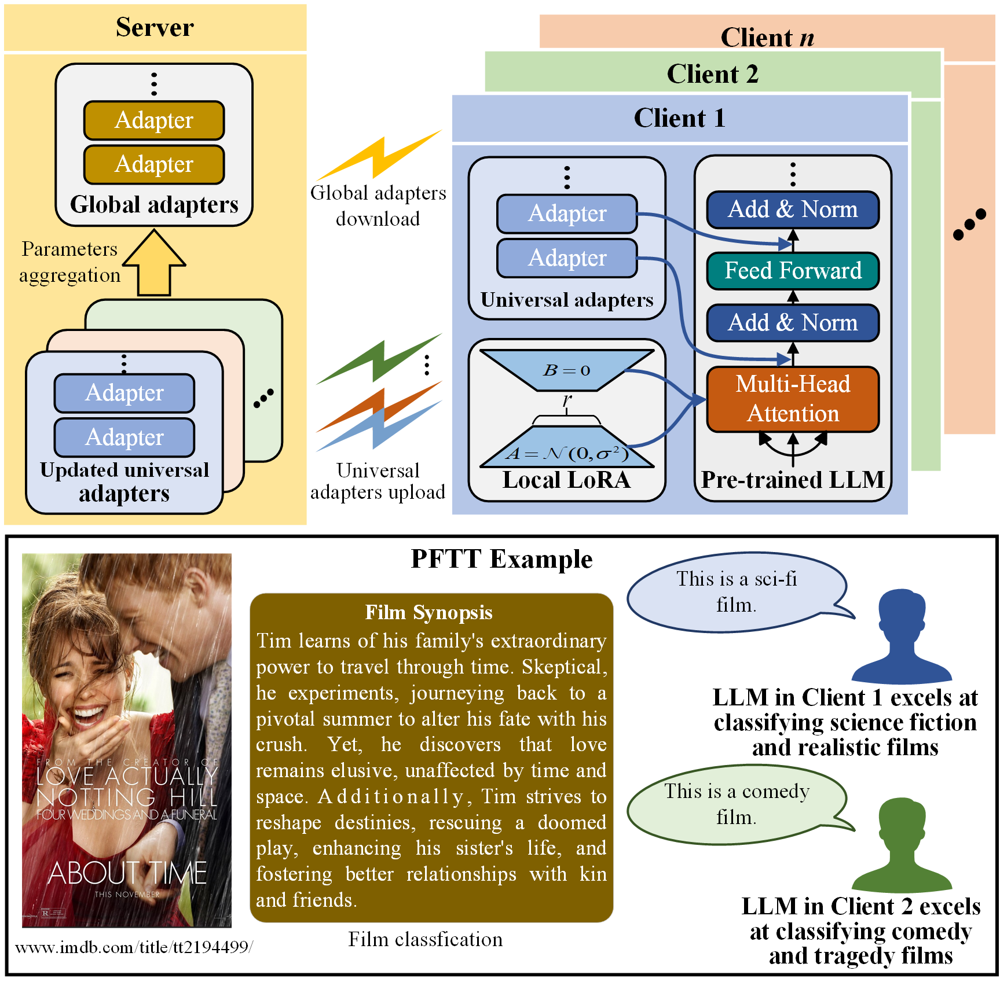
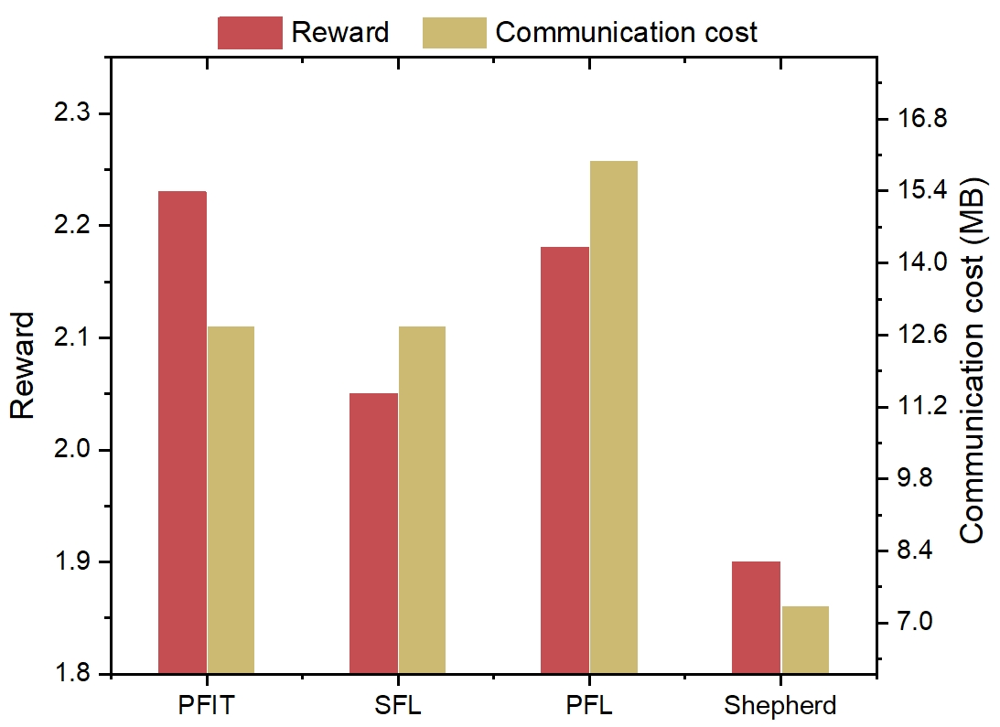
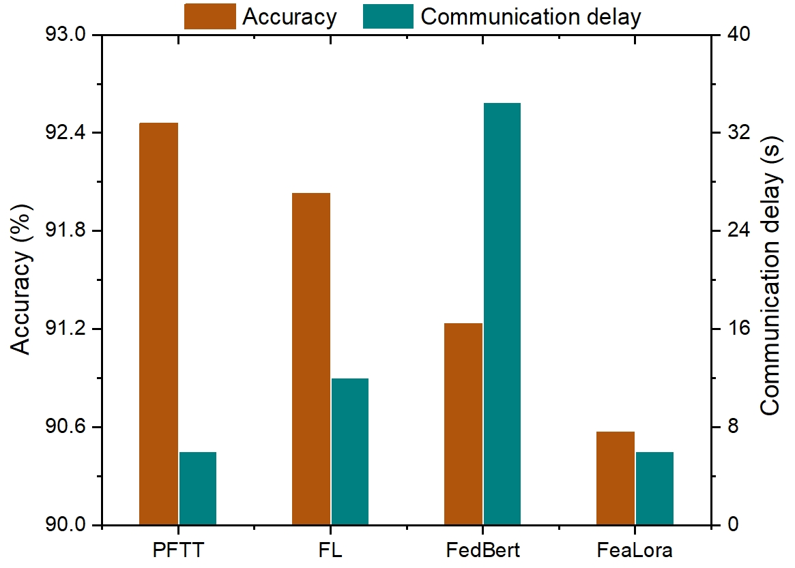

# 为大型语言模型量身定制的无线联合学习

发布时间：2024年04月19日

`LLM应用` `无线通信` `联邦学习`

> Personalized Wireless Federated Learning for Large Language Models

# 摘要

> 大型语言模型（LLMs）在自然语言处理领域引发了一场革命。但在无线网络中的应用却遭遇了隐私与安全保护不足的难题。联邦学习（FL）作为一种应对策略应运而生，尽管它在处理大规模异构数据、训练资源消耗以及通信成本高昂等方面存在挑战。为了克服这些难题，我们首先对LLMs在无线网络中的不同学习阶段进行了特性对比分析。随后，我们提出了两种个性化的低通信开销无线联邦微调方法：（1）个性化联邦指令微调（PFIT），利用强化学习针对多样化的奖励模型对本地LLMs进行微调，以实现个性化；（2）个性化联邦任务微调（PFTT），通过全局适配器和本地低秩适应（LoRA）技术协同优化本地LLMs，且本地LoRA可用于在不聚合数据的情况下实现个性化。最终，通过模拟实验验证了这两种方法的有效性，并深入探讨了当前面临的开放性问题。

> Large Language Models (LLMs) have revolutionized natural language processing tasks. However, their deployment in wireless networks still face challenges, i.e., a lack of privacy and security protection mechanisms. Federated Learning (FL) has emerged as a promising approach to address these challenges. Yet, it suffers from issues including inefficient handling with big and heterogeneous data, resource-intensive training, and high communication overhead. To tackle these issues, we first compare different learning stages and their features of LLMs in wireless networks. Next, we introduce two personalized wireless federated fine-tuning methods with low communication overhead, i.e., (1) Personalized Federated Instruction Tuning (PFIT), which employs reinforcement learning to fine-tune local LLMs with diverse reward models to achieve personalization; (2) Personalized Federated Task Tuning (PFTT), which can leverage global adapters and local Low-Rank Adaptations (LoRA) to collaboratively fine-tune local LLMs, where the local LoRAs can be applied to achieve personalization without aggregation. Finally, we perform simulations to demonstrate the effectiveness of the proposed two methods and comprehensively discuss open issues.

[Arxiv](https://arxiv.org/abs/2404.13238)