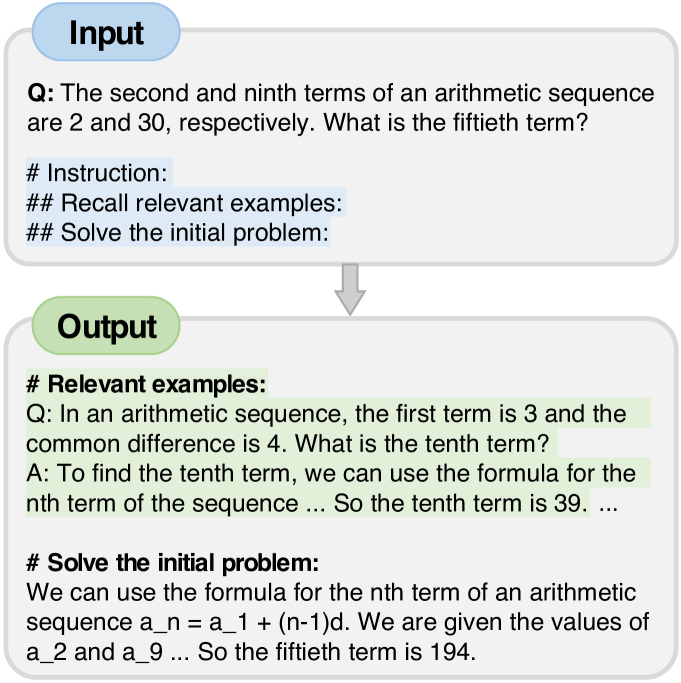
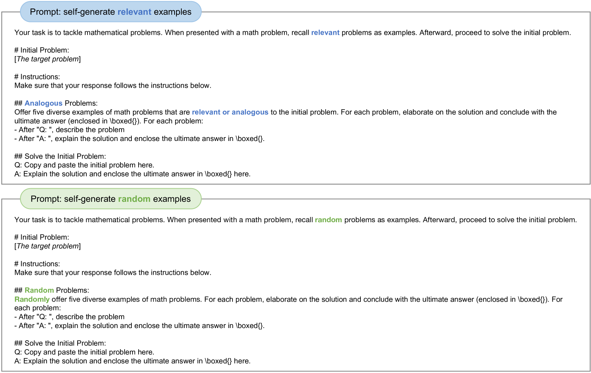
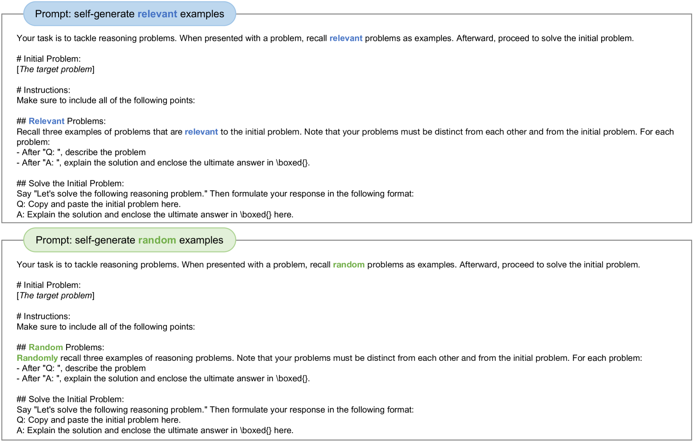
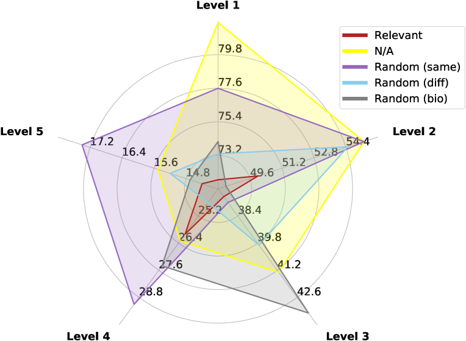
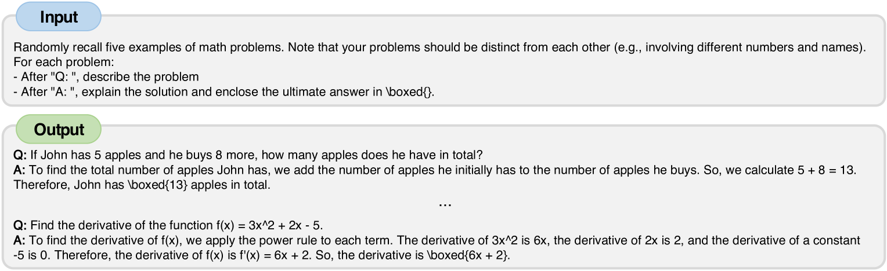
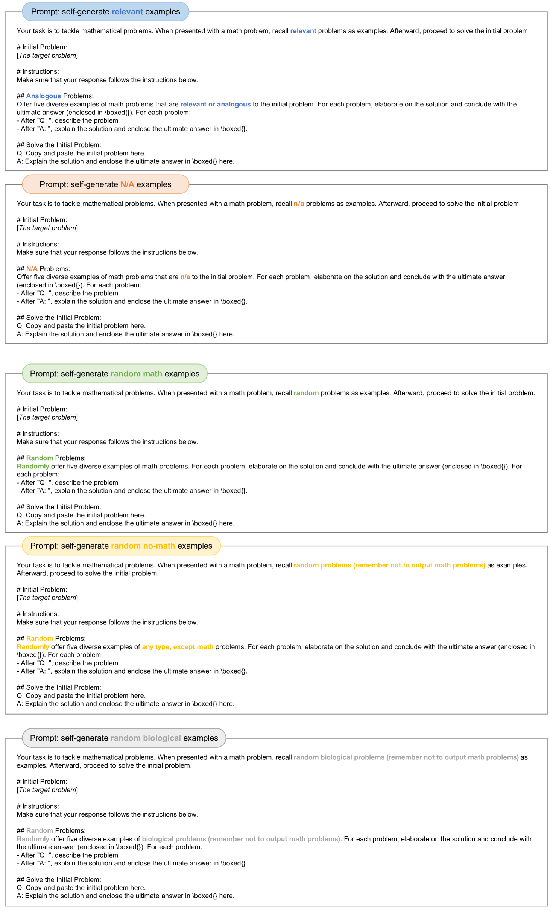
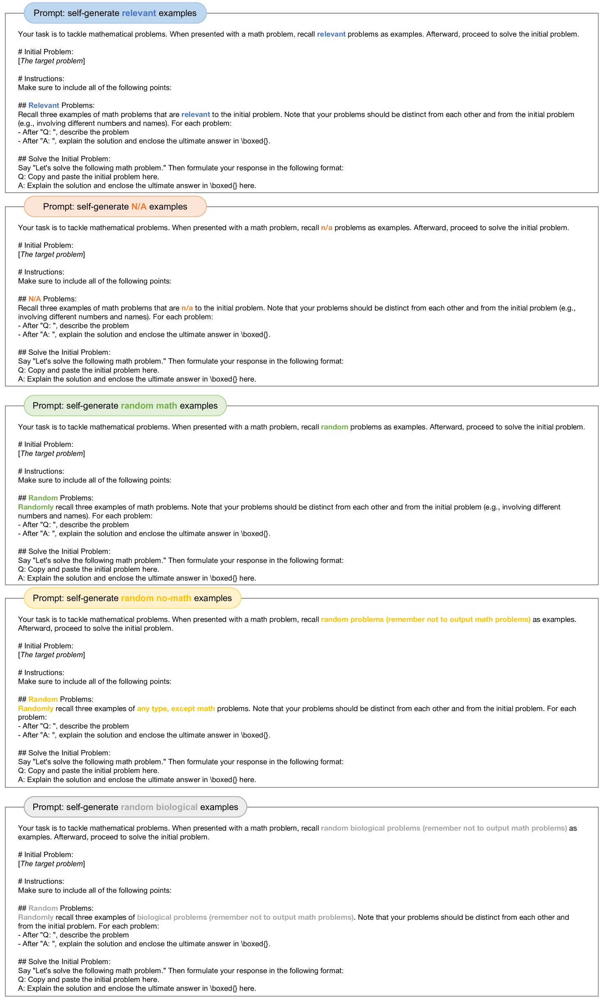
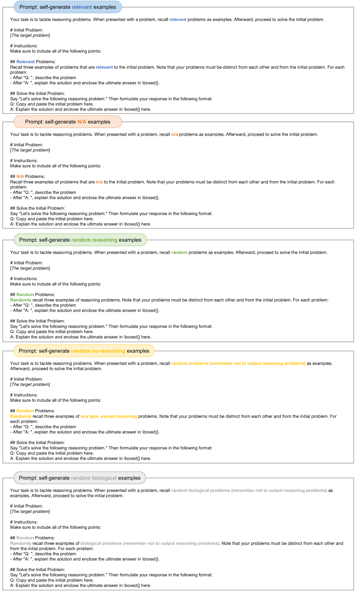
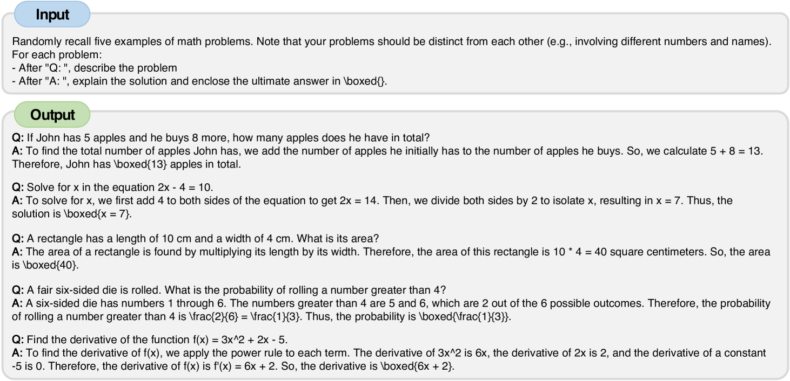
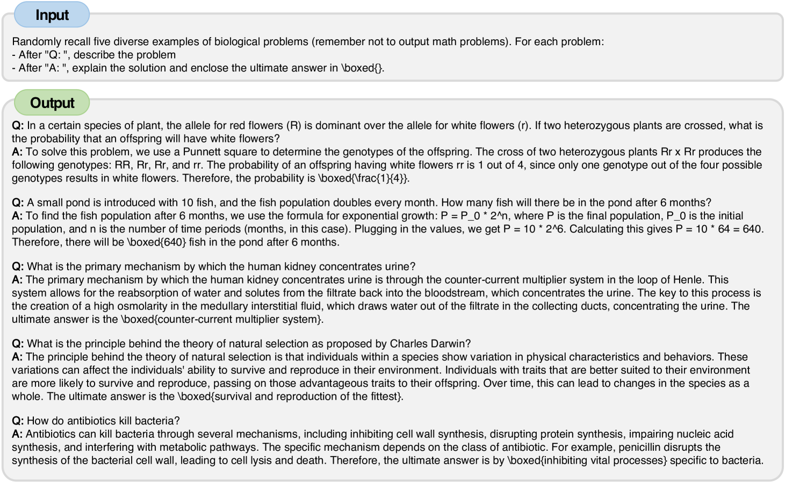

# 关联性抑或随机性：大型语言模型（LLM）是否真正具备类比推理的能力？

发布时间：2024年04月19日

`LLM应用` `心理学`

> Relevant or Random: Can LLMs Truly Perform Analogical Reasoning?

# 摘要

> 人类凭借类比推理的独特才能，通过借鉴过往相关经验来应对新挑战。心理学研究发现，回忆相关经验比回忆不相关经验更能助人应对新任务。同样，自然语言处理（NLP）领域也发现，大型语言模型（LLM）在上下文中自我生成相关示例，比手工制作的提示更能有效解决问题。然而，目前尚不明确相关性是否是激发LLM这种能力的关键。本研究旨在系统探讨LLM是否能够真正在多样化的推理任务上进行类比推理。经过大量实验和分析，我们意外发现，即使是随机生成的示例，也能实现可比或更好的性能提升，如在GSM8K数据集上使用随机生物示例提升了4%的性能。我们发现，自我生成示例的准确性是关键，并据此设计了两种方法，大幅降低了推理成本。我们旨在深化对LLM类比推理的理解，并期望本研究能推动自生成上下文设计领域的进一步研究。

> Analogical reasoning is a unique ability of humans to address unfamiliar challenges by transferring strategies from relevant past experiences. One key finding in psychology is that compared with irrelevant past experiences, recalling relevant ones can help humans better handle new tasks. Coincidentally, the NLP community has also recently found that self-generating relevant examples in the context can help large language models (LLMs) better solve a given problem than hand-crafted prompts. However, it is yet not clear whether relevance is the key factor eliciting such capability, i.e., can LLMs benefit more from self-generated relevant examples than irrelevant ones? In this work, we systematically explore whether LLMs can truly perform analogical reasoning on a diverse set of reasoning tasks. With extensive experiments and analysis, we show that self-generated random examples can surprisingly achieve comparable or even better performance, e.g., 4% performance boost on GSM8K with random biological examples. We find that the accuracy of self-generated examples is the key factor and subsequently design two improved methods with significantly reduced inference costs. Overall, we aim to advance a deeper understanding of LLM analogical reasoning and hope this work stimulates further research in the design of self-generated contexts.

[Arxiv](https://arxiv.org/abs/2404.12728)