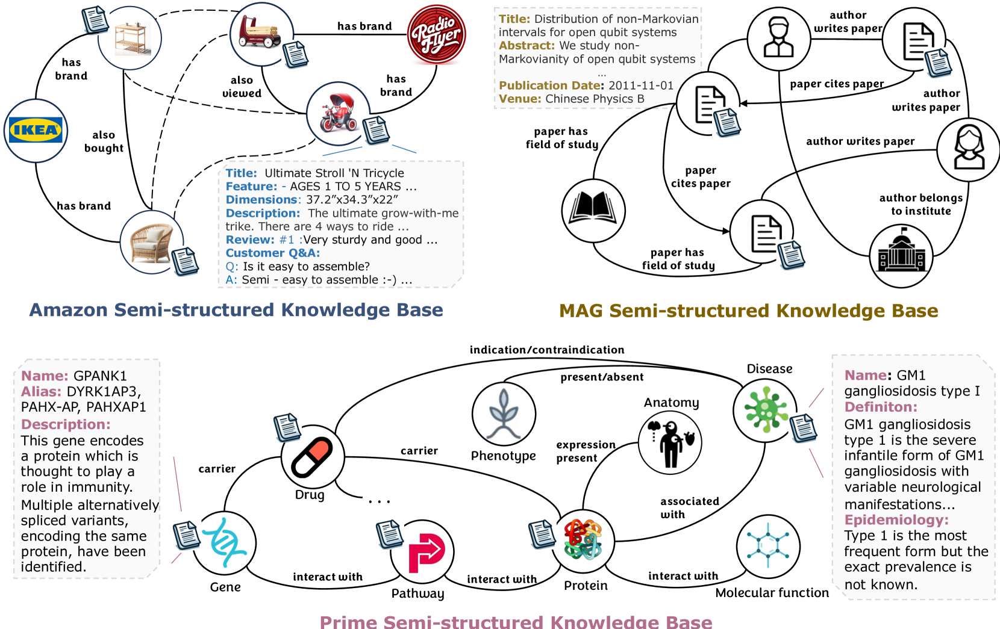
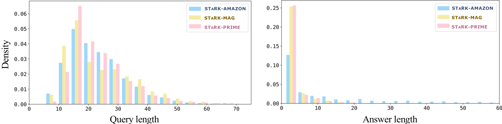
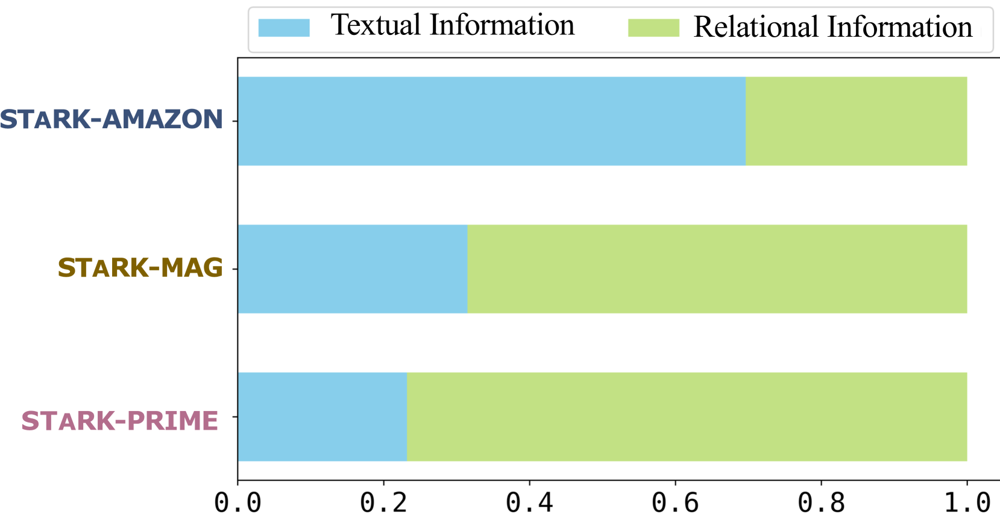
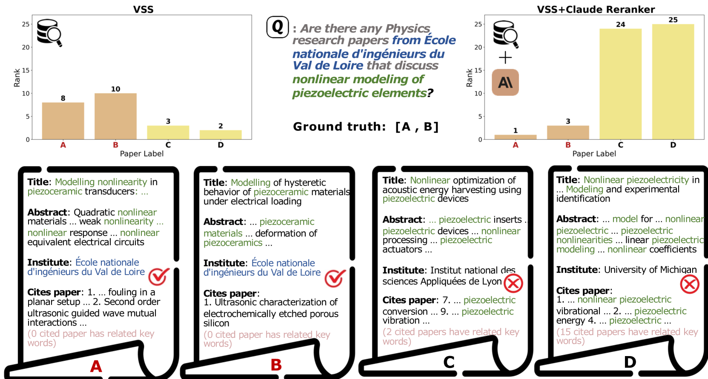

# STaRK：为大型语言模型在文本与关系知识库检索上设立的基准测试。

发布时间：2024年04月19日

`LLM应用` `信息检索` `知识库`

> STaRK: Benchmarking LLM Retrieval on Textual and Relational Knowledge Bases

# 摘要

> 为了响应现实世界用户的查询，例如产品搜索，我们需要从融合了非结构化（如产品文本描述）和结构化信息（如产品实体关系）的半结构化知识库或数据库中精确提取信息。尽管以往的研究多将文本检索和关系检索作为独立议题探讨，我们为了弥合这一研究空白，开发了STARK——一个基于文本和关系知识库的大规模半结构化检索基准。我们设计了创新的流程，用以合成既自然又真实的用户查询，这些查询融合了多元的关系信息、复杂的文本特性及其标准答案。此外，我们通过严格的人工评估来确认我们基准的质量，它覆盖了包括产品推荐、学术论文搜索和精准医疗咨询在内的多种实际应用场景。STARK基准旨在全面测试检索系统的性能，特别强调了大型语言模型（LLMs）驱动的检索方法。我们的实验结果表明，STARK数据集对现有的检索技术和LLM系统构成了显著挑战，这表明我们需要构建更高效的检索系统，以同时处理文本和关系方面的复杂性。

> Answering real-world user queries, such as product search, often requires accurate retrieval of information from semi-structured knowledge bases or databases that involve blend of unstructured (e.g., textual descriptions of products) and structured (e.g., entity relations of products) information. However, previous works have mostly studied textual and relational retrieval tasks as separate topics. To address the gap, we develop STARK, a large-scale Semi-structure retrieval benchmark on Textual and Relational Knowledge Bases. We design a novel pipeline to synthesize natural and realistic user queries that integrate diverse relational information and complex textual properties, as well as their ground-truth answers. Moreover, we rigorously conduct human evaluation to validate the quality of our benchmark, which covers a variety of practical applications, including product recommendations, academic paper searches, and precision medicine inquiries. Our benchmark serves as a comprehensive testbed for evaluating the performance of retrieval systems, with an emphasis on retrieval approaches driven by large language models (LLMs). Our experiments suggest that the STARK datasets present significant challenges to the current retrieval and LLM systems, indicating the demand for building more capable retrieval systems that can handle both textual and relational aspects.

[Arxiv](https://arxiv.org/abs/2404.13207)