# 样本设计工程：探究何种样本能成为大型语言模型（LLM）下游微调的优质选择的实证研究

发布时间：2024年04月19日

`LLM应用` `机器学习`

> Sample Design Engineering: An Empirical Study of What Makes Good Downstream Fine-Tuning Samples for LLMs

# 摘要

> 在大型语言模型（LLMs）的新兴领域，如ChatGPT和LLaMA，提示工程（PE）通过调整提示来提升零样本或上下文学习（ICL）的效果，备受推崇。尽管如此，对于定制化LLM以适应特定任务的下游微调样本设计，这一领域尚未得到充分探索。本文提出了样本设计工程（SDE），这是一种系统化的方法，通过优化输入、输出和推理设计，来提升LLMs微调后的性能。我们进行了一系列的领域内（ID）和领域外（OOD）实验，评估了不同设计选项对LLMs下游性能的影响，并发现了一些跨不同LLMs一致的有趣模式。基于这些发现，我们提出了一种综合的SDE策略，整合了最有效的设计选项，并证实了其在复杂下游任务中，如多维度情感分析、事件抽取和嵌套实体识别等，相较于传统启发式样本设计，展现出持续的优越性。此外，对LLMs的内在提示/输出困惑度、零样本和ICL能力的分析揭示了，优秀的PE策略并不总能直接转化为有效的SDE策略。相关代码可在 https://github.com/beyondguo/LLM-Tuning 查看。

> In the burgeoning field of Large Language Models (LLMs) like ChatGPT and LLaMA, Prompt Engineering (PE) is renowned for boosting zero-shot or in-context learning (ICL) through prompt modifications. Yet, the realm of the sample design for downstream fine-tuning, crucial for task-specific LLM adaptation, is largely unexplored. This paper introduces Sample Design Engineering (SDE), a methodical approach to enhancing LLMs' post-tuning performance by refining input, output, and reasoning designs. We conduct a series of in-domain (ID) and out-of-domain (OOD) experiments to assess the impact of various design options on LLMs' downstream performance, revealing several intriguing patterns that hold consistently across different LLMs. Based on these insights, we propose an integrated SDE strategy, combining the most effective options, and validate its consistent superiority over heuristic sample designs in complex downstream tasks like multi-aspect sentiment analysis, event extraction, and nested entity recognition. Additionally, analyses of LLMs' inherent prompt/output perplexity, zero-shot, and ICL abilities illustrate that good PE strategies may not always translate to good SDE strategies. Code available at https://github.com/beyondguo/LLM-Tuning.

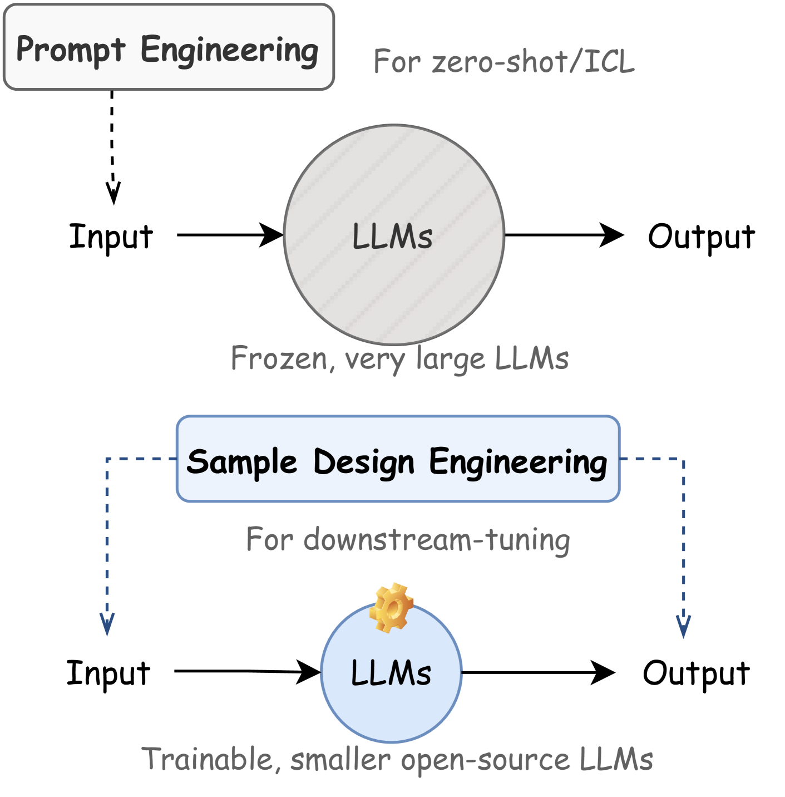

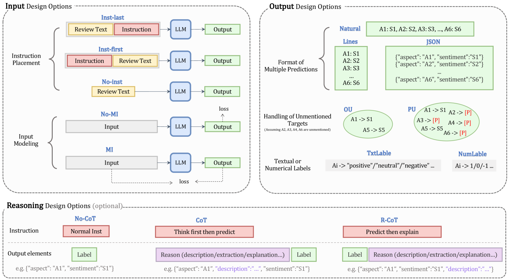

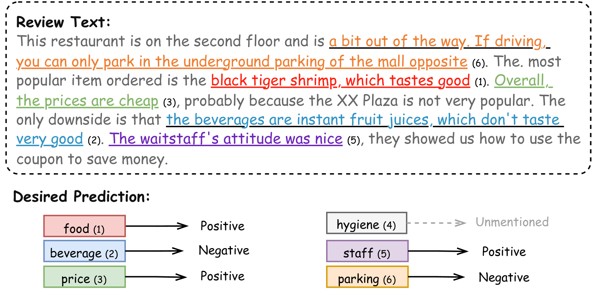

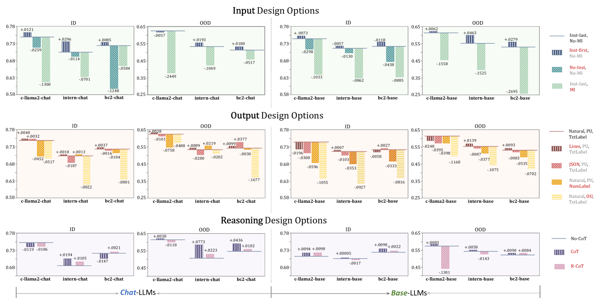

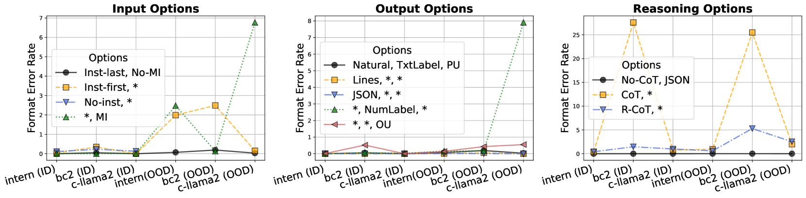

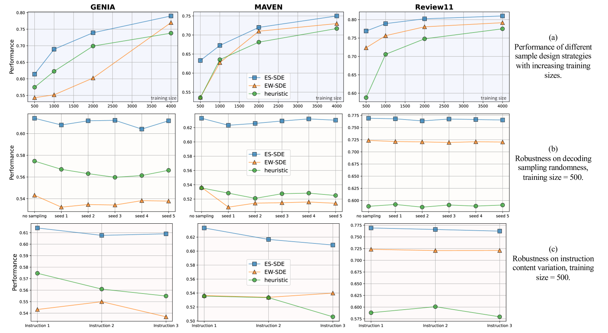

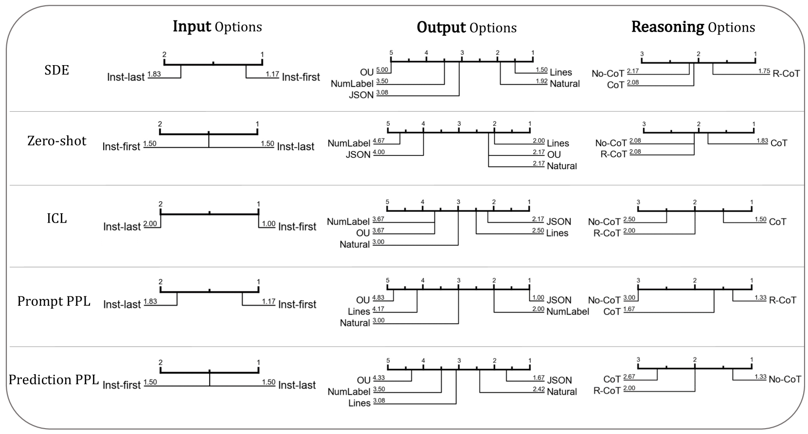

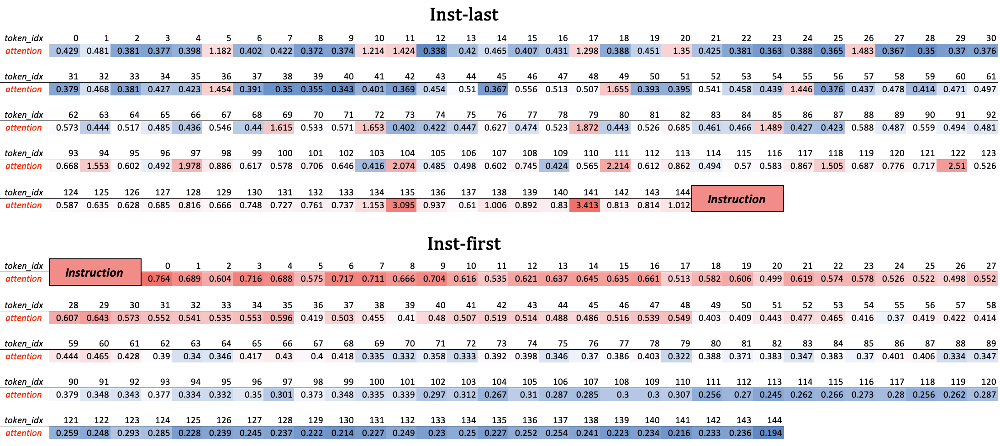

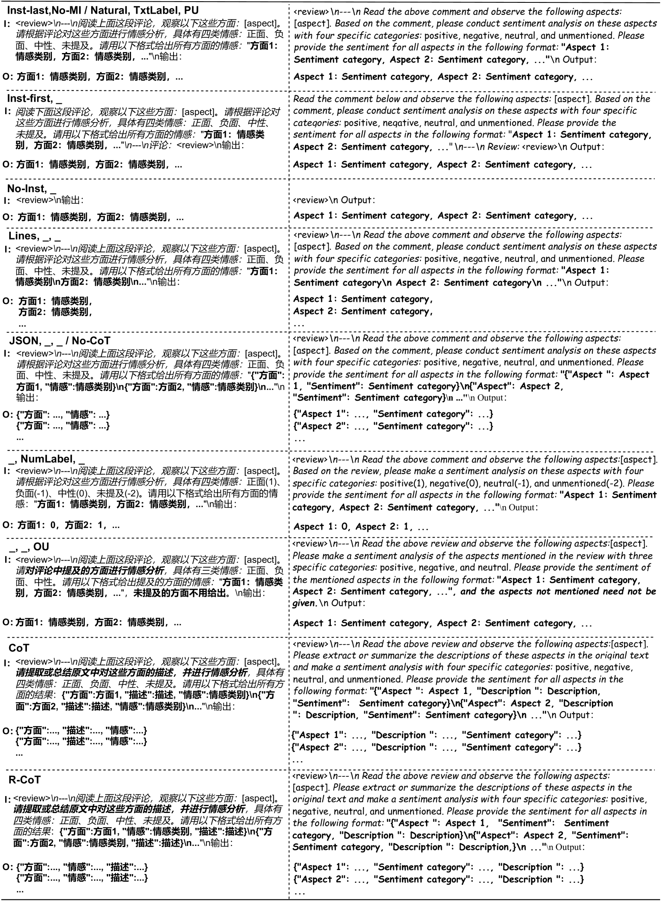

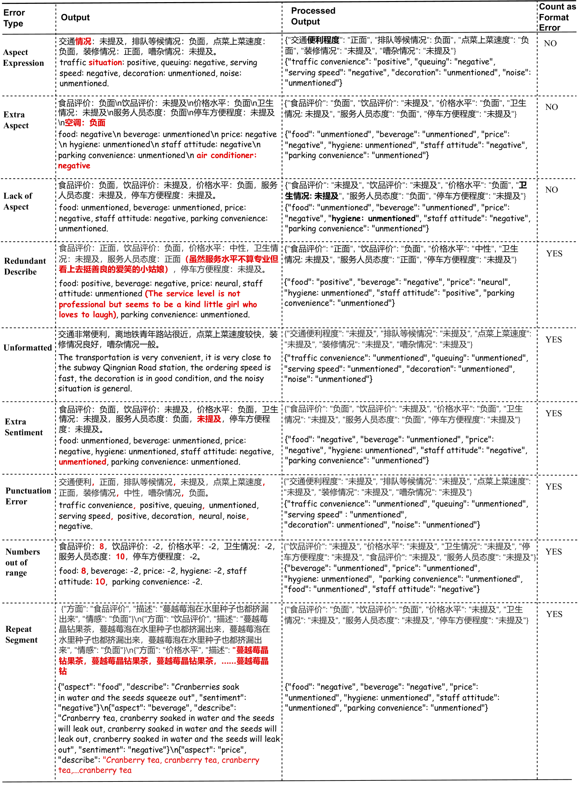

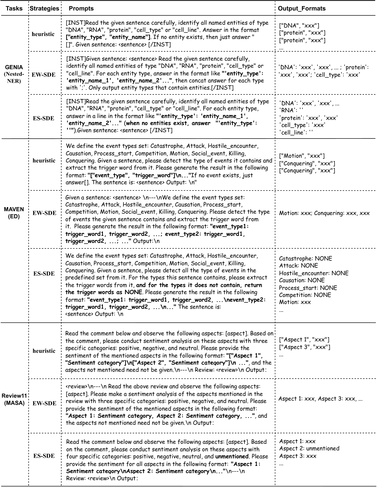

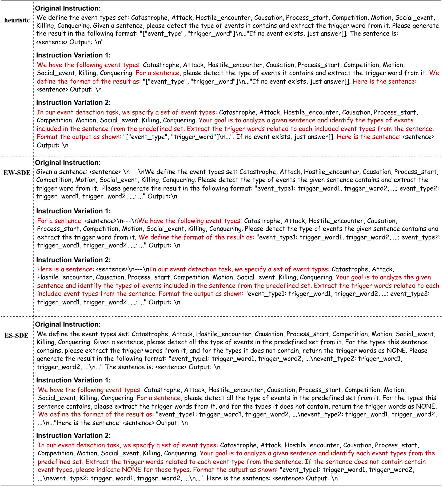

[Arxiv](https://arxiv.org/abs/2404.13033)