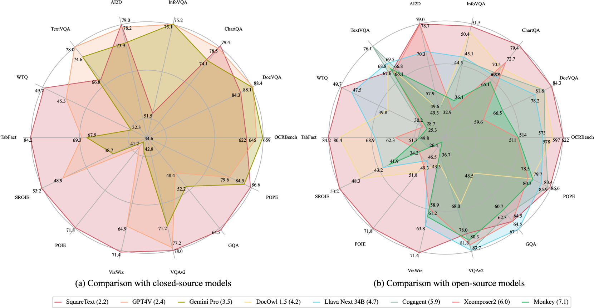
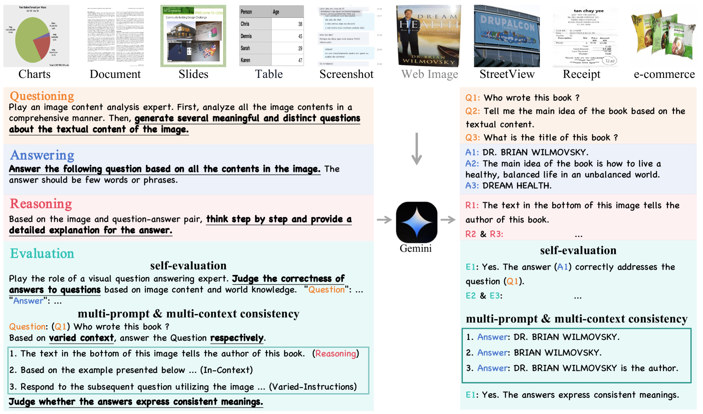
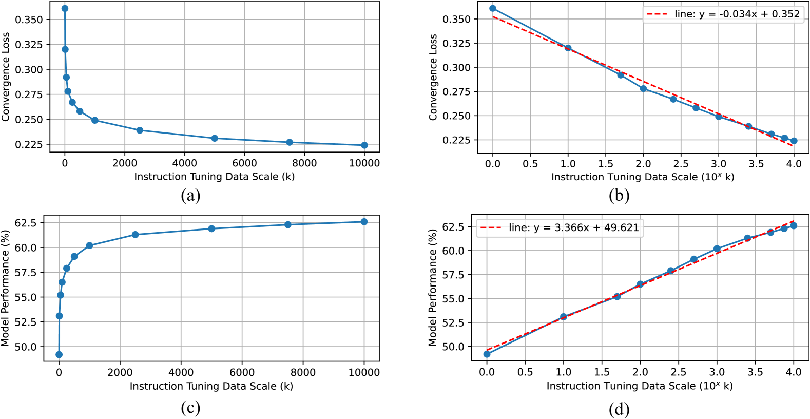

# TextSquare：提升文本导向视觉指令调优的规模

发布时间：2024年04月19日

`LLM应用` `视觉问答`

> TextSquare: Scaling up Text-Centric Visual Instruction Tuning

# 摘要

> 随着多模态大型语言模型（MLLMs）的兴起，文本中心的视觉问答（VQA）技术实现了显著进步。然而，开源模型与GPT4V和Gemini等行业佼佼者相比仍有差距，这主要是由于缺少大量且优质的指令调优数据。为了解决这一问题，我们提出了一种创新方法，成功构建了一个庞大且高质量的指令调优数据集Square-10M，该数据集利用闭源MLLMs生成。整个数据构建流程，称为Square，分为自我提问、解答、推理和评估四个阶段。通过Square-10M的实验，我们得出了三项重要发现：首先，我们的模型TextSquare在OCRBench上达到了62.2%的准确率，大幅超越了先前的开源顶尖模型，并在10个文本中心的基准测试中的6个上超越了GPT4V和Gemini。其次，我们证实了VQA推理数据在提供具体问题全面上下文洞察中的核心作用，这不仅提升了准确度，还显著减少了幻觉现象。具体来说，TextSquare在四个通用VQA和幻觉评估数据集上的平均准确率达到了75.1%，超过了之前的所有顶尖模型。最后，我们发现在扩展文本中心VQA数据集时，模型性能的提升与指令调优数据量的指数增长成正比，这一现象凸显了数据集规模和Square-10M高质量对提升性能的重要性。

> Text-centric visual question answering (VQA) has made great strides with the development of Multimodal Large Language Models (MLLMs), yet open-source models still fall short of leading models like GPT4V and Gemini, partly due to a lack of extensive, high-quality instruction tuning data. To this end, we introduce a new approach for creating a massive, high-quality instruction-tuning dataset, Square-10M, which is generated using closed-source MLLMs. The data construction process, termed Square, consists of four steps: Self-Questioning, Answering, Reasoning, and Evaluation. Our experiments with Square-10M led to three key findings: 1) Our model, TextSquare, considerably surpasses open-source previous state-of-the-art Text-centric MLLMs and sets a new standard on OCRBench(62.2%). It even outperforms top-tier models like GPT4V and Gemini in 6 of 10 text-centric benchmarks. 2) Additionally, we demonstrate the critical role of VQA reasoning data in offering comprehensive contextual insights for specific questions. This not only improves accuracy but also significantly mitigates hallucinations. Specifically, TextSquare scores an average of 75.1% across four general VQA and hallucination evaluation datasets, outperforming previous state-of-the-art models. 3) Notably, the phenomenon observed in scaling text-centric VQA datasets reveals a vivid pattern: the exponential increase of instruction tuning data volume is directly proportional to the improvement in model performance, thereby validating the necessity of the dataset scale and the high quality of Square-10M.

[Arxiv](https://arxiv.org/abs/2404.12803)