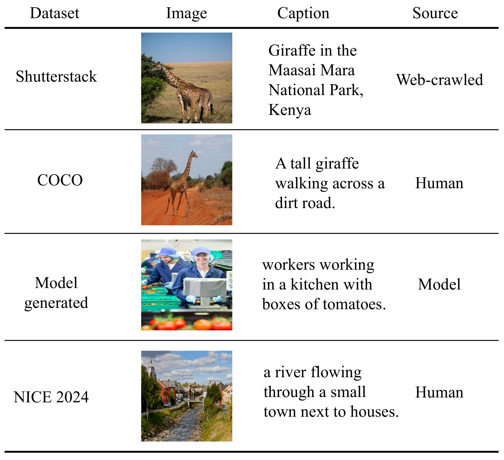
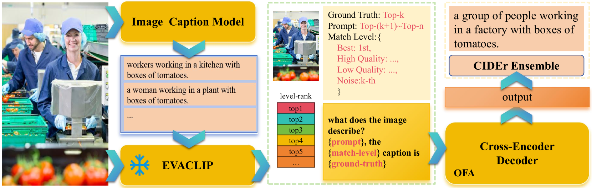
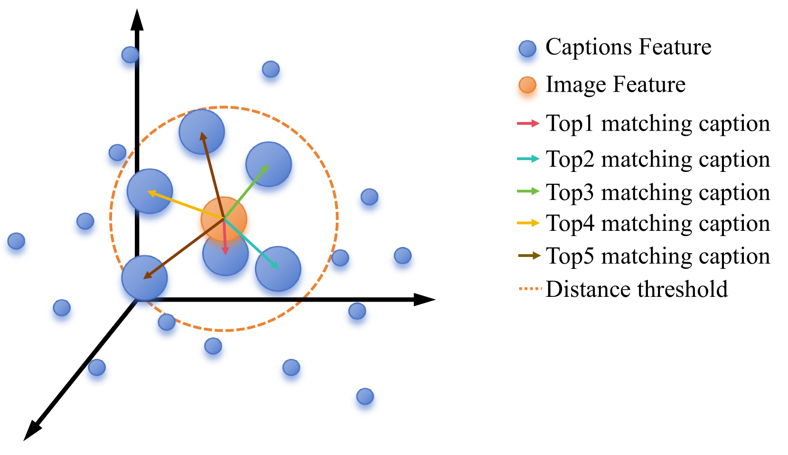
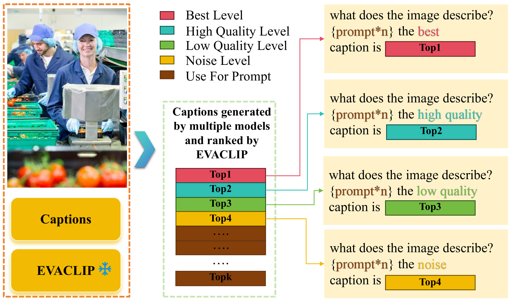
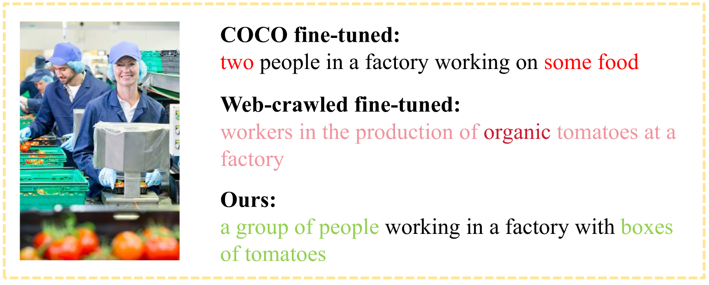

# CVPR2024 NICE图像标题挑战赛的解决之道

发布时间：2024年04月19日

`分类：RAG

这篇论文的摘要描述了一个针对零样本图像描述问题的解决方案，涉及到图像描述模型、检索增强技术和标题评分技术。这些技术的应用和改进表明，这篇论文主要关注于如何通过结合不同的方法来提高图像描述的质量。由于这些技术通常涉及到检索和生成（RAG），因此这篇论文应该被归类为RAG类别。` `计算机视觉`

> The Solution for the CVPR2024 NICE Image Captioning Challenge

# 摘要

> 本报告提出了2024年NICE挑战赛主题1——零样本图像描述的解决方案。与2023年的NICE数据集不同，新挑战包含了人类标注者在描述风格和内容上的显著差异。我们通过检索增强和标题评分技术，有效提升了图像描述的质量。在数据层面，我们利用图像描述模型生成的优质标题作为训练集，以弥补文本风格的差异。模型方面，我们采用了OFA模型——一种基于手工模板的大规模视觉-语言预训练模型，来执行图像描述任务。我们进一步提出了一种标题级策略，针对图像描述模型生成的高质量数据，并将其与检索增强策略相结合，以促使模型生成更优质、更贴合、语义更丰富的描述。这一方法在排行榜上位居榜首，获得了CIDEr得分234.11，并在其他所有评价指标中均位列第一。

> This report introduces a solution to the Topic 1 Zero-shot Image Captioning of 2024 NICE : New frontiers for zero-shot Image Captioning Evaluation. In contrast to NICE 2023 datasets, this challenge involves new annotations by humans with significant differences in caption style and content. Therefore, we enhance image captions effectively through retrieval augmentation and caption grading methods. At the data level, we utilize high-quality captions generated by image caption models as training data to address the gap in text styles. At the model level, we employ OFA (a large-scale visual-language pre-training model based on handcrafted templates) to perform the image captioning task. Subsequently, we propose caption-level strategy for the high-quality caption data generated by the image caption models and integrate them with retrieval augmentation strategy into the template to compel the model to generate higher quality, more matching, and semantically enriched captions based on the retrieval augmentation prompts. Our approach ranks first on the leaderboard, achieving a CIDEr score of 234.11 and 1st in all other metrics.

[Arxiv](https://arxiv.org/abs/2404.12739)