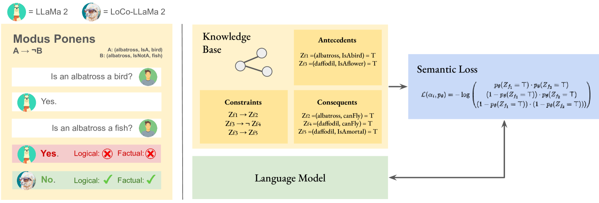
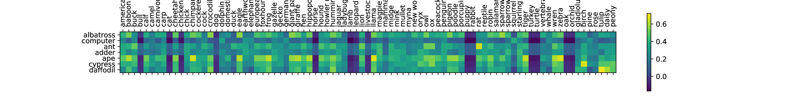

# 通过概率推理方法，推动语言模型向逻辑一致性方向发展。

发布时间：2024年04月19日

`LLM理论` `知识推理`

> Towards Logically Consistent Language Models via Probabilistic Reasoning

# 摘要

> 大型语言模型（LLMs）在自然语言理解和生成任务上展现出巨大潜力。尽管如此，现有的LLMs并非完美无缺，它们可能会产生不准确的信息，更重要的是，在对世界的认知进行推理时，它们可能会自相矛盾。目前，这些问题通常通过大规模的精细调整或依赖外部工具来实现一致性推理来解决。在本项研究中，我们寻求一种折衷方案，提出了一种基于概率推理原理的训练目标，旨在培养LLMs与外部事实和规则形式的知识保持一致性。通过在我们设计的损失函数上对有限的事实集进行微调，我们的LLMs在逻辑一致性上超越了以往的基准，并且能够更加系统地扩展到未见过但语义相似的新事实知识。

> Large language models (LLMs) are a promising venue for natural language understanding and generation tasks. However, current LLMs are far from reliable: they are prone to generate non-factual information and, more crucially, to contradict themselves when prompted to reason about beliefs of the world. These problems are currently addressed with large scale fine-tuning or by delegating consistent reasoning to external tools. In this work, we strive for a middle ground and introduce a training objective based on principled probabilistic reasoning that teaches a LLM to be consistent with external knowledge in the form of a set of facts and rules. Fine-tuning with our loss on a limited set of facts enables our LLMs to be more logically consistent than previous baselines and allows them to extrapolate to unseen but semantically similar factual knowledge more systematically.

[Arxiv](https://arxiv.org/abs/2404.12843)