# 探索大型语言模型中可靠的潜在知识评估：比较了情境学习与基于提示的事实知识抽取方法。

发布时间：2024年04月19日

`LLM理论` `人工智能` `知识评估`

> Towards Reliable Latent Knowledge Estimation in LLMs: In-Context Learning vs. Prompting Based Factual Knowledge Extraction

# 摘要

> 本研究提出了一种评估大型语言模型（LLMs）中隐含知识的方法。通过发挥LLMs的上下文学习能力（ICL），我们能够估计模型对知识库内事实的掌握程度。相较于传统基于提示的方法，我们的估计器在概念上更为简洁，操作也更简便，且能有效挖掘LLMs深层的知识储备。此外，我们还探讨了不同设计决策对ICL驱动的知识估计效果的影响。利用这一新工具，我们对包括OPT、Pythia、Llama(2)、Mistral、Gemma等在内的多种开源LLMs进行了广泛的事实知识评估，这些评估基于Wikidata知识库中的众多关系和事实。研究发现，不同模型族和大小的模型在事实知识掌握上存在差异，某些关系的认知普遍优于其他关系，不同模型对特定事实的了解也各有千秋，基础模型与它们的微调版本在知识层面亦展现出差异。

> We propose an approach for estimating the latent knowledge embedded inside large language models (LLMs). We leverage the in-context learning (ICL) abilities of LLMs to estimate the extent to which an LLM knows the facts stored in a knowledge base. Our knowledge estimator avoids reliability concerns with previous prompting-based methods, is both conceptually simpler and easier to apply, and we demonstrate that it can surface more of the latent knowledge embedded in LLMs. We also investigate how different design choices affect the performance of ICL-based knowledge estimation. Using the proposed estimator, we perform a large-scale evaluation of the factual knowledge of a variety of open source LLMs, like OPT, Pythia, Llama(2), Mistral, Gemma, etc. over a large set of relations and facts from the Wikidata knowledge base. We observe differences in the factual knowledge between different model families and models of different sizes, that some relations are consistently better known than others but that models differ in the precise facts they know, and differences in the knowledge of base models and their finetuned counterparts.

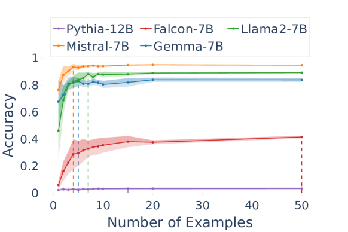

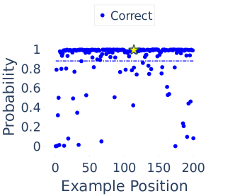

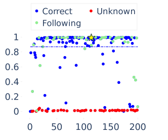

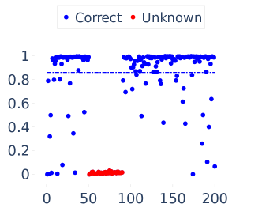

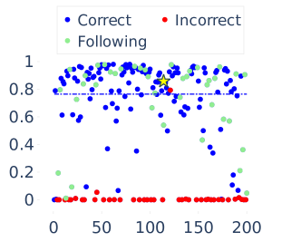

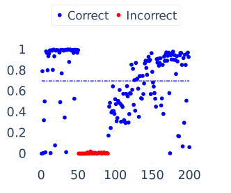

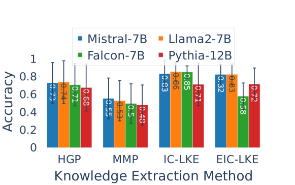

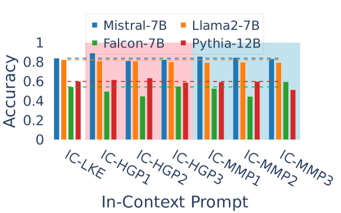

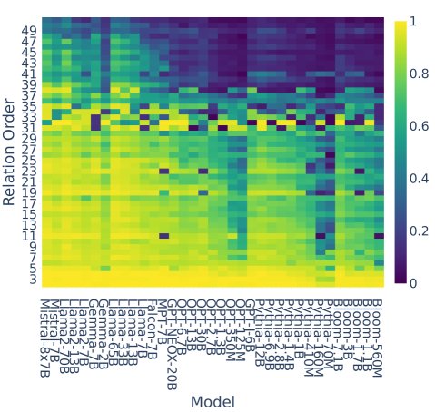

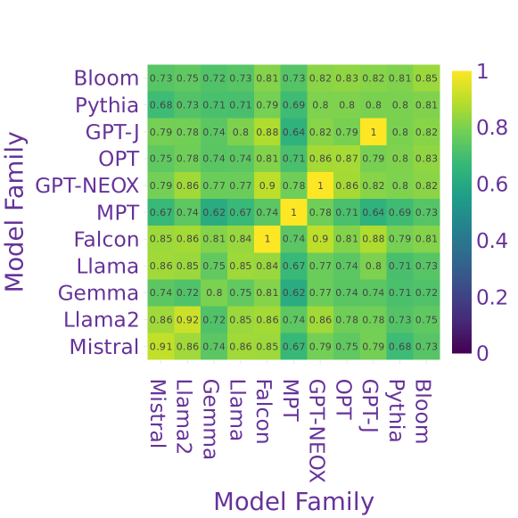

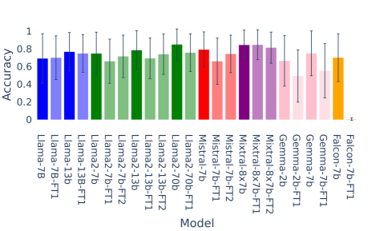

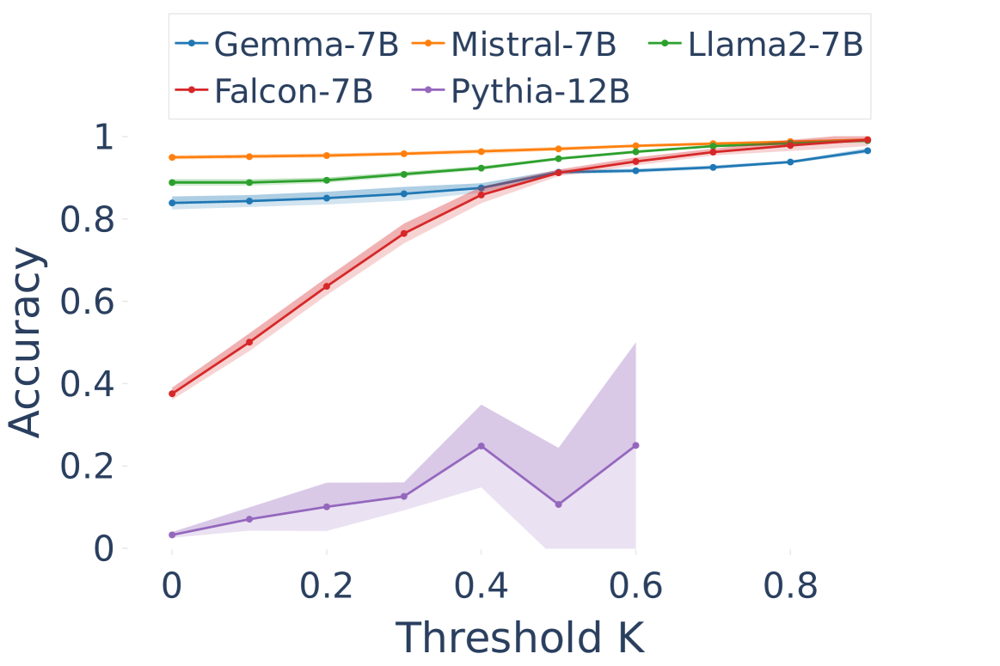

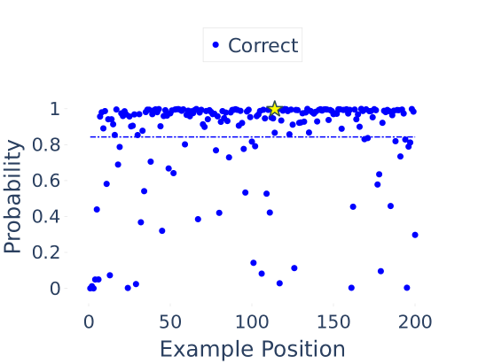

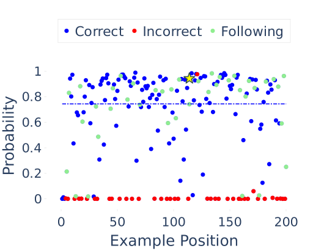

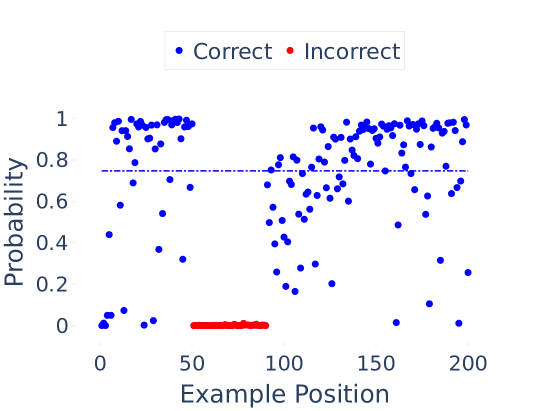

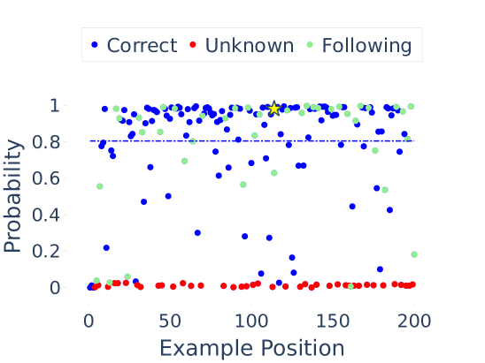

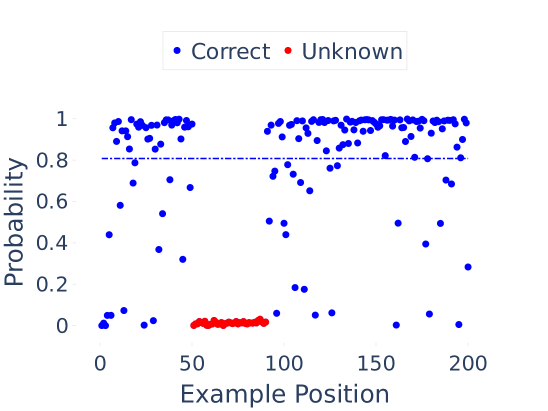

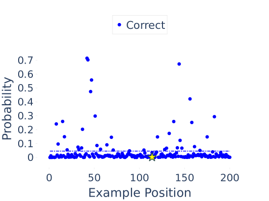

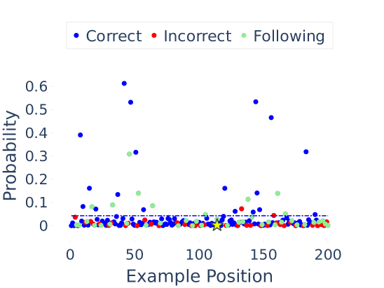

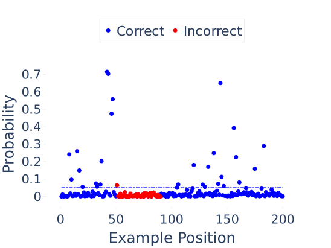

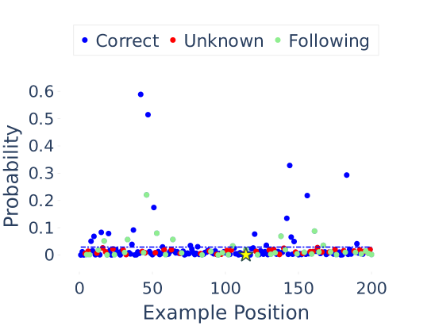

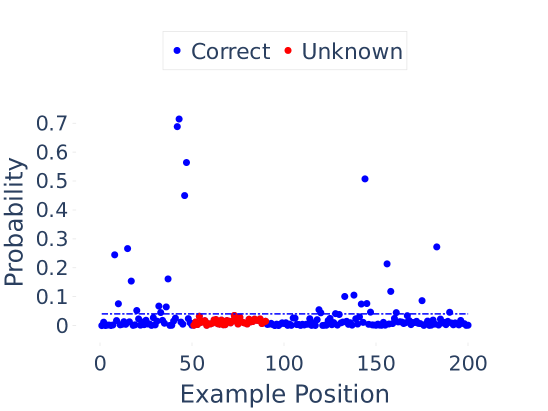

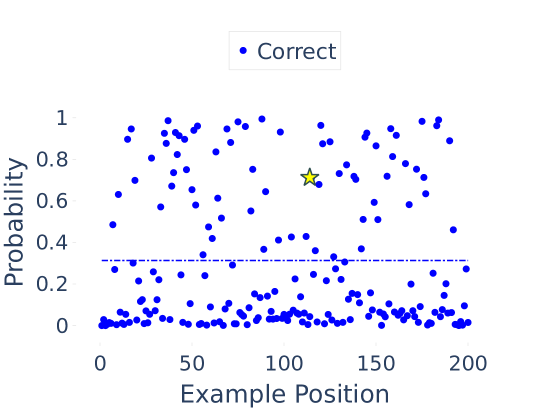

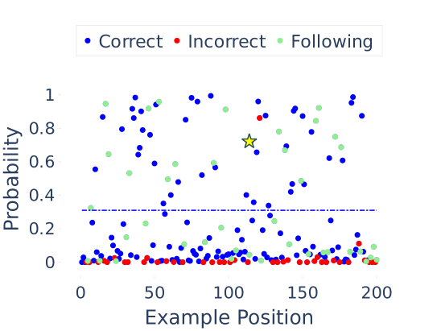

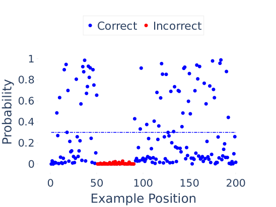

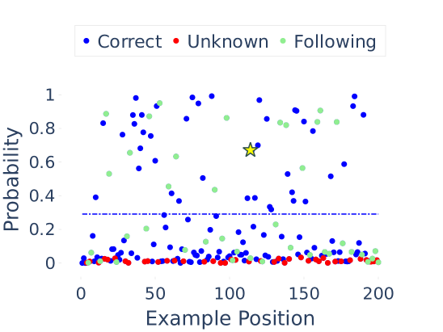

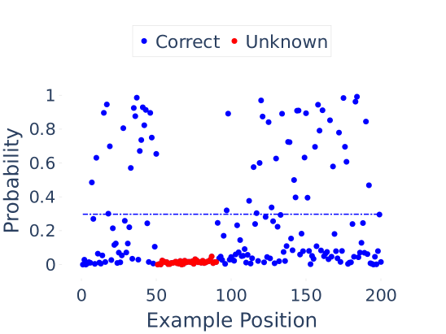

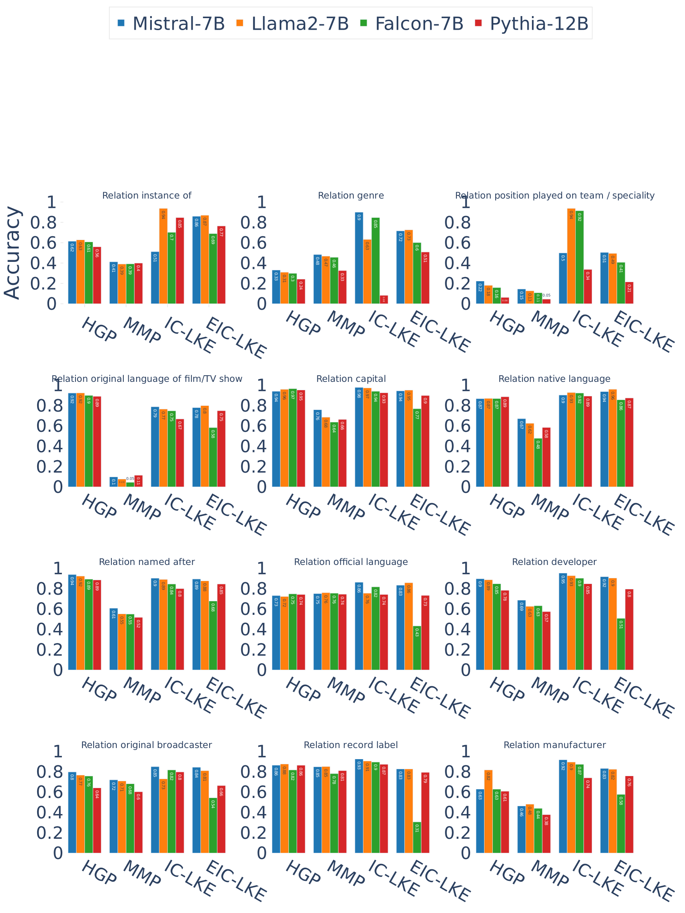

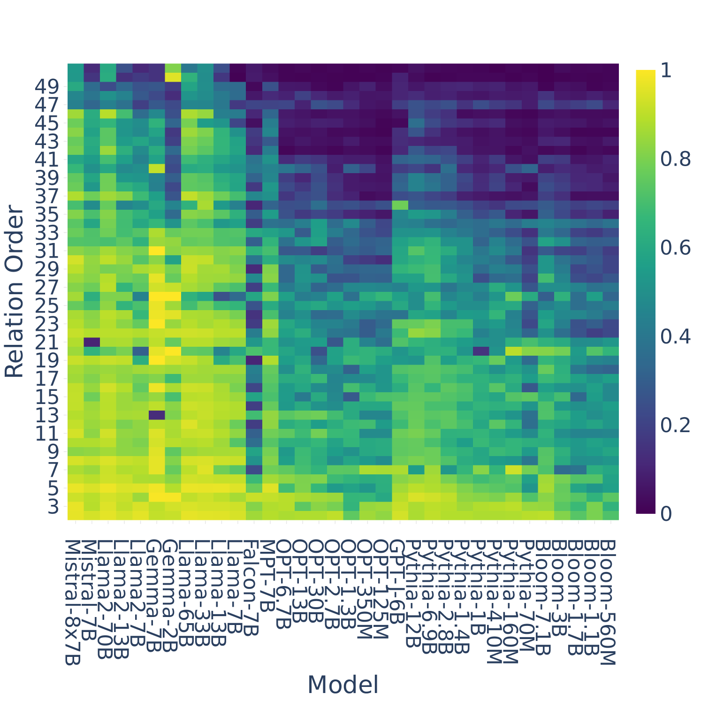

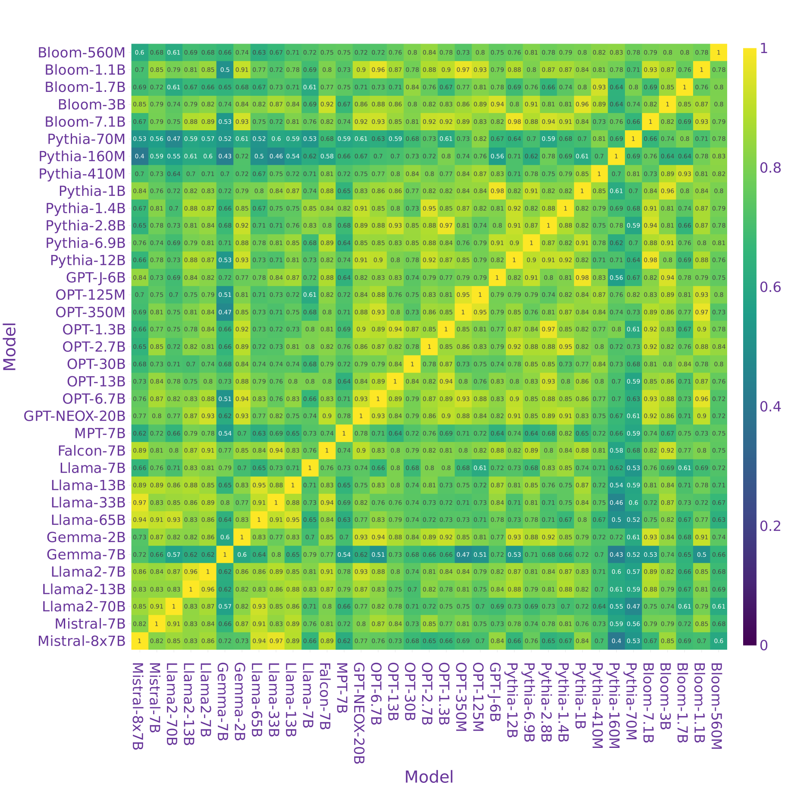

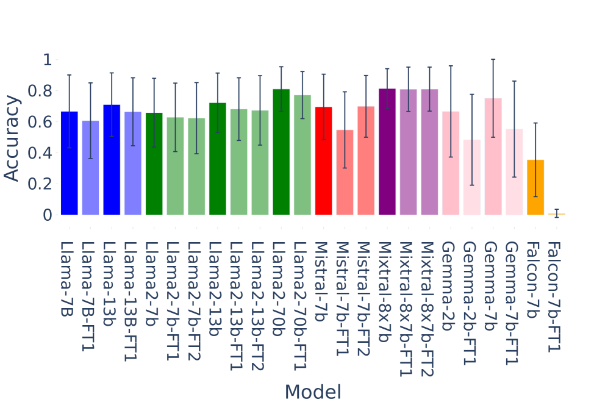

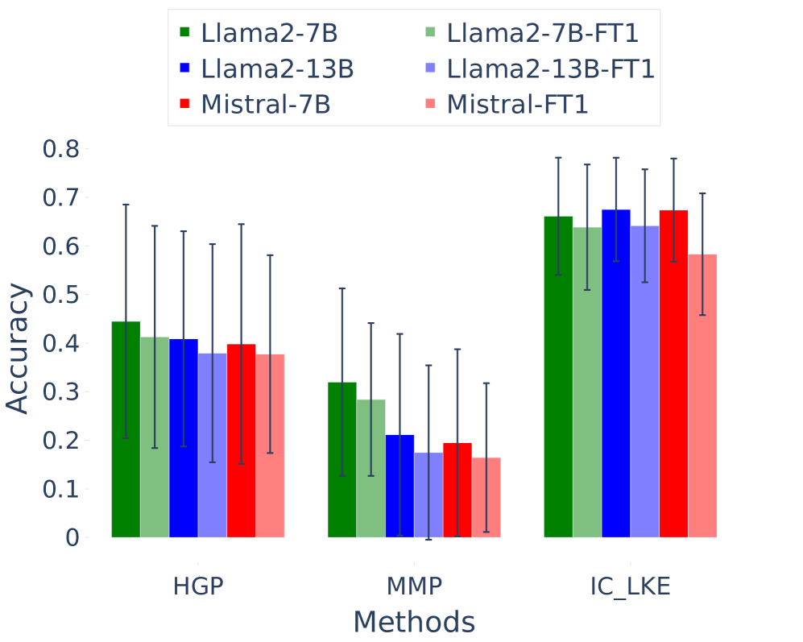

[Arxiv](https://arxiv.org/abs/2404.12957)