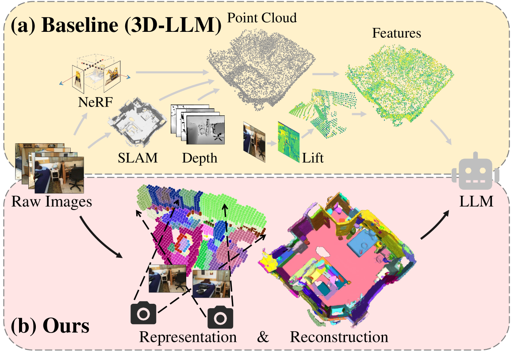
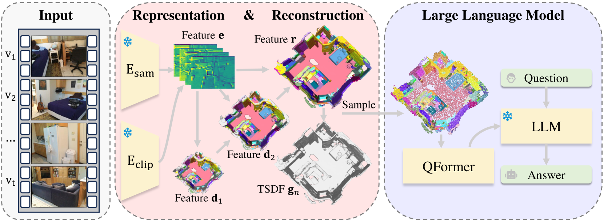
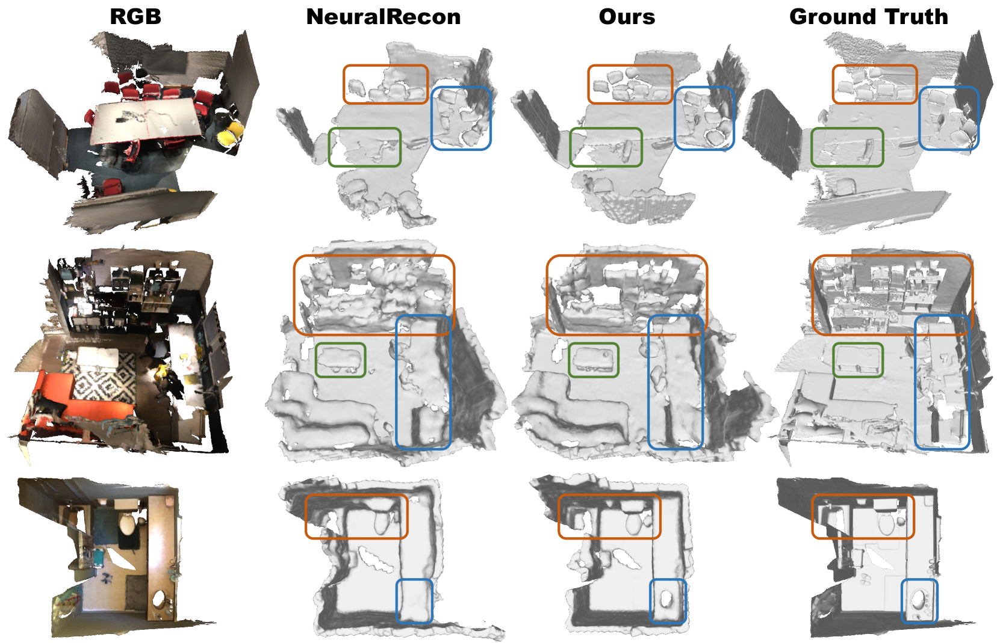

# 为3D大型语言模型提供统一的场景表示与重建。

发布时间：2024年04月19日

`分类：LLM应用

这篇论文讨论了如何将大型语言模型（LLMs）应用于三维环境的互动，提出了一种新的统一场景表示和重建框架Uni3DR^2，以提高LLMs在三维场景中的应用效果。这属于LLM应用的范畴，因为它探索了如何将LLMs应用于新的领域和任务。` `三维重建` `人工智能`

> Unified Scene Representation and Reconstruction for 3D Large Language Models

# 摘要

> 让大型语言模型（LLMs）与三维环境互动面临诸多挑战。目前的方法通常是从真实几何数据（GT）或辅助模型重建的三维场景中提取点云，再将CLIP中的文图对齐的二维特征提升至点云，作为LLMs的输入。但这种方法未能建立三维点对点的连接，导致空间结构信息的缺失。同时，场景的几何与语义表示之间缺少整合，影响了对三维场景的深入理解。本文强调了统一场景表示和重建框架对于LLMs在三维场景中应用的重要性。具体而言，我们提出了Uni3DR^2，它利用预训练的二维基础模型（如CLIP和SAM）和多尺度聚合三维解码器，提取具有3D几何和语义感知的表示特征。这些学习到的3D表示不仅促进了重建过程，也为LLMs提供了重要知识。实验结果显示，Uni3DR^2在ScanNet三维重建数据集上取得了显著提升（F-Score提升了1.8%）。在LLMs应用方面，Uni3DR^2-LLM在ScanQA三维视觉-语言理解数据集上超越了基线（在验证集和测试集上BLEU-1分别提高了4.0%和4.2%）。此外，它在ScanQA和3DMV-VQA上的表现也超越了使用额外GT点云的最先进方法。

> Enabling Large Language Models (LLMs) to interact with 3D environments is challenging. Existing approaches extract point clouds either from ground truth (GT) geometry or 3D scenes reconstructed by auxiliary models. Text-image aligned 2D features from CLIP are then lifted to point clouds, which serve as inputs for LLMs. However, this solution lacks the establishment of 3D point-to-point connections, leading to a deficiency of spatial structure information. Concurrently, the absence of integration and unification between the geometric and semantic representations of the scene culminates in a diminished level of 3D scene understanding. In this paper, we demonstrate the importance of having a unified scene representation and reconstruction framework, which is essential for LLMs in 3D scenes. Specifically, we introduce Uni3DR^2 extracts 3D geometric and semantic aware representation features via the frozen pre-trained 2D foundation models (e.g., CLIP and SAM) and a multi-scale aggregate 3D decoder. Our learned 3D representations not only contribute to the reconstruction process but also provide valuable knowledge for LLMs. Experimental results validate that our Uni3DR^2 yields convincing gains over the baseline on the 3D reconstruction dataset ScanNet (increasing F-Score by +1.8\%). When applied to LLMs, our Uni3DR^2-LLM exhibits superior performance over the baseline on the 3D vision-language understanding dataset ScanQA (increasing BLEU-1 by +4.0\% and +4.2\% on the val set and test set, respectively). Furthermore, it outperforms the state-of-the-art method that uses additional GT point clouds on both ScanQA and 3DMV-VQA.

[Arxiv](https://arxiv.org/abs/2404.13044)