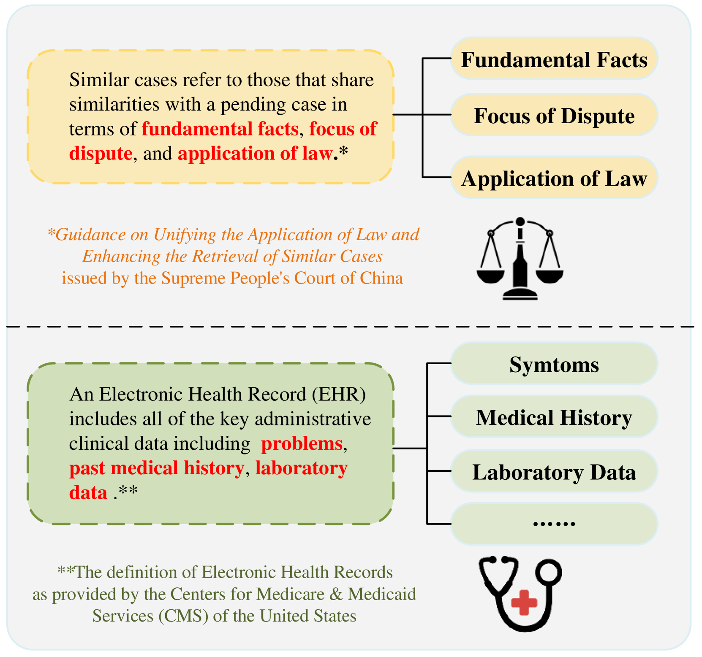
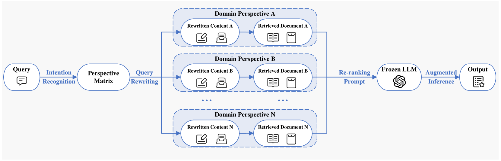
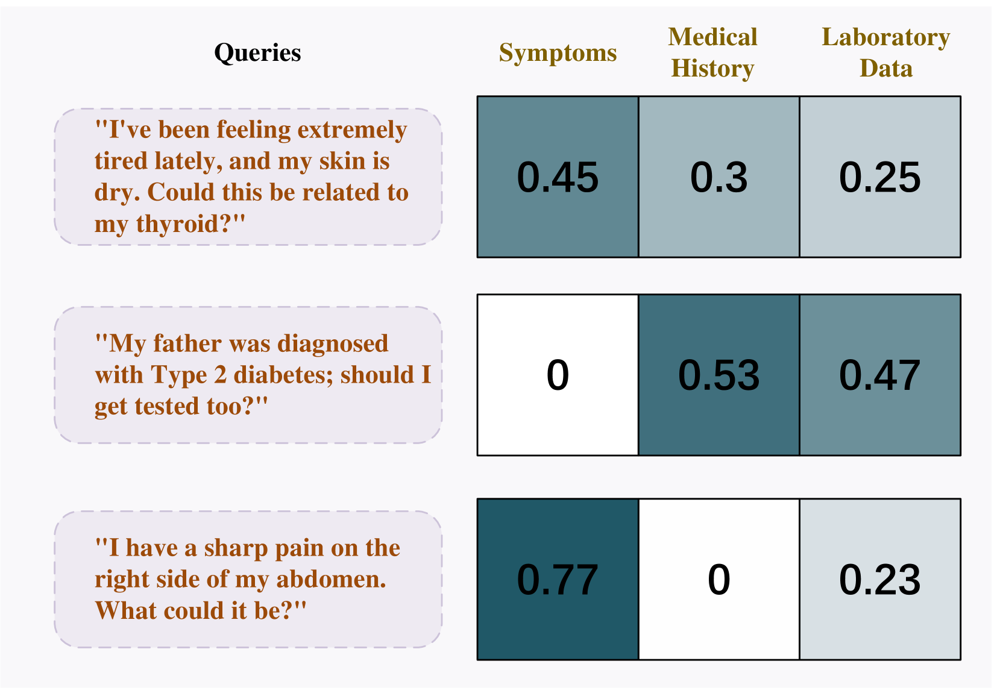
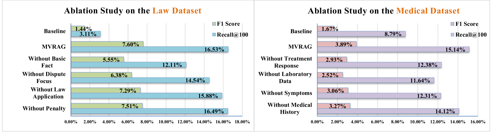

# 探索知识密集型检索增强生成中的多角度洞察

发布时间：2024年04月19日

`RAG`

> Unlocking Multi-View Insights in Knowledge-Dense Retrieval-Augmented Generation

# 摘要

> 检索增强生成（RAG）对于大型语言模型（LLM）的应用至关重要，但在法律和医学等知识密集型领域，现有检索方法缺乏多视角视图，这限制了解释性和可靠性的提升。以往的多视图检索研究多聚焦于查询的不同语义表达，而忽视了特定领域知识视角的重要性。本论文提出了一种创新的多视图RAG框架——MVRAG，专为知识密集型领域设计，通过从多个领域视角进行意图感知的查询重写，以提高检索的精确度，进而增强最终推理的有效性。在法律和医学案例检索的实验中，我们的框架显著提升了召回率和精确率。我们的多视角检索方法充分发挥了多视图信息在RAG任务中的潜力，为LLM在知识密集型领域的深入应用提供了加速动力。

> While Retrieval-Augmented Generation (RAG) plays a crucial role in the application of Large Language Models (LLMs), existing retrieval methods in knowledge-dense domains like law and medicine still suffer from a lack of multi-perspective views, which are essential for improving interpretability and reliability. Previous research on multi-view retrieval often focused solely on different semantic forms of queries, neglecting the expression of specific domain knowledge perspectives. This paper introduces a novel multi-view RAG framework, MVRAG, tailored for knowledge-dense domains that utilizes intention-aware query rewriting from multiple domain viewpoints to enhance retrieval precision, thereby improving the effectiveness of the final inference. Experiments conducted on legal and medical case retrieval demonstrate significant improvements in recall and precision rates with our framework. Our multi-perspective retrieval approach unleashes the potential of multi-view information enhancing RAG tasks, accelerating the further application of LLMs in knowledge-intensive fields.

[Arxiv](https://arxiv.org/abs/2404.12879)