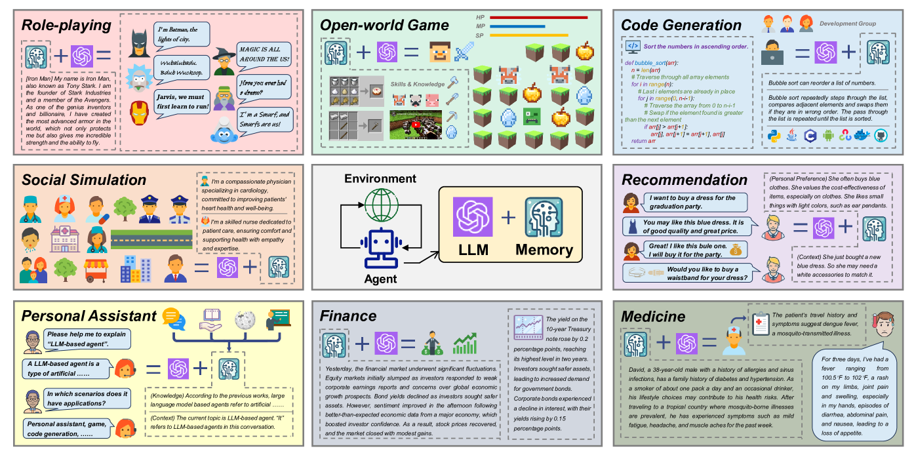
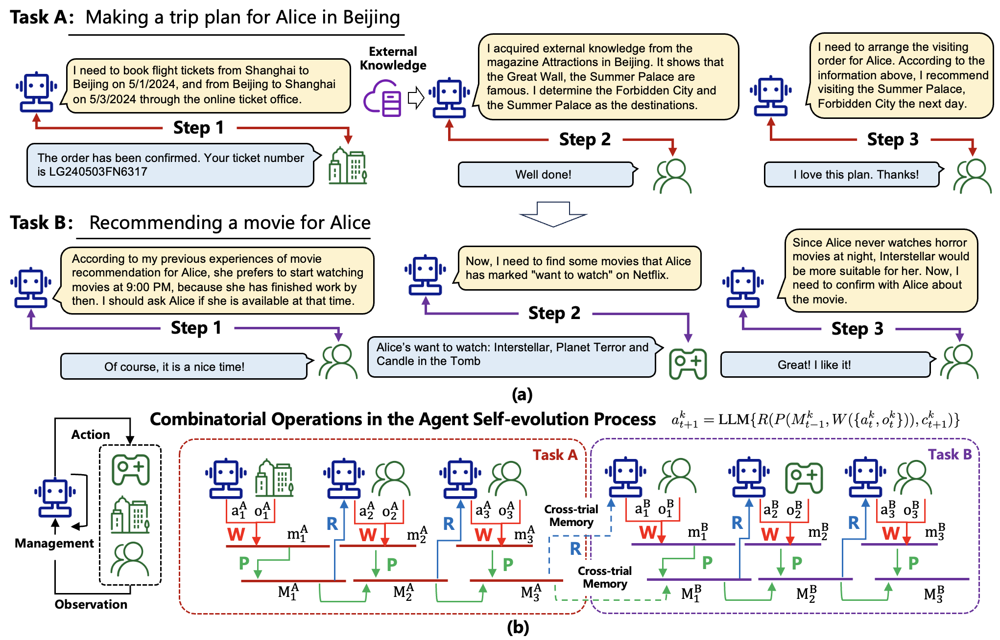
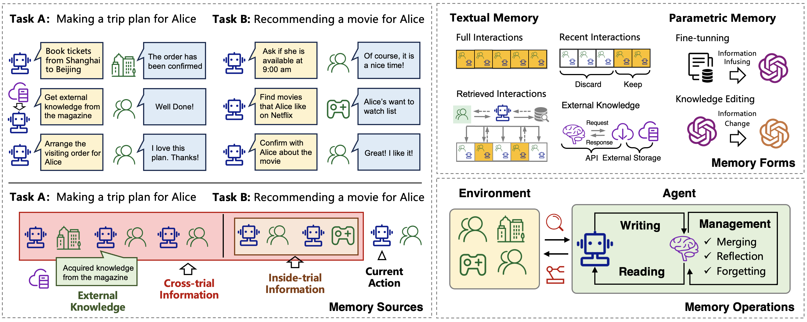
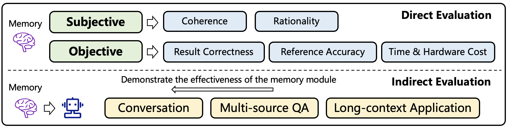

# 本文综述了大型语言模型代理中的记忆机制。

发布时间：2024年04月20日

`Agent` `人工智能` `存储技术`

> A Survey on the Memory Mechanism of Large Language Model based Agents

# 摘要

> 近期，基于大型语言模型（LLM）的智能代理在学术界和产业界引起了广泛关注。与传统LLM相比，这些代理的亮点在于其自我演化的能力，这对于解决需要长期复杂交互的现实世界问题至关重要。在这些交互中，代理的“记忆”功能发挥着核心作用。尽管先前研究已经提出了许多有潜力的存储机制，但这些成果分散在众多文献中，目前还缺乏一个全面系统的回顾来梳理和比较这些研究成果，未能提炼出共通且有效的设计模式以启发未来的研究方向。为了填补这一空白，本文提出了对LLM基础代理存储机制的深入综述。我们首先探讨了LLM代理中“记忆”的实质及其必要性。接着，我们系统性地审视了关于存储模块设计和评估的既有研究。此外，我们还介绍了许多存储模块发挥关键作用的代理应用案例。文末，我们分析了现有研究的局限性，并指出了未来研究的重要方向。为了紧跟这一领域的最新进展，我们建立了一个在线资源库，地址为 \url{https://github.com/nuster1128/LLM_Agent_Memory_Survey}。

> Large language model (LLM) based agents have recently attracted much attention from the research and industry communities. Compared with original LLMs, LLM-based agents are featured in their self-evolving capability, which is the basis for solving real-world problems that need long-term and complex agent-environment interactions. The key component to support agent-environment interactions is the memory of the agents. While previous studies have proposed many promising memory mechanisms, they are scattered in different papers, and there lacks a systematical review to summarize and compare these works from a holistic perspective, failing to abstract common and effective designing patterns for inspiring future studies. To bridge this gap, in this paper, we propose a comprehensive survey on the memory mechanism of LLM-based agents. In specific, we first discuss ''what is'' and ''why do we need'' the memory in LLM-based agents. Then, we systematically review previous studies on how to design and evaluate the memory module. In addition, we also present many agent applications, where the memory module plays an important role. At last, we analyze the limitations of existing work and show important future directions. To keep up with the latest advances in this field, we create a repository at \url{https://github.com/nuster1128/LLM_Agent_Memory_Survey}.

[Arxiv](https://arxiv.org/abs/2404.13501)