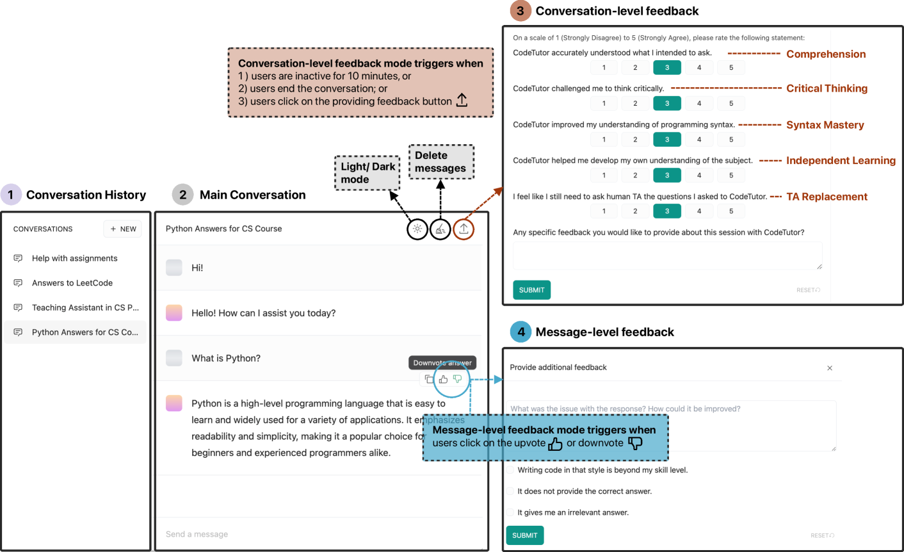
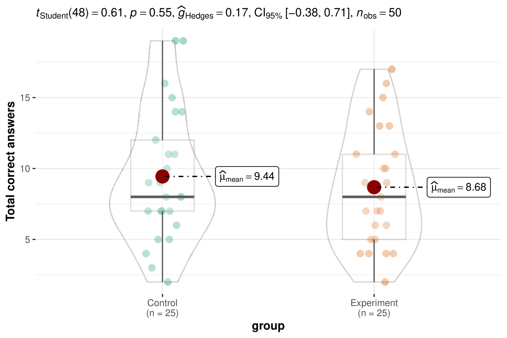
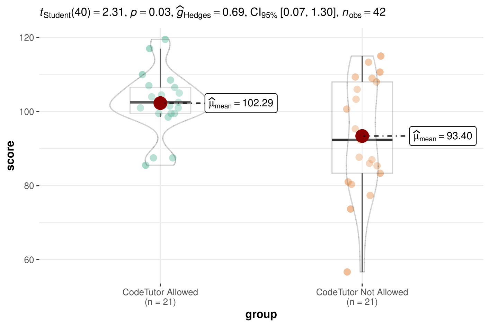

# 探究大型语言模型（LLM）在入门计算机科学教育领域的应用效果：进行了一学期的深入实地考察。

发布时间：2024年04月20日

`LLM应用` `计算机科学教育` `人工智能助手`

> Evaluating the Effectiveness of LLMs in Introductory Computer Science Education: A Semester-Long Field Study

# 摘要

> 人工智能助手的融入，尤其是通过大型语言模型（LLMs）的发展，已在计算机科学教育领域引发了激烈的讨论。尽管研究者们开始探索LLMs在教育中的应用，但关于它们对初学者编程课程学生影响的研究却寥寥无几，尤其是在实际环境和长期教学中的考量。为填补这一研究空缺，我们开展了一项为期半年的研究，共有50名学生参与，他们使用了由我们研究团队开发的LLM驱动的编程辅助工具CodeTutor。研究结果显示，使用CodeTutor的实验组学生在期末成绩上相较于未使用该工具的对照组学生有了显著提升。在实验组内部，那些未曾接触过LLM工具的学生比有接触经验的学生获得了更大的进步。此外，学生们对CodeTutor的功能给予了正面评价，但同时也对其在培养批判性思维能力方面的局限性表示担忧。随着时间的推移，学生们对CodeTutor建议的认同度有所下降，他们更倾向于寻求传统人类助教的帮助。我们的分析还发现，用户输入的质量问题与CodeTutor响应的有效性显著相关。基于这些发现，我们讨论了将生成性人工智能素养纳入课程设置，以促进批判性思维技能的发展，并探讨了用户与LLM工具互动的时间动态。我们还讨论了工具预期功能与学生实际能力之间的差异，这突显了制定针对性策略以提升教育成效的必要性。

> The integration of AI assistants, especially through the development of Large Language Models (LLMs), into computer science education has sparked significant debate. An emerging body of work has looked into using LLMs in education, but few have examined the impacts of LLMs on students in entry-level programming courses, particularly in real-world contexts and over extended periods. To address this research gap, we conducted a semester-long, between-subjects study with 50 students using CodeTutor, an LLM-powered assistant developed by our research team. Our study results show that students who used CodeTutor (the experimental group) achieved statistically significant improvements in their final scores compared to peers who did not use the tool (the control group). Within the experimental group, those without prior experience with LLM-powered tools demonstrated significantly greater performance gain than their counterparts. We also found that students expressed positive feedback regarding CodeTutor's capability, though they also had concerns about CodeTutor's limited role in developing critical thinking skills. Over the semester, students' agreement with CodeTutor's suggestions decreased, with a growing preference for support from traditional human teaching assistants. Our analysis further reveals that the quality of user prompts was significantly correlated with CodeTutor's response effectiveness. Building upon our results, we discuss the implications of our findings for integrating Generative AI literacy into curricula to foster critical thinking skills and turn to examining the temporal dynamics of user engagement with LLM-powered tools. We further discuss the discrepancy between the anticipated functions of tools and students' actual capabilities, which sheds light on the need for tailored strategies to improve educational outcomes.

[Arxiv](https://arxiv.org/abs/2404.13414)