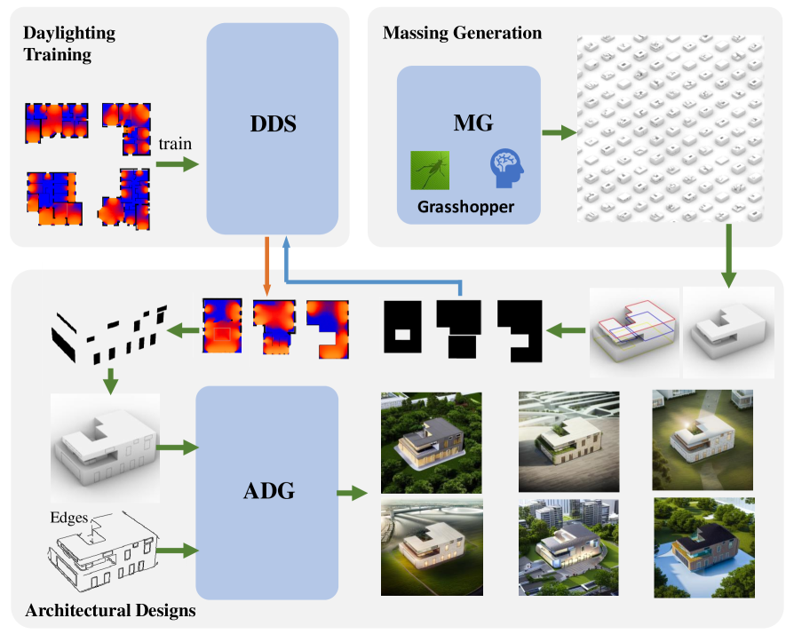
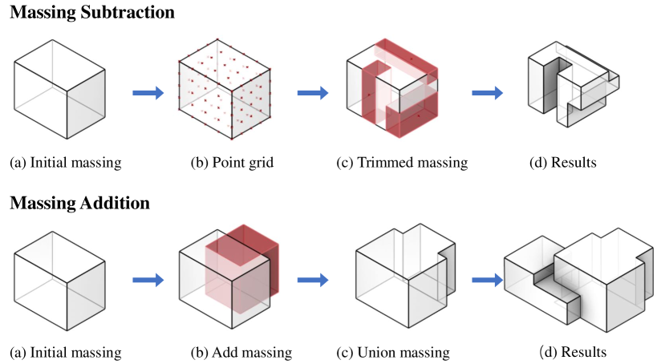
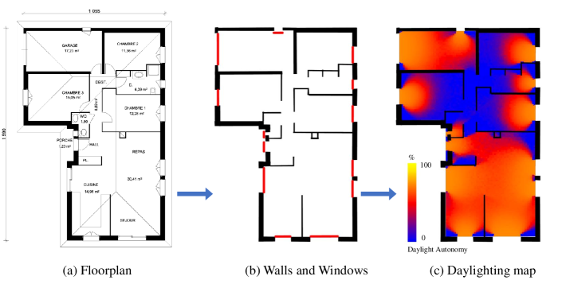
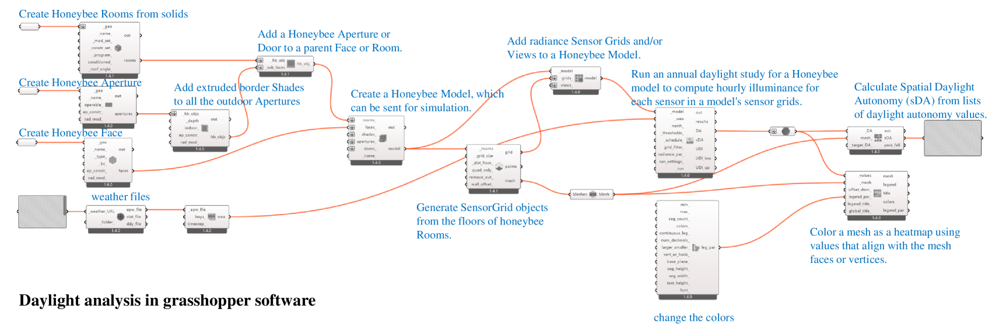

# 利用扩散模型打造以日光为驱动力的建筑设计。

发布时间：2024年04月20日

`分类：LLM应用` `人工智能`

> Generating Daylight-driven Architectural Design via Diffusion Models

# 摘要

> 随着大规模模型的迅猛发展，建筑等跨学科领域迎来了创新机遇。本文介绍了一种创新的人工智能辅助建筑设计方法，该方法以日光为驱动力。我们首先构建了一种快速生成建筑体量模型的方法，利用随机参数迅速产出设计模型。接着，引入了一种日光导向的立面设计策略，精确规划窗户布局，并将其整合到体量模型中。最终，我们巧妙地将大规模语言模型与文本到图像模型结合，大幅提升了视觉建筑设计渲染的生成效率。实验结果显示，这种方法不仅激发了建筑师的创意灵感，还为建筑设计的创新之路提供了新的方向。项目详情可见：https://zrealli.github.io/DDADesign/。

> In recent years, the rapid development of large-scale models has made new possibilities for interdisciplinary fields such as architecture. In this paper, we present a novel daylight-driven AI-aided architectural design method. Firstly, we formulate a method for generating massing models, producing architectural massing models using random parameters quickly. Subsequently, we integrate a daylight-driven facade design strategy, accurately determining window layouts and applying them to the massing models. Finally, we seamlessly combine a large-scale language model with a text-to-image model, enhancing the efficiency of generating visual architectural design renderings. Experimental results demonstrate that our approach supports architects' creative inspirations and pioneers novel avenues for architectural design development. Project page: https://zrealli.github.io/DDADesign/.

[Arxiv](https://arxiv.org/abs/2404.13353)