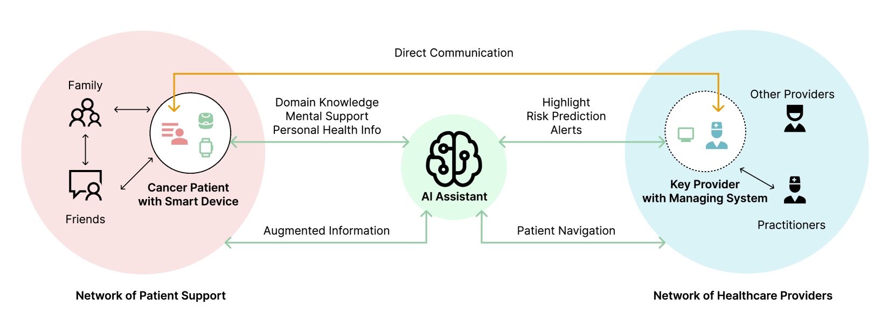

# 癌症患者与医疗提供者之间的沟通充满了挑战，但人工智能的介入潜力巨大。我们渴望有AI的助力，以改善这一沟通过程。

发布时间：2024年04月20日

`LLM应用` `人工智能`

> "I Wish There Were an AI": Challenges and AI Potential in Cancer Patient-Provider Communication

# 摘要

> 癌症患者在治疗后的存活与医患沟通紧密相关。然而，治疗后的沟通难题常被忽视，这主要是因为患者病情的严重性和癌症的多样性及罕见性。幸运的是，人工智能的最新进展，尤其是多功能的大规模语言模型（LLMs），为复杂医疗情境中的沟通提供了支持。我们通过与六位医疗提供者和八位癌症患者对话，旨在探究治疗后恢复期的医患沟通障碍、对未来沟通技术的期望，以及AI技术在此领域的潜力。研究发现了当前医患沟通中的多重挑战，包括知识与时机的不匹配、协作障碍和资源限制。基于这些需求和期望，我们为智能沟通系统，尤其是借助LLMs的系统，提出了一系列设计建议。本研究为未来在高风险和不确定性情境下，设计以人工智能为动力的医患沟通系统提供了新思路。

> Patient-provider communication has been crucial to cancer patients' survival after their cancer treatments. However, the research community and patients themselves often overlook the communication challenges after cancer treatments as they are overshadowed by the severity of the patient's illness and the variety and rarity of the cancer disease itself. Meanwhile, the recent technical advances in AI, especially in Large Language Models (LLMs) with versatile natural language interpretation and generation ability, demonstrate great potential to support communication in complex real-world medical situations. By interviewing six healthcare providers and eight cancer patients, our goal is to explore the providers' and patients' communication barriers in the post-cancer treatment recovery period, their expectations for future communication technologies, and the potential of AI technologies in this context. Our findings reveal several challenges in current patient-provider communication, including the knowledge and timing gaps between cancer patients and providers, their collaboration obstacles, and resource limitations. Moreover, based on providers' and patients' needs and expectations, we summarize a set of design implications for intelligent communication systems, especially with the power of LLMs. Our work sheds light on the design of future AI-powered systems for patient-provider communication under high-stake and high-uncertainty situations.

[Arxiv](https://arxiv.org/abs/2404.13409)