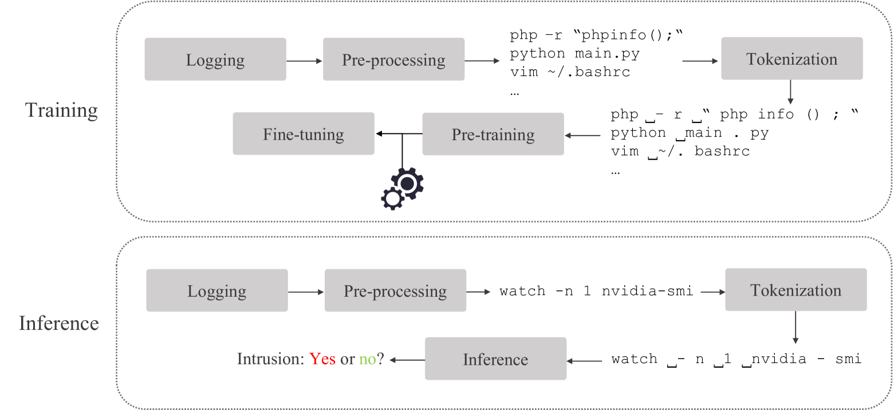
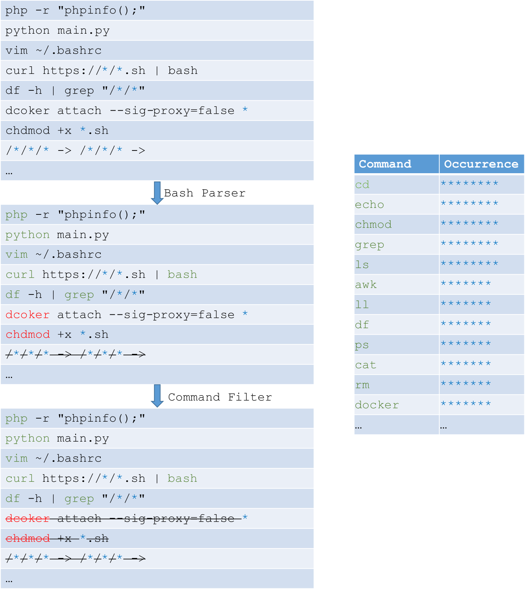

# 借助命令行语言模型的力量，实现大规模入侵检测。

发布时间：2024年04月20日

`LLM应用` `网络安全` `机器学习`

> Intrusion Detection at Scale with the Assistance of a Command-line Language Model

# 摘要

> 入侵检测一直是网络安全领域的核心议题。企业安全领域迫切需要能够自动识别入侵的系统。目前的方法多依赖于安全专家制定的手工规则，这些规则不仅误报率高，而且难以有效应对新型的零日攻击。人工智能和机器学习技术为我们提供了新的解决路径，它们能够智能地从大量数据中自动识别异常行为。尽管如此，现有的基于学习的方法主要针对小规模数据集，未能充分发挥云计算环境中大数据的潜力。本文旨在解决这一问题，提出了一种结合了大规模预训练的入侵检测系统，该系统利用数千万条命令行数据训练大型语言模型，以实现基于AI的入侵检测。我们在3000万训练样本和1000万测试样本上进行的实验，证明了我们方案的有效性。

> Intrusion detection is a long standing and crucial problem in security. A system capable of detecting intrusions automatically is on great demand in enterprise security solutions. Existing solutions rely heavily on hand-crafted rules designed by security operators, which suffer from high false negative rates and poor generalization ability to new, zero-day attacks at scale. AI and machine learning offer promising solutions to address the issues, by inspecting abnormal user behaviors intelligently and automatically from data. However, existing learning-based intrusion detection systems in the literature are mostly designed for small data, and they lack the ability to leverage the power of big data in cloud environments. In this paper, we target at this problem and introduce an intrusion detection system which incorporates large-scale pre-training, so as to train a large language model based on tens of millions of command lines for AI-based intrusion detection. Experiments performed on 30 million training samples and 10 million test samples verify the effectiveness of our solution.

[Arxiv](https://arxiv.org/abs/2404.13402)