# Movie101v2：提升版电影叙事基准

发布时间：2024年04月20日

`分类：LLM应用

这篇论文主要研究了自动电影旁白的生成，这是一个与视障观众理解电影内容相关的应用。论文中提到了开发新的数据集、设计评估方法以及对现有视觉-语言模型的分析，这些都是在实际应用中进行的探索和改进。因此，这篇论文应该归类为LLM应用。` `电影制作` `辅助技术`

> Movie101v2: Improved Movie Narration Benchmark

# 摘要

> 自动电影旁白致力于制作与视频同步的剧情解说，以辅助视障观众理解电影内容。与传统视频字幕不同，它不仅需要捕捉关键的视觉信息，更要能够推断出跨越多个场景的电影情节，这无疑带来了一系列新颖且持续的挑战。为了推动自动电影旁白技术的进步，我们首先回顾了现有数据集的不足，并开发了一个新的大规模双语电影旁白数据集，命名为 Movie101v2。其次，鉴于实现实用的电影旁白所面临的挑战，我们提出了分阶段的目标，并首先集中于理解单个片段内的内容。同时，我们还设计了一种新的旁白评估方法，以匹配我们阶段性的目标。最后，利用新数据集，我们对包括 GPT-4V 在内的几个前沿的视觉-语言模型进行了基准测试，并深入分析了现有模型在生成电影旁白时所面临的难题。我们的研究结果表明，要实现实用的电影旁白生成，仍需进行深入的研究工作。

> Automatic movie narration targets at creating video-aligned plot descriptions to assist visually impaired audiences. It differs from standard video captioning in that it requires not only describing key visual details but also inferring the plots developed across multiple movie shots, thus posing unique and ongoing challenges. To advance the development of automatic movie narrating systems, we first revisit the limitations of existing datasets and develop a large-scale, bilingual movie narration dataset, Movie101v2. Second, taking into account the essential difficulties in achieving applicable movie narration, we break the long-term goal into three progressive stages and tentatively focus on the initial stages featuring understanding within individual clips. We also introduce a new narration assessment to align with our staged task goals. Third, using our new dataset, we baseline several leading large vision-language models, including GPT-4V, and conduct in-depth investigations into the challenges current models face for movie narration generation. Our findings reveal that achieving applicable movie narration generation is a fascinating goal that requires thorough research.

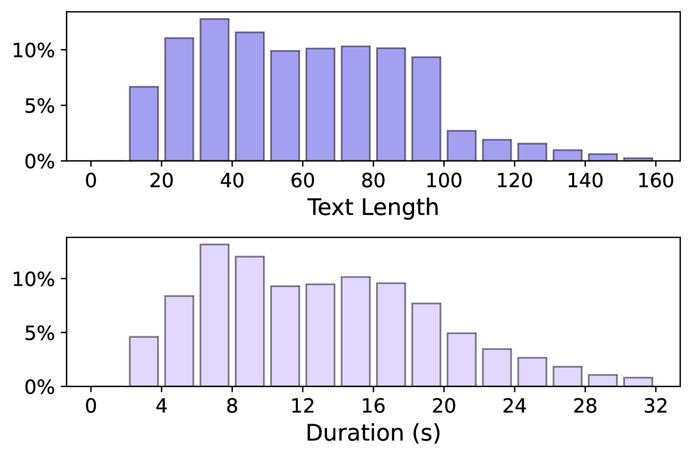

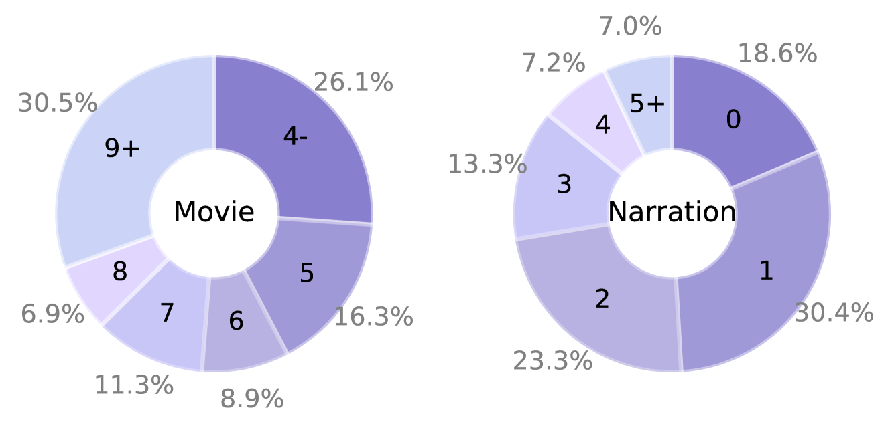

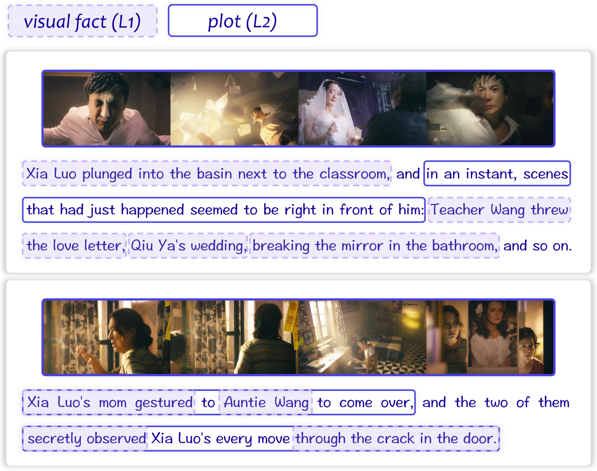

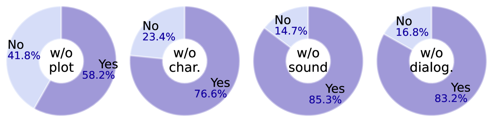

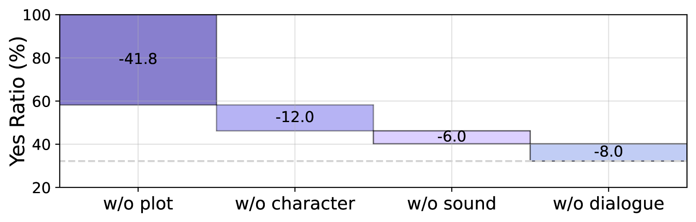

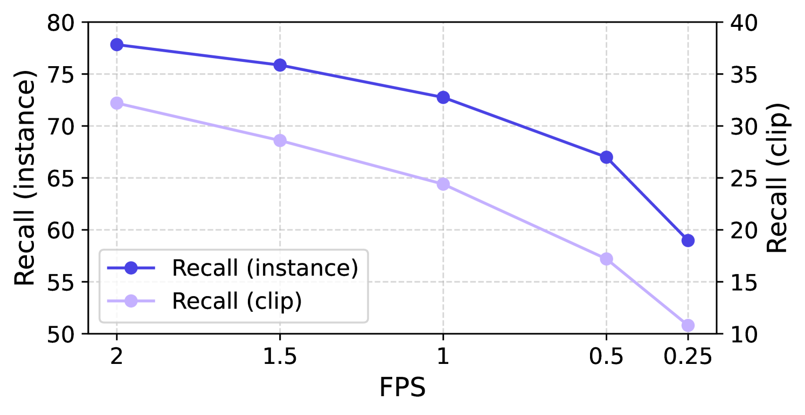

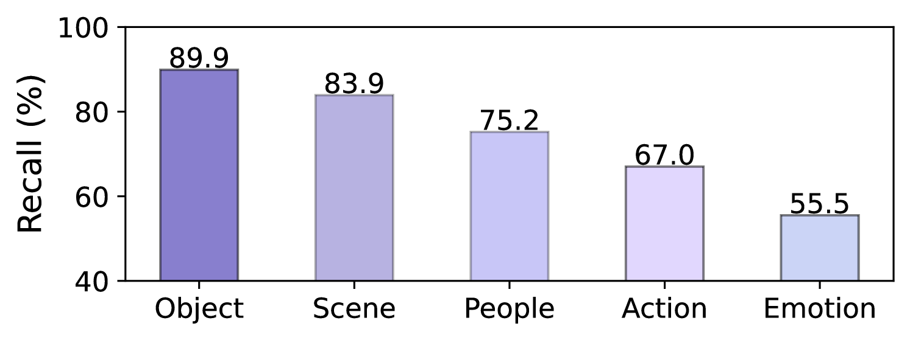

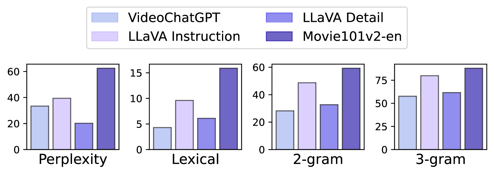

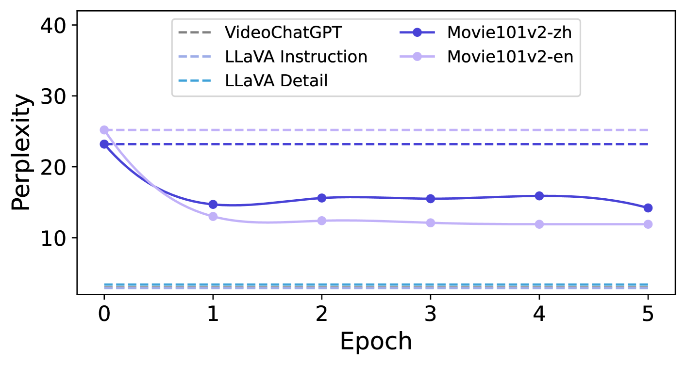

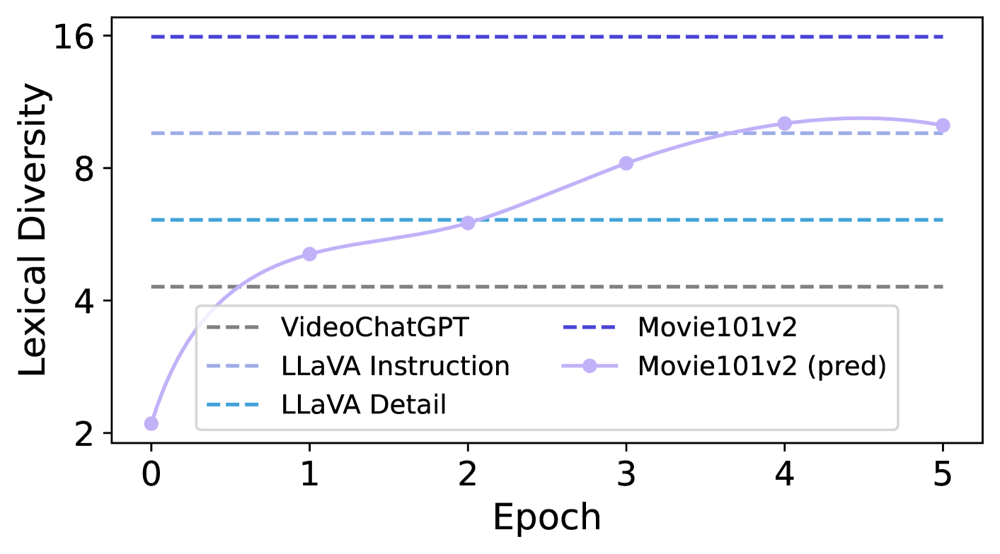

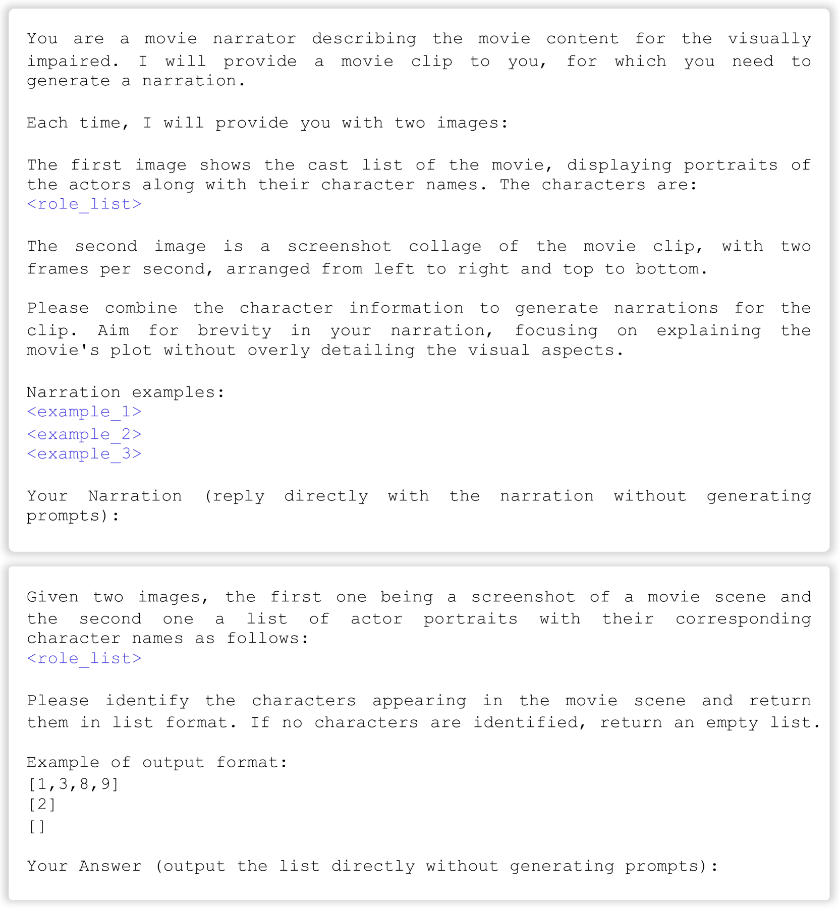

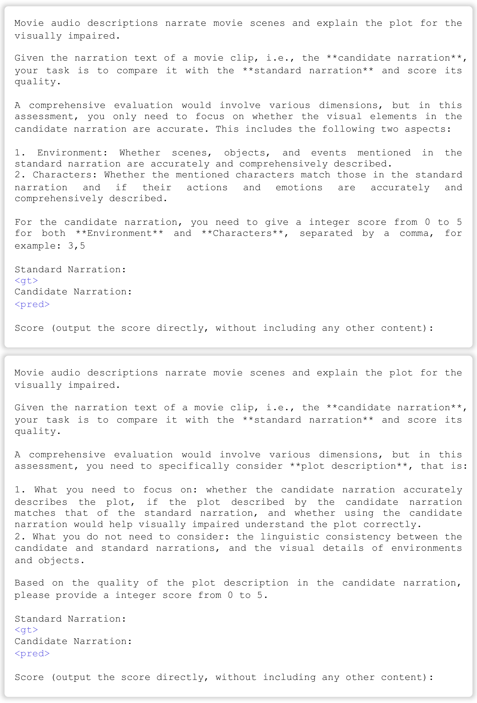

[Arxiv](https://arxiv.org/abs/2404.13370)