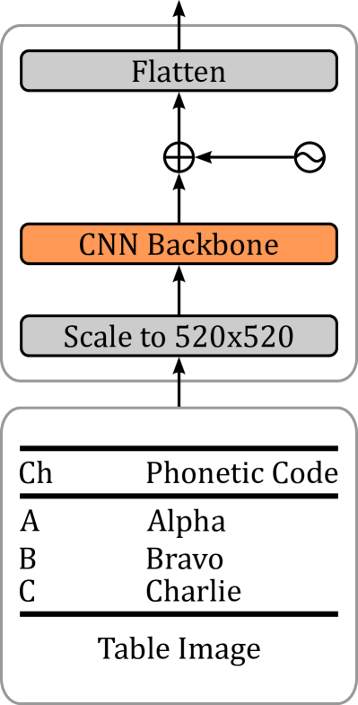
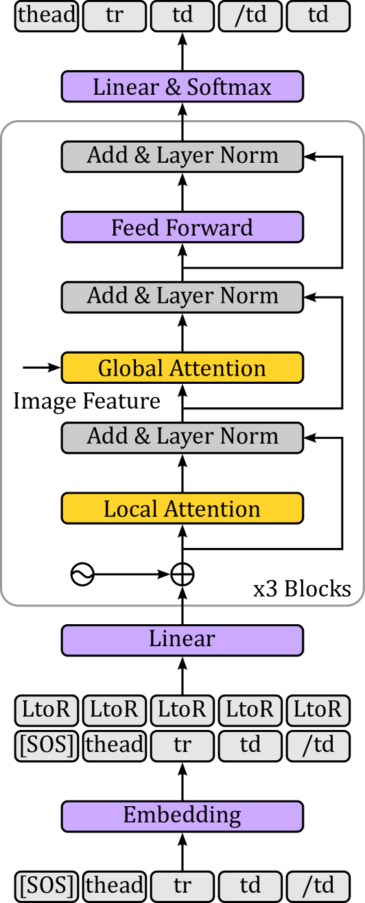
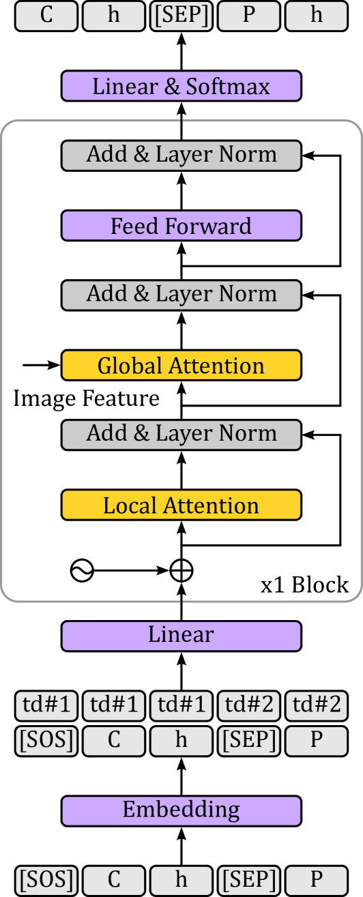

# 本文介绍了一种多单元解码器技术，结合互学习机制，旨在提升表格结构识别和字符识别的准确性。

发布时间：2024年04月20日

`LLM应用` `文档处理` `人工智能`

> Multi-Cell Decoder and Mutual Learning for Table Structure and Character Recognition

# 摘要

> 将科学论文和财务报告等文档中的表格内容提取并转换成大型语言模型处理的格式，对于知识信息处理至关重要。端到端解决方案通过识别表格结构及单元格内容，达到了与外部字符识别系统相媲美的性能，且有提升空间。引入局部注意力机制后，这些模型还能识别拥有数百单元格的长表格。不过，现有模型仅单向识别表格结构，单元格内容识别也是各自独立，忽略了邻近单元格间的信息关联。本文提出了一种多单元格内容解码器和双向互学习机制，以优化端到端处理方法。在两大数据集上的测试显示，该方法不仅有效，而且在处理长表格时，性能与最先进模型不相上下。

> Extracting table contents from documents such as scientific papers and financial reports and converting them into a format that can be processed by large language models is an important task in knowledge information processing. End-to-end approaches, which recognize not only table structure but also cell contents, achieved performance comparable to state-of-the-art models using external character recognition systems, and have potential for further improvements. In addition, these models can now recognize long tables with hundreds of cells by introducing local attention. However, the models recognize table structure in one direction from the header to the footer, and cell content recognition is performed independently for each cell, so there is no opportunity to retrieve useful information from the neighbor cells. In this paper, we propose a multi-cell content decoder and bidirectional mutual learning mechanism to improve the end-to-end approach. The effectiveness is demonstrated on two large datasets, and the experimental results show comparable performance to state-of-the-art models, even for long tables with large numbers of cells.

[Arxiv](https://arxiv.org/abs/2404.13268)