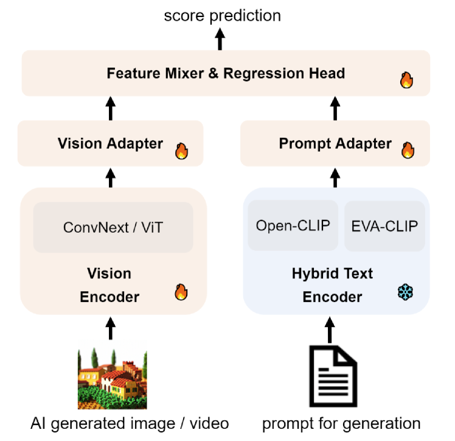
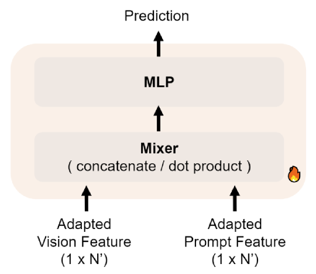
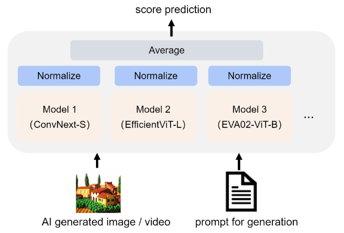
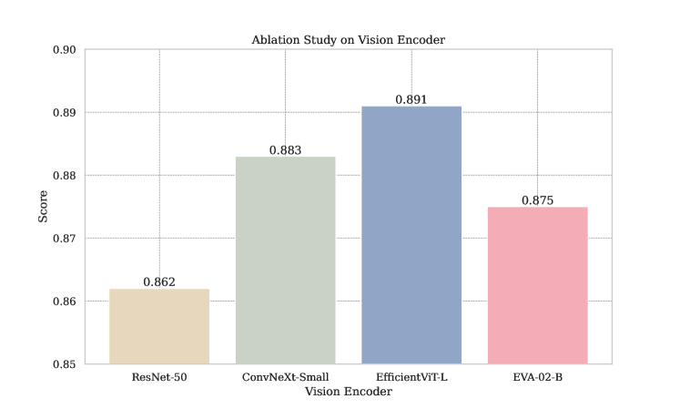

# PCQA：一种基于提示条件的AI生成内容（AIGC）质量评估的强有力基准

发布时间：2024年04月20日

`LLM应用` `人工智能` `内容生成`

> PCQA: A Strong Baseline for AIGC Quality Assessment Based on Prompt Condition

# 摘要

> 随着大型语言模型（LLM）和扩散模型的兴起，人工智能生成内容（AIGC）迎来了蓬勃发展。为了对基于AIGC技术生成的多样化图像或视频进行量化评估，亟需建立一个高效的质量评估体系。AIGC生成的内容往往依赖于精心设计的提示，提示本身自然成为了质量评估的关键。本研究提出了一套创新的AIGC质量评估框架。首先，我们引入了一种混合提示编码技术，依托双源CLIP文本编码器，以深入理解和响应提示的要求。接着，我们设计了一个集成特征混合模块，用以高效融合调整后的提示与视觉特征。通过在AIGIQA-20K和T2VQA-DB两大数据库上的实证研究，我们验证了所提出的提示条件质量评估（PCQA）方法的有效性。这一简洁而实用的框架有望推动多模态生成研究领域的进一步发展。

> The development of Large Language Models (LLM) and Diffusion Models brings the boom of Artificial Intelligence Generated Content (AIGC). It is essential to build an effective quality assessment framework to provide a quantifiable evaluation of different images or videos based on the AIGC technologies. The content generated by AIGC methods is driven by the crafted prompts. Therefore, it is intuitive that the prompts can also serve as the foundation of the AIGC quality assessment. This study proposes an effective AIGC quality assessment (QA) framework. First, we propose a hybrid prompt encoding method based on a dual-source CLIP (Contrastive Language-Image Pre-Training) text encoder to understand and respond to the prompt conditions. Second, we propose an ensemble-based feature mixer module to effectively blend the adapted prompt and vision features. The empirical study practices in two datasets: AIGIQA-20K (AI-Generated Image Quality Assessment database) and T2VQA-DB (Text-to-Video Quality Assessment DataBase), which validates the effectiveness of our proposed method: Prompt Condition Quality Assessment (PCQA). Our proposed simple and feasible framework may promote research development in the multimodal generation field.

[Arxiv](https://arxiv.org/abs/2404.13299)